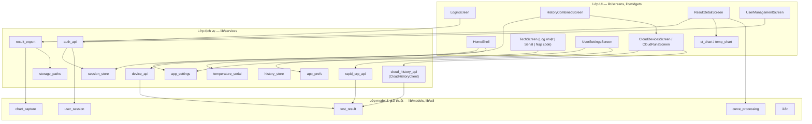
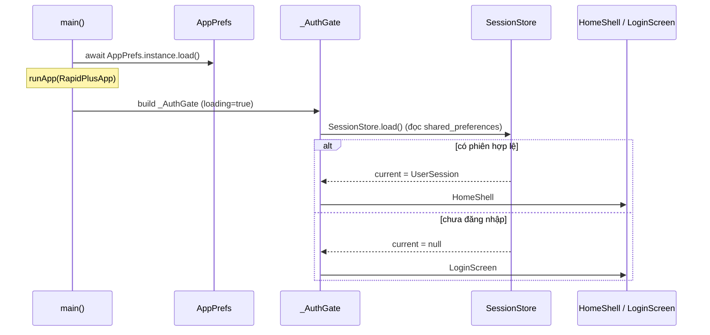
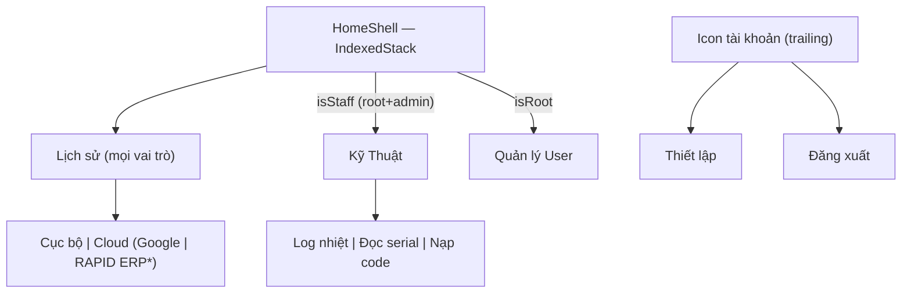

# 01 — Kiến trúc tổng quan

## 1. Phân lớp

App theo mô hình **3 lớp mỏng**: Màn hình (UI) → Dịch vụ (I/O + trạng thái) →
Giải thuật/Model thuần. Không dùng framework state-management ngoài; trạng thái
toàn cục giữ bằng **singleton static** (`SessionStore`, `StoragePaths`,
`AppPrefs`).



## 2. Tên gọi (dễ nhầm)

| Khía cạnh | Giá trị |
|-----------|---------|
| Tên hiển thị | **FBT_RAPID** |
| `pubspec name` | `RapidPlusApp` |
| Tên exe | `fbt_dxd_app.exe` (đặt ở `windows/CMakeLists.txt → BINARY_NAME`) |
| Nền tảng | **Chỉ** Windows desktop |

## 3. Luồng khởi động

`main()` nạp tuỳ chọn (theme/ngôn ngữ) → `_AuthGate` khôi phục phiên đã lưu →
rẽ nhánh Login hoặc Home.



Mã: [lib/main.dart](../lib/main.dart) (`main`, `RapidPlusApp`, `_AuthGate`).

## 4. Điều hướng theo vai trò (`HomeShell`)

Thanh điều hướng **dọc, ẩn hẳn** — hover mép trái (vùng 14px + "tay nắm") mới
trượt ra dưới dạng overlay trong `Stack` (KHÔNG dùng `Row` → bung/thu không
relayout nội dung, tránh giật `fl_chart`). Chỉ **tab nội dung** nằm trên thanh;
**Thiết lập + Đăng xuất** ẩn trong menu icon tài khoản ở `trailing`.



`*` Nút gạt nguồn cloud **chỉ hiện cho admin**. Mã:
[lib/screens/home_shell.dart](../lib/screens/home_shell.dart).

## 5. Trạng thái toàn cục (singleton static)

| Singleton | Giữ gì | Bền (persist) |
|-----------|--------|----------------|
| `SessionStore.current` | Phiên đăng nhập (`UserSession`) | `shared_preferences` (`user_session_v1`) |
| `StoragePaths.parent` | Thư mục gốc lưu file (mặc định Documents) | đặt từ Cài đặt |
| `AppPrefs.instance` | Theme (sáng/tối) + ngôn ngữ | `shared_preferences` |
| `AppSettings` (instance, nạp mỗi màn) | IP máy, khoảng đọc, URL/key cloud | `shared_preferences` |

`AppPrefs` là `ChangeNotifier` → `MaterialApp` bọc trong
`AnimatedBuilder(animation: AppPrefs.instance)` để đổi theme/ngôn ngữ "live".

## 6. Theme & đa ngôn ngữ

- **Theme token-driven** tập trung ở `lib/main.dart::_theme(Brightness)` (M3,
  seed `0xFF1565C0`). Màn con luôn dùng `Theme.of(context).colorScheme.*`, KHÔNG
  hardcode `Colors.grey/black` (sai tương phản dark mode).
- **i18n tự viết** (`lib/util/i18n.dart`): `tr('key')` tra theo
  `AppPrefs.instance.localeCode`, thiếu bản dịch → lùi tiếng Việt. Đổi ngôn ngữ
  phải **đổi `key` của `MaterialApp`** (`ValueKey('locale_..')`) để rebuild toàn
  bộ và dịch lại; theme thì áp live qua prop.

## 7. Bản đồ thư mục

```
lib/
├── main.dart                 # entry + theme + _AuthGate
├── models/                   # test_result, user_session  (thuần data)
├── screens/                  # mỗi màn 1 file
├── services/                 # I/O + trạng thái (API, serial, store, settings)
├── util/                     # giải thuật & tiện ích (curve_processing, i18n, …)
└── widgets/                  # ct_chart, temp_chart, result_badge, …
docs/                         # tài liệu thiết kế (file này)
sheet/                        # backend Apps Script (getData.js, userAuth.js)
server/                       # backend Docker tự host (ĐỘC LẬP, app không gọi)
```
