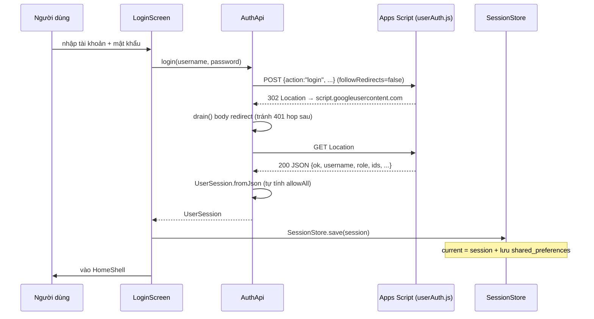
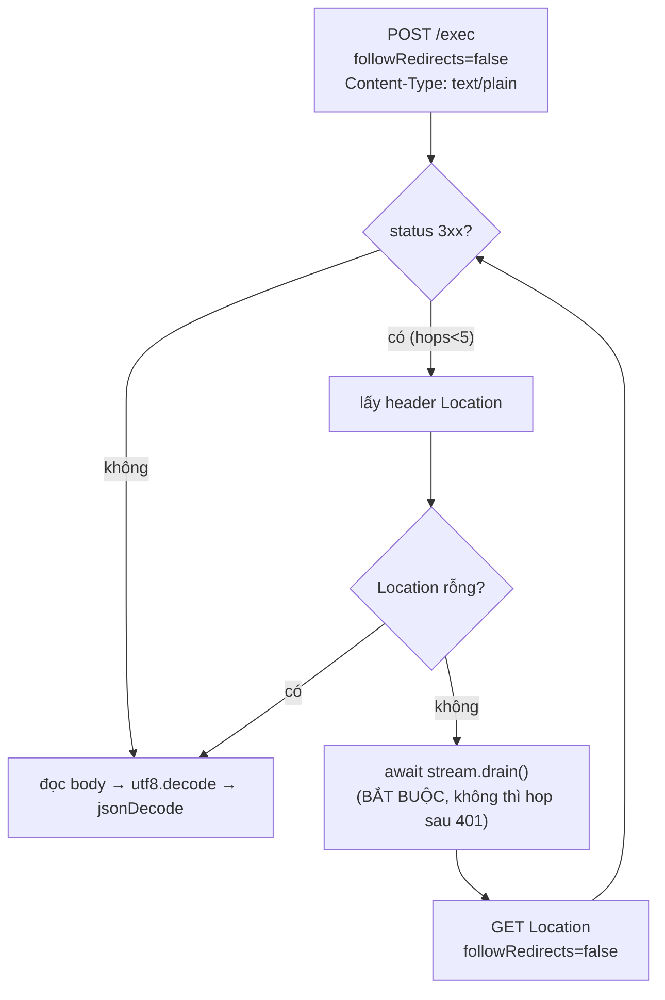
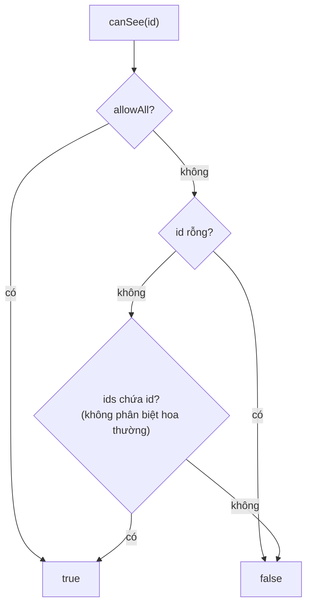
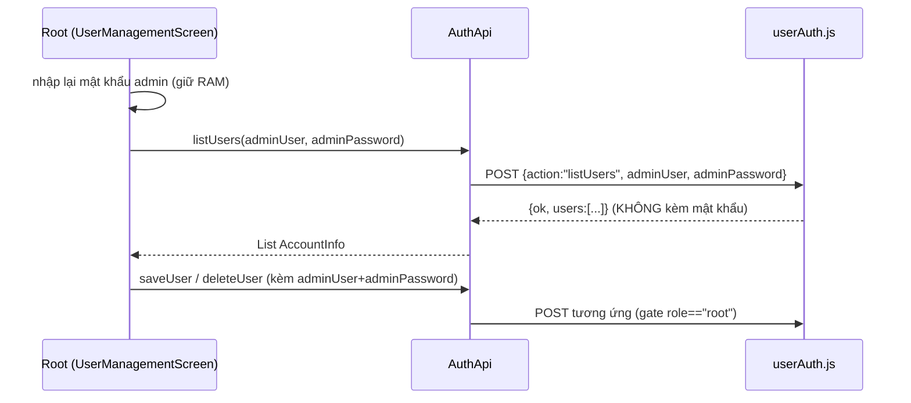
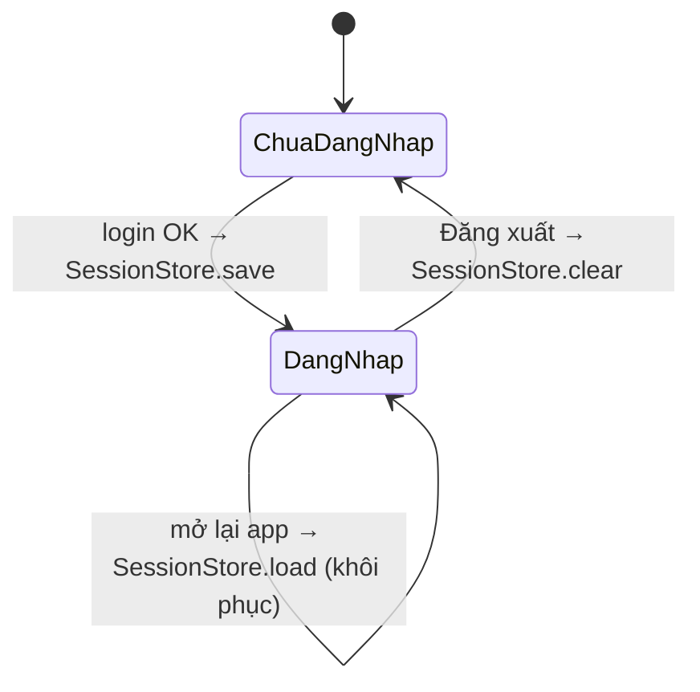

# 02 — Xác thực & phân quyền

## 1. Ba vai trò

| Vai trò (`UserRole`) | Mã | Ý nghĩa | `isStaff` | `canManageUsers` |
|---|---|---|:---:|:---:|
| `root` | `root` | Root — super-admin, quản lý tài khoản | ✅ | ✅ |
| `admin` | `admin` | Nhân viên — full app, KHÔNG quản lý tài khoản | ✅ | ❌ |
| `user` | `user` | Khách hàng — chỉ xem (read-only) | ❌ | ❌ |

Mã: [lib/models/user_session.dart](../lib/models/user_session.dart).

## 2. Luồng đăng nhập



### 2.1. Giải thuật xử lý 302 của Apps Script (quan trọng)

`http.post` của Dart **không** tự đi theo redirect tới URL "echo" của Apps Script
→ phải tự lái tay:



Điểm chí tử (đã gặp lỗi thật):
- **Phải `drain()`** body của response 302, nếu không kết nối tái dùng "bẩn" →
  hop GET sau nhận **401**.
- **`Content-Type: text/plain`** để Apps Script vẫn đọc `e.postData.contents`
  mà tránh CORS preflight.
- Giải mã `utf8.decode(resp.bodyBytes)` để giữ dấu tiếng Việt.

Mã: [lib/services/auth_api.dart](../lib/services/auth_api.dart) (`_post`).

## 3. Tính `allowAll` — phạm vi xem máy

`UserSession.fromJson` **TỰ tính** `allowAll` (không tin backend cũ):

```mermaid
flowchart LR
  A["role, ids từ backend"] --> B{"role == root?"}
  B -- có --> AA["allowAll = true"]
  B -- không --> C{'ids chứa "*"?'}
  C -- có --> AA
  C -- không --> NN["allowAll = false<br/>→ chỉ thấy đúng ids được cấp"]
```

> **Admin KHÔNG còn auto thấy mọi máy** — lọc theo `ids` được cấp như khách hàng
> (chỉ `*` mới full). `isStaff` chỉ quyết định **canWrite** + hiện tab Kỹ Thuật,
> KHÔNG quyết định phạm vi xem.

`canSee(deviceId)`:



## 4. Ma trận quyền

| Khả năng | Cờ | root | admin | user |
|---|---|:---:|:---:|:---:|
| Xem lịch sử các máy được phép | `canSee` | mọi máy | theo `ids` | theo `ids` |
| Ghi mạnh (Đồng bộ/Xóa/Lấy-từ-máy) | `canWrite = isStaff` | ✅ | ✅ | ❌ |
| Hiện tab Kỹ Thuật | `isStaff` | ✅ | ✅ | ❌ |
| Quản lý tài khoản | `canManageUsers = isRoot` | ✅ | ❌ | ❌ |
| Chọn nguồn cloud (Google/RAPID ERP) | `canWrite` | ✅ | ✅ | ❌ |
| Lưu ảnh đồ thị về thư mục | `canSaveCharts` | ✅ | ✅ | ✅ |

Lọc dữ liệu **enforce ở client**: màn `cloud_devices`/`history` fetch hết rồi
mới lọc `canSee`; nút ghi bọc `if (SessionStore.canWrite)`.

## 5. Quản lý tài khoản (root)

Vì `SessionStore` **KHÔNG lưu mật khẩu**, các action admin (listUsers/saveUser/
deleteUser) **hỏi lại mật khẩu admin mỗi lần** (chỉ giữ trong RAM):



Mật khẩu băm `sha256$<salt>$<hash>` ở backend; app gửi plaintext qua HTTPS
(server băm + so khớp).

## 6. Vòng đời phiên


