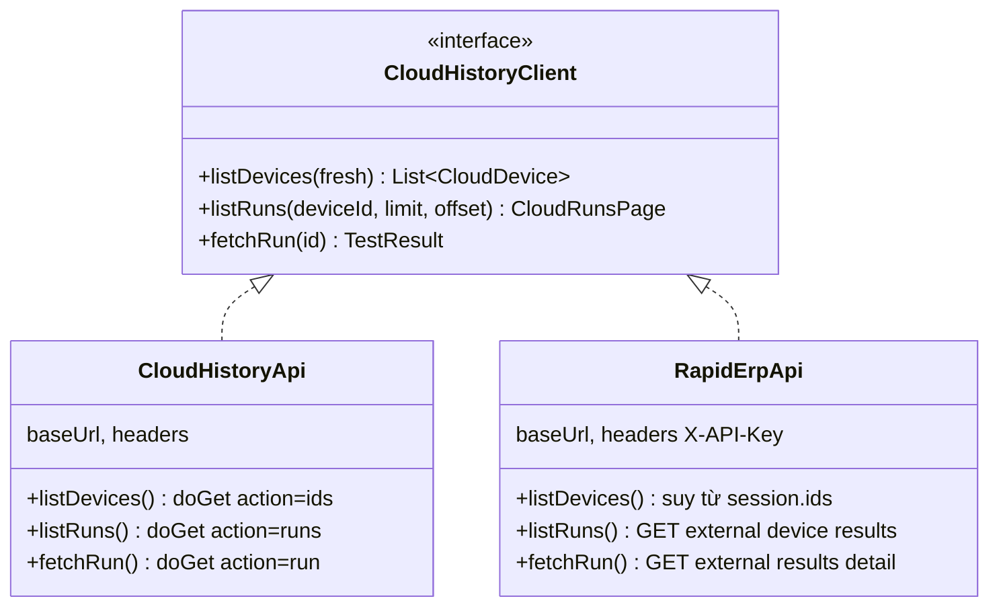
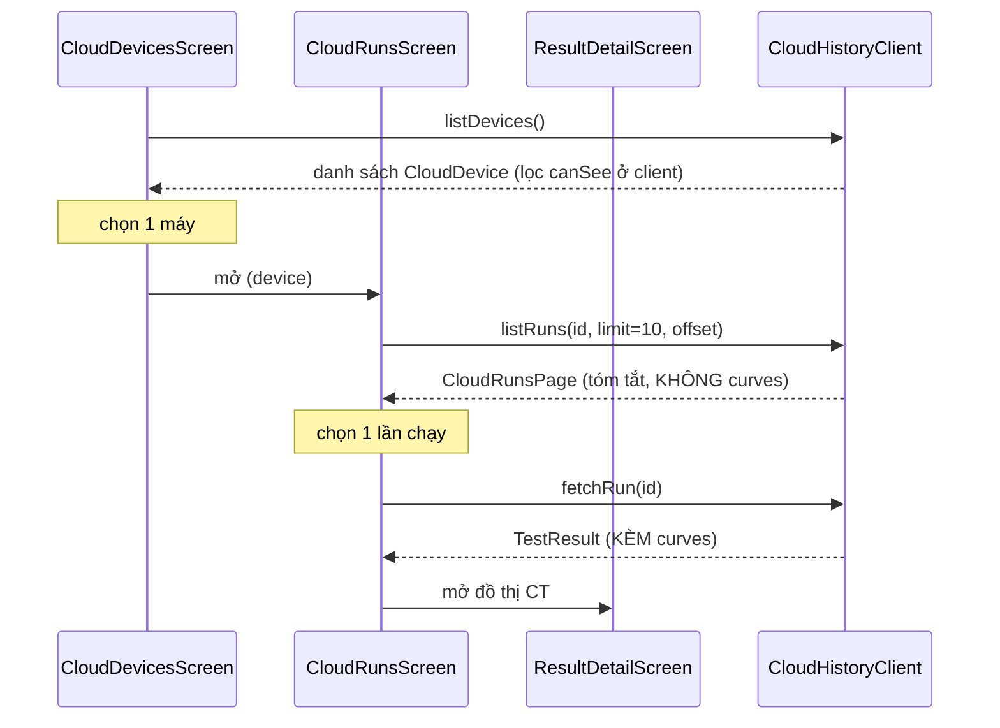
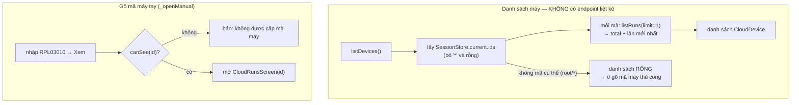
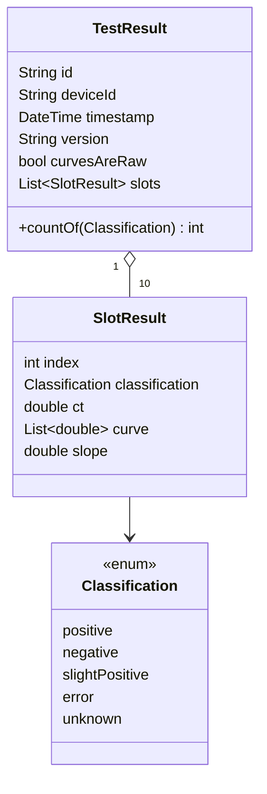
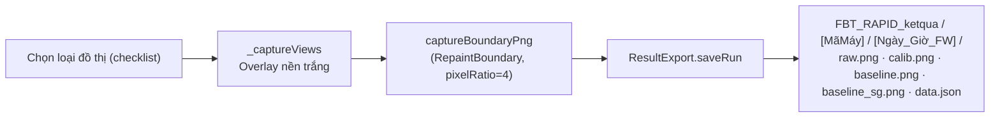

# 03 — Nguồn dữ liệu & lịch sử

## 1. Ba nguồn dữ liệu

| Nguồn | Service | Giao thức | Auth | Có liệt kê máy? |
|---|---|---|---|:---:|
| **Cục bộ** (LAN) | `device_api.dart` | `GET http://<ip>/getdata` | — | ❌ (1 máy/IP) |
| **Cloud Google** | `cloud_history_api.dart` | Apps Script `doGet` `action=ids/runs/run` | (Anyone) | ✅ `action=ids` |
| **RAPID ERP** | `rapid_erp_api.dart` | REST `/external/...` | header `X-API-Key` (hiện không bắt buộc) | ❌ (gõ mã máy tay) |

> Tab **Lịch sử** hiện mặc định hiển thị Cloud (mục "Cục bộ" tạm ẩn — bật lại
> bằng `_showLocal = true` trong `history_combined_screen.dart`).

## 2. Một giao diện chung — `CloudHistoryClient`

2 nguồn cloud (Google, RAPID ERP) chia sẻ **một giao diện**; màn UI chỉ phụ
thuộc giao diện, lớp triển khai do **factory** `buildCloudClient` chọn theo
`CloudSource`. Thêm nguồn = thêm 1 lớp + 1 nhánh factory, **không sửa UI**.

Factory `buildCloudClient(settings, source)`: `google → CloudHistoryApi`,
`rapidErp → RapidErpApi`. Mã:
[lib/services/cloud_history_api.dart](../lib/services/cloud_history_api.dart),
[lib/services/rapid_erp_api.dart](../lib/services/rapid_erp_api.dart).

## 3. Luồng lịch sử: máy → lần chạy → chi tiết

Hai bước (tóm tắt rồi mới tải chi tiết kèm đường cong) — tiết kiệm băng thông:

### 3.1. Nguồn Google (Apps Script)

- `action=ids` quét folder Drive (hàng nghìn file) → có thể 20–60s → timeout dài.
- Cache 5 phút ở client (`cloud_cache.dart`); bấm "Làm mới" → `nocache=1`.

### 3.2. Nguồn RAPID ERP (khác biệt)

- **`/external/device/{id}/results`** → `items[]`; mỗi item `result_codes` =
  map `{"0".."9": "22.3 | N"}` → tách CT + chữ phân loại.
- **`/external/results/{id}/detail`** → `channels[]`, mỗi kênh có
  `ct_value`, `result_code "08.0 | N"`, `calibration_slope`,
  `amplification_data` (mảng số) → dựng đường cong (xem
  [04-giai-thuat-duong-cong-ct.md](04-giai-thuat-duong-cong-ct.md)).
- Parse phòng thủ (`_channelMaps`): ưu tiên khoá `channels` → dạng cột →
  fallback `raw_payload` kiểu firmware.

## 4. Model `TestResult` & ánh xạ phân loại

Ánh xạ chữ → phân loại + màu:

| Nguồn | Chuỗi | Hàm |
|---|---|---|
| `/getdata` | "Positive/Negative/Slide Positive/E" | `fromDevice` |
| Cloud | "P / N / S / E" | `fromLetter` |

| Phân loại | Nhãn | Màu |
|---|---|---|
| positive | Dương tính | đỏ `#D32F2F` |
| negative | Âm tính | xanh lá `#388E3C` |
| slightPositive | Dương tính nhẹ | cam `#F57C00` |
| error | Lỗi | xám `#616161` |

> **Quy ước CT**: CT chỉ có nghĩa với **dương tính**; âm/lỗi/không rõ → hiển thị
> `N/A` (đặt `ct = null`).

Mã: [lib/models/test_result.dart](../lib/models/test_result.dart).

## 5. Cờ `curvesAreRaw`

| Giá trị | Ý nghĩa | Hệ quả UI |
|---|---|---|
| `true` | `curve` là **raw draw** + có `slope` | Vẽ được **4 loại đồ thị** (Raw/Calib/Baseline/SG) + nút Lưu ảnh |
| `false` | Chỉ có CT + phân loại (tóm tắt) | Bảng kết quả, KHÔNG có bộ chọn loại đường |

## 6. Xuất kết quả ra file

`ResultDetailScreen` chụp đồ thị **off-screen** (Overlay `left:-10000`) rồi lưu:

- Gốc lưu = `StoragePaths.parent` (mặc định Documents).
- Mở thư mục = `Process.run('explorer.exe', [path])`.

> **Cạm bẫy chụp PNG**: `result_detail` chụp 1 layer off-screen **nền trắng cố
> định** → ảnh luôn trắng dù app dark. Còn `curve_compare`/`temperature_log` bọc
> `RepaintBoundary` thẳng widget đang hiển thị → ảnh đổi theo theme.

Mã: [lib/services/result_export.dart](../lib/services/result_export.dart),
[lib/util/chart_capture.dart](../lib/util/chart_capture.dart).
