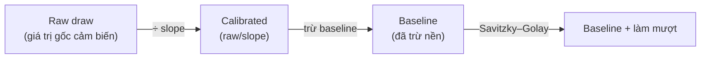
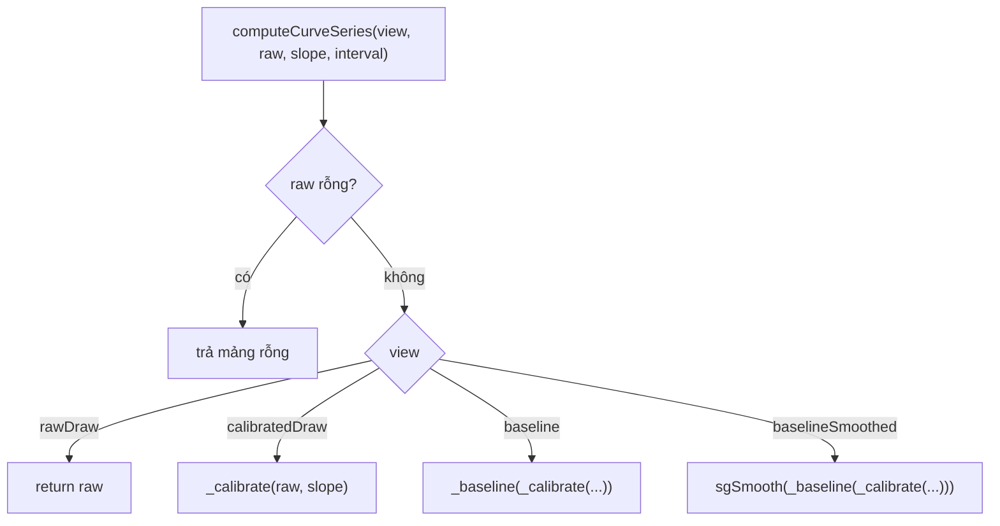
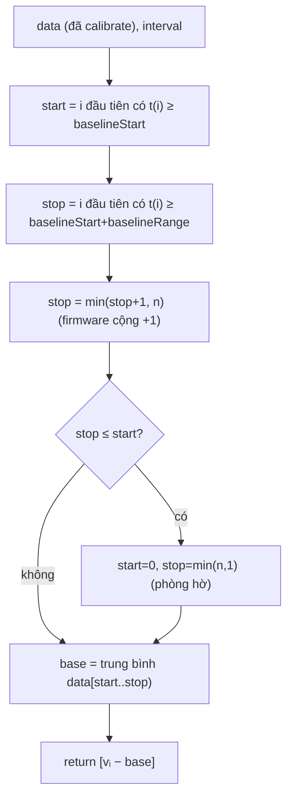
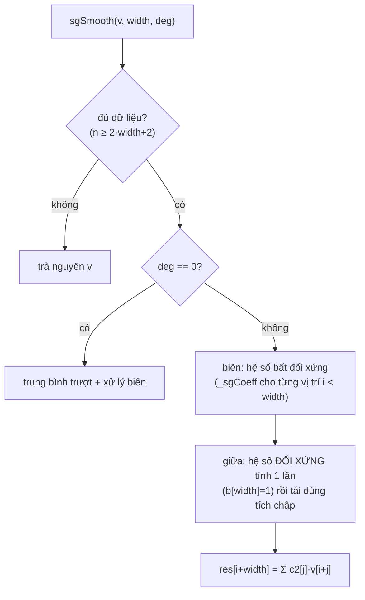
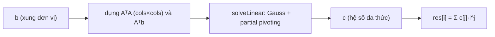

# 04 — Giải thuật xử lý đường cong CT

Đây là phần **giải thuật cốt lõi**: từ đường cong **raw draw** (mỗi slot quang
là 1 mảng số) tính ra 4 dạng đồ thị để chẩn đoán. Port từ firmware
(`src/Alg/Algo.cpp`, `src/Alg/sgsmooth.cpp`). Mã:
[lib/util/curve_processing.dart](../lib/util/curve_processing.dart).

## 1. Pipeline 4 bước

`CurveView` (4 lựa chọn trên UI): `rawDraw → calibratedDraw → baseline →
baselineSmoothed`. `computeCurveSeries(view, raw, slope, intervalSec)` chỉ chạy
tới bước tương ứng:

## 2. Bước 1 — Calibrate

Chia mỗi điểm cho hệ số hiệu chuẩn của slot (`slope`/`calibration_slope`):

$$ \text{cal}_i = \frac{\text{raw}_i}{\text{slope}} $$

`slope == null` hoặc `0` → giữ nguyên raw (tránh chia 0).

## 3. Bước 2 — Baseline (trừ nền)

Lấy **trung bình** trong cửa sổ thời gian `[baselineStart, baselineStart +
baselineRange]` phút làm nền rồi trừ khỏi mọi điểm. Index → phút quy đổi qua
`readingIntervalSec`:

$$ t(i) = \frac{i \cdot \text{readingIntervalSec}}{60} \ \text{(phút)} $$

Tham số mặc định (`CurveParams`, **theo firmware `define.h`** vì log cloud không
lưu): `baselineStart = 3` phút, `baselineRange = 4` phút, `sgWidth = 4`,
`sgOrder = 2`.

## 4. Bước 3 — Savitzky–Golay (làm mượt)

Làm mượt giữ đỉnh bằng cách **fit đa thức bậc `deg`** trên cửa sổ trượt rộng
`window = 2·width + 1`. Port của `sg_smooth()`.

### 4.1. Hệ số SG = bài toán bình phương tối thiểu

Với cửa sổ, dựng ma trận Vandermonde `A[i][j] = i^j` (cột = bậc 0..deg). Tìm hệ
số đa thức `c` khớp xung đơn vị `b` theo **least squares** → giải **hệ phương
trình chuẩn**:

$$ (A^{T}A)\,c = A^{T}b $$

rồi trả giá trị đa thức fit tại từng điểm. `_solveLinear` giải hệ nhỏ này bằng
**khử Gauss có chọn trụ (partial pivoting)**.

Mã liên quan: `sgSmooth`, `_sgCoeff` (dựng `AᵀA`, `Aᵀb`), `_solveLinear`.

## 5. Vì sao quan trọng

- **4 đồ thị** giúp kỹ thuật viên đối chiếu: raw thô → calib (bù cảm biến) →
  baseline (thấy biên độ khuếch đại thật) → SG (đỉnh mượt để đọc CT).
- **Bảng màu slot** `kSlotColors`/`kTempColors` **đồng bộ với web UI** —
  KHÔNG tô lại theo theme (mất phân biệt slot/kênh); chỉ token-hoá lưới/viền.
- Tính phía **client** từ raw draw → đổi tham số/thuật toán không cần backend.

## 6. Quan hệ với nguồn dữ liệu

| Nguồn | Có raw draw? | Vẽ 4 đồ thị? |
|---|:---:|:---:|
| `/getdata` có `amplification` + `slopes` | ✅ | ✅ |
| Cloud Google `action=run` (`curves`) | ✅ | ✅ |
| RAPID ERP `/detail` (`amplification_data` + `calibration_slope`) | ✅ | ✅ |
| Bản tóm tắt (`runs`/`results`) | ❌ | ❌ (chỉ bảng CT) |
