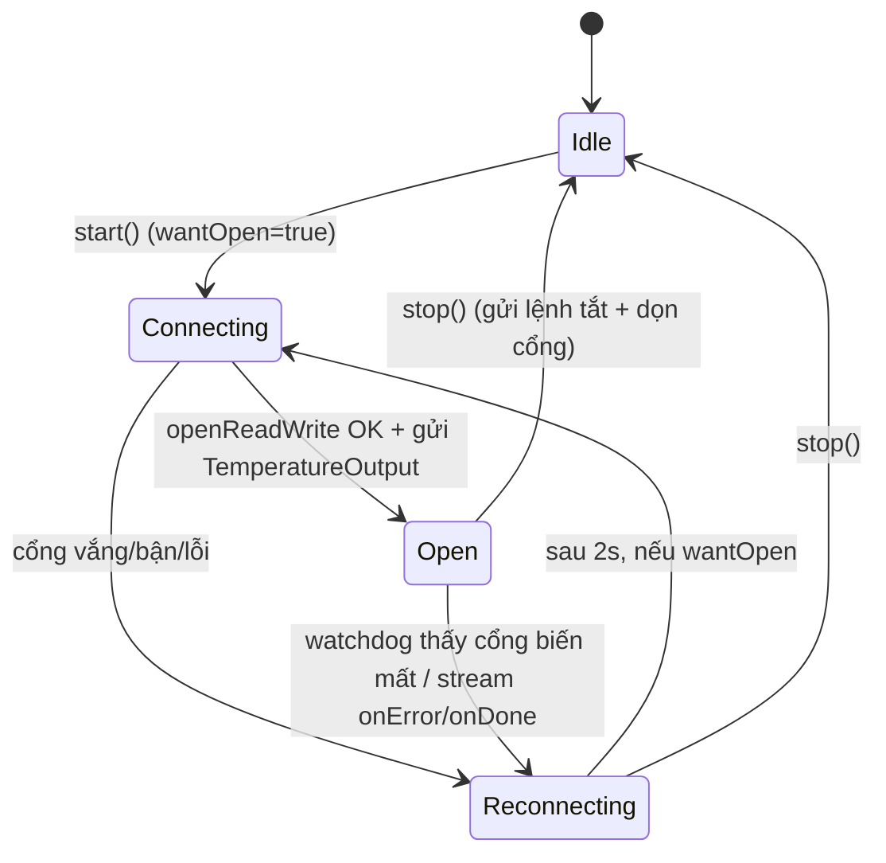
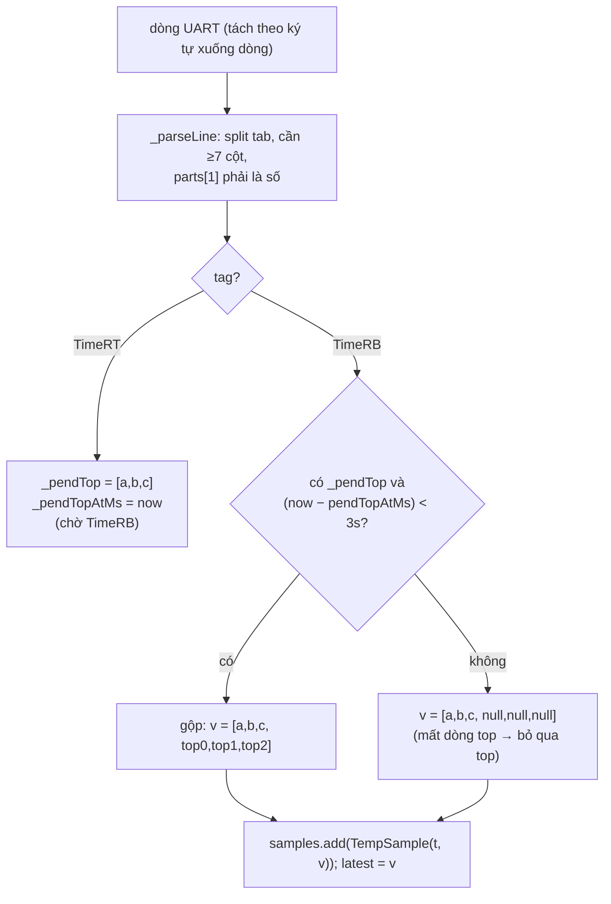
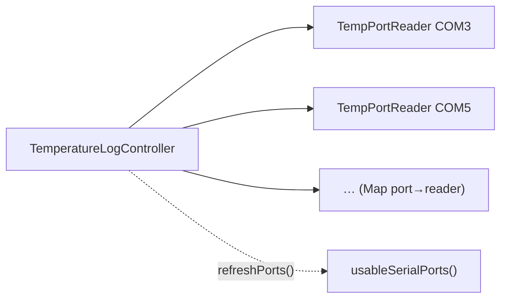

# 05 — Theo dõi nhiệt độ realtime (UART/COM)

Đọc nhiệt 6 kênh từ máy RPL qua cổng COM @115200, vẽ realtime, **tự kết nối
lại** khi rớt. Mã: [lib/services/temperature_serial.dart](../lib/services/temperature_serial.dart).

## 1. Sáu kênh nhiệt

| Index | Kênh | Nguồn firmware |
|---|---|---|
| 0 | Lysis | BottomHeater[0] |
| 1 | Amp1 | BottomHeater[1] |
| 2 | Amp2 | BottomHeater[2] |
| 3 | Hotlid1 | TopHeater[0] |
| 4 | Hotlid2 | TopHeater[1] |
| 5 | Ambient | TopHeater[2] |

Firmware xuất **2 dòng/chu kỳ**: `TimeRB` (3 kênh dưới) và `TimeRT` (3 kênh
trên), phân tách bằng tab. App ghép 2 dòng thành **1 mẫu** `TempSample{t, v[6]}`.

## 2. Máy trạng thái cổng (`TempPortReader`)

Các bộ đếm giờ hỗ trợ:

| Timer | Chu kỳ | Vai trò |
|---|---|---|
| **watchdog** | 2s | Cổng rút ra → biến khỏi `availablePorts` → coi như mất kết nối |
| **kickstart** | 3s | Mở cổng mà chưa thấy dữ liệu → gửi lại `TemperatureOutput` (toggle), tối đa 2 lần |
| **reconnect** | 2s (một lần) | Lên lịch thử `_connect()` lại |

> `TemperatureOutput` là lệnh **toggle** bật/tắt xuất nhiệt → nếu mở cổng đúng
> lúc máy đang TẮT, kickstart gửi lại để bật.

## 3. Giải thuật ghép cặp TimeRT + TimeRB

### 3.1. Mốc thời gian = "app-elapsed", KHÔNG dùng đồng hồ máy

`t = _clock.elapsedMilliseconds / 1000` (Stopwatch của app), vì **millis của máy
nhảy về 0 khi rút cáp / reset** → trục X sẽ gãy. App-elapsed giữ trục X **liên
tục** qua mọi lần reconnect.

## 4. Bộ đệm & chống tràn

| Bộ đệm | Trần | Khi vượt |
|---|---|---|
| `samples` (mẫu nhiệt) | 500 000 | bỏ 10% cũ nhất (amortized) |
| `rawLines` (mọi dòng UART) | 2 000 000 | bỏ 10% cũ nhất |
| `_buf` (ghép dòng dở) | 8192 ký tự | giữ 2048 ký tự cuối |

## 5. Đa cổng (`TemperatureLogController`)

Quản lý nhiều `TempPortReader` song song (mỗi cổng 1 reader). Chỉ liệt kê cổng
**USB-serial** qua `usableSerialPorts()` (bỏ native/Bluetooth).

## 6. Dọn tài nguyên an toàn

Khi `stop()`/`dispose()`: huỷ sub/reader, gửi lệnh tắt (nếu cổng còn sống), rồi
**hoãn 350ms** mới `close()`+`dispose()` cổng native để isolate đọc kịp dừng
(tránh use-after-free).

## 7. Xuất CSV

`toCsv()` → `time_s,Lysis,Amp1,Amp2,Hotlid1,Hotlid2,Ambient`. Lưu vào
`FBT_RAPID_templog/` dưới `StoragePaths.parent`.
