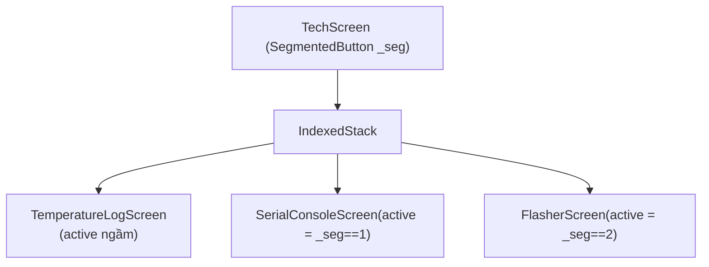
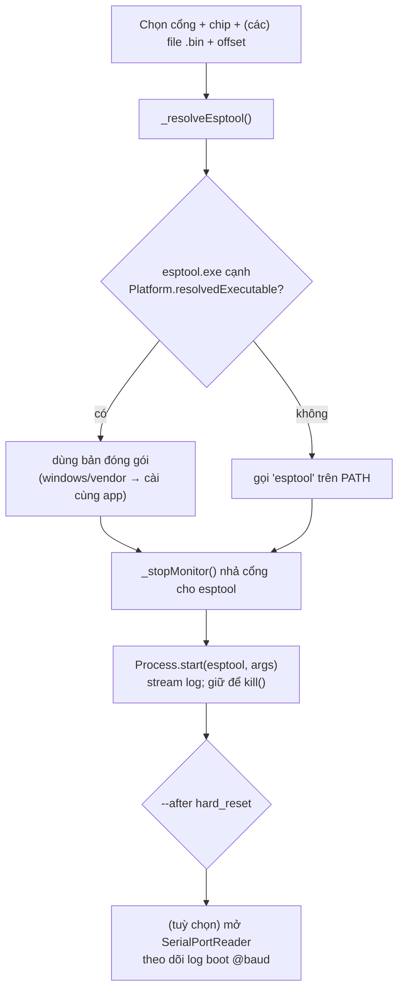

# 06 — Công cụ kỹ thuật (Tab Kỹ Thuật)

Tab **Kỹ Thuật** (chỉ nhân sự: root + nhân viên) gộp 3 công cụ chia sẻ phần cứng
COM: **Log nhiệt | Đọc serial | Nạp code**. Mã:
[lib/screens/tech_screen.dart](../lib/screens/tech_screen.dart),
[lib/screens/serial_console_screen.dart](../lib/screens/serial_console_screen.dart),
[lib/screens/flasher_screen.dart](../lib/screens/flasher_screen.dart).

## 1. Cấu trúc & chia sẻ cổng COM

3 màn nằm trong `IndexedStack` (giữ state). `TechScreen` truyền cờ
**`active: _seg == i`** cho từng màn; màn nào `active == false` tự **nhả cổng**
trong `didUpdateWidget`.

### Quy tắc nhả cổng khi rời màn

| Màn | Khi `active=false` | Lưu ý |
|---|---|---|
| **Log nhiệt** | **CỐ TÌNH giữ đọc nền** | Dừng = mất mẫu → muốn nạp đúng cổng đang log phải **Dừng thủ công** |
| **Đọc serial** | Đóng cổng (GIỮ log) | Nhả phần cứng cho công cụ khác |
| **Nạp code** | Dừng theo dõi serial | KHÔNG ngắt tiến trình nạp đang chạy |

> Hệ quả: mở cổng X ở Log nhiệt/Đọc serial rồi sang Nạp code nạp cổng X sẽ báo
> **bận** → đóng cổng trước khi nạp.

Lọc cổng: cả 3 màn dùng `usableSerialPorts()` — chỉ giữ cổng **USB-serial**
(`transport==usb` hoặc có `vendorId`); lọc ra rỗng → trả toàn bộ để không kẹt.

## 2. Đọc serial (Serial console)

Mở 1 cổng COM, đọc luồng UART thô, hiển thị + lưu log
`FBT_RAPID_seriallog/<COM>_<thời gian>.txt`. Decode `Utf8Decoder(allowMalformed:
true)` để không vỡ khi gặp byte rác lúc boot.

## 3. Nạp firmware (esptool)

Gọi **esptool** qua `Process.start(exe, args, runInShell: true)`, stream
`stdout`+`stderr` vào log, giữ `Process` để `kill()` (nút Dừng).

### Offset mặc định theo chip

| Chip | bootloader | partitions | app |
|---|---|---|---|
| ESP32 | `0x1000` | `0x8000` | `0x10000` |
| ESP32-S3 / C3 | `0x0` | `0x8000` | `0x10000` |
| ESP8266 | — | — | `0x0` (chỉ app) |

- `--chip auto` → **bỏ** cờ `--chip` (để esptool tự nhận).
- Có dropdown **flash mode** (`--flash_mode`) + **flash size** (`--flash_size`,
  chỉ thêm khi ≠ `keep`).

### Đọc lỗi reset từ log boot

| Dấu hiệu trên serial | Nguyên nhân thường gặp |
|---|---|
| reset **1 lần** rồi chạy app | bình thường (`--after hard_reset`) |
| reset **lặp** (boot-loop) | xem các dòng dưới |
| `invalid header: 0xffffffff` | thiếu/sai bootloader/partition hoặc sai offset |
| `Guru Meditation` | firmware crash |
| `Brownout` | nguồn yếu |
| `flash read err` / `checksum failed` | sai flash mode (DIO/QIO) |

**Fix hay dùng**: nạp đủ 3 file đúng offset + mode `dio` + size `detect` +
`erase_flash` trước.

## 4. Đóng gói esptool kèm app

`windows/vendor/esptool.exe` → rule `install(FILES ...)` trong
`windows/CMakeLists.txt` (guard `EXISTS`) copy cạnh `fbt_dxd_app.exe` mỗi lần
build → installer tự kèm; app tự dò. Bỏ file mới vào phải **`flutter clean`** 1
lần (guard EXISTS đánh giá lúc configure).
