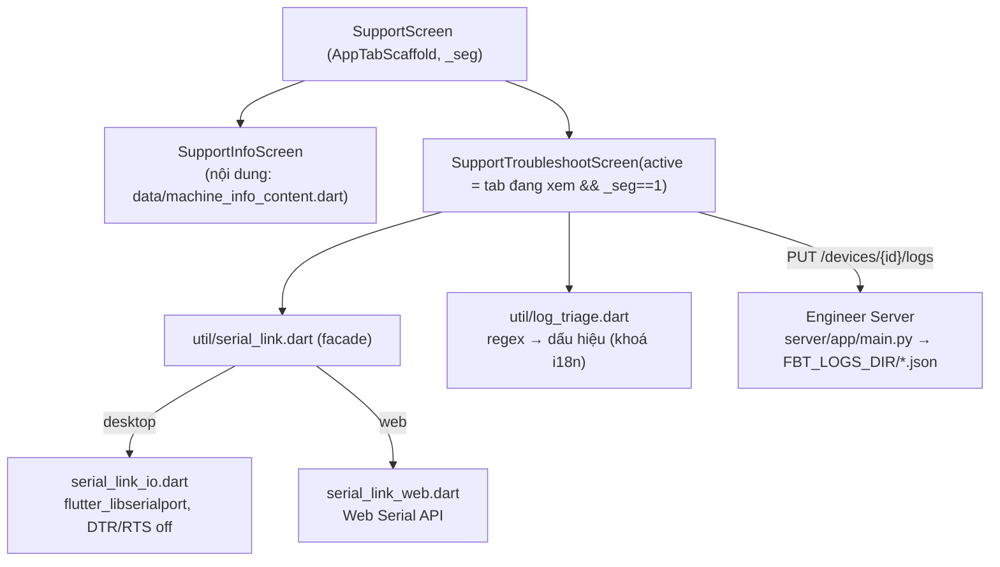

# 07 — Chăm sóc khách hàng (Tab Chăm sóc KH)

Tab **Chăm sóc KH** (nhân sự: root + nhân viên) là bộ công cụ cho **nhân viên chăm sóc
khách hàng** vận hành mà không cần kiến thức kỹ thuật, gồm 4 mục con:
**Thông tin máy | Xử lý sự cố | Log đã nhận | Thống kê lỗi** (2 mục sau thêm 2026-09-25 cho kỹ thuật). Mã:
[lib/screens/support_screen.dart](../lib/screens/support_screen.dart),
[lib/screens/support_info_screen.dart](../lib/screens/support_info_screen.dart),
[lib/screens/support_troubleshoot_screen.dart](../lib/screens/support_troubleshoot_screen.dart),
[lib/util/log_triage.dart](../lib/util/log_triage.dart),
[lib/util/serial_link.dart](../lib/util/serial_link.dart).

Vì sao tách khỏi tab Kỹ Thuật: bên đó là công cụ kỹ thuật (đa cổng, HEX, nạp code) — đúng
thứ nhân viên CSKH không cần và dễ bấm nhầm. Tab này chỉ có việc của họ: **một cổng, một
nút gửi**, và chạy được cả trên **web** (Chrome/Edge desktop) lẫn desktop.

## 1. Thông tin máy

Viết cho **nhân viên CSKH không có nền kỹ thuật**, theo thứ tự nên đọc: sản phẩm là gì → một
lần xét nghiệm diễn ra thế nào (5 bước, số phút lấy từ `ParaRead` máy thật) → đọc kết quả cho
khách → nút bấm & màn hình → WiFi/app/hệ thống → cập nhật phần mềm → **câu hỏi khách thường
gọi** (mỗi mục: hỏi gì · khách tự thử gì · khi nào chuyển kỹ thuật) → **kịch bản tiếp nhận &
ticket** → từ điển thuật ngữ. Mục cuối **"Dành cho kỹ thuật"** (`advanced: true`: cổng USB,
lệnh máy, 6 kênh nhiệt, web nội bộ) **thu gọn mặc định**, chỉ mở khi bấm "Mở" hoặc khi đang tìm
mà khớp. Đầu màn có dải giới thiệu (viết cho ai, đọc thế nào) và chip **"Đi tới"** (`jump`) cuộn
thẳng tới mục (`GlobalKey` + `Scrollable.ensureVisible`, nên danh sách là `SingleChildScrollView`
+ `Column`, không `ListView.builder`). **Nội dung là dữ liệu** ở
`lib/data/machine_info_content.dart` (`kMachineInfoSections`) — tiếng Việt, một chỗ, không qua
`tr()`; màn hình chỉ trình bày + ô tìm (`AppSearchBox`) lọc theo tiêu đề/nội dung.

Thẻ "Nút bấm & màn hình" gắn thêm **bộ tách mã lỗi**: nhập 4 chữ số trên màn TFT →
`decodeErrorCode` tách theo công thức firmware `module*1000 + type*100 + step*10 + slot`
(cùng công thức `SensorError` trong `fbt_api.dart`). App chỉ tách số; bảng ý nghĩa từng
số nằm ở firmware.

## 2. Xử lý sự cố — ba bước

| Bước | Việc | Cơ chế |
|---|---|---|
| 1 Kết nối | chọn cổng COM (desktop) / hộp thoại trình duyệt (web) → **Kết nối** | `openSerialLink(name, baud: 115200)` — 8N1, **DTR/RTS off** nên máy KHÔNG reset khi nối |
| 2 Đọc log | nhật ký hiện theo dòng; dòng đáng chú ý tô đỏ; bộ lọc "Chỉ dòng đáng chú ý"; khung **"Máy đang nói gì"** = **kết luận một dòng** (đỏ `hasError` → chuyển kỹ thuật · vàng có cảnh báo → khách tự thử · xanh → không thấy lỗi quen thuộc) + từng dấu hiệu kèm gợi ý; nút "Yêu cầu máy" chỉ nhãn tiếng Việt, lệnh thật trong tooltip | `_onData` tách dòng, `isSuspiciousLine` đánh dấu ngay khi dòng tới; `triageLog` chạy debounce 600 ms sau đợt dữ liệu cuối |
| 3 Gửi | mã máy (tự điền nếu log in `RPL#####`) + mô tả → **Gửi log về kỹ thuật**; hoặc **Lưu file** | `FbtApi.uploadDeviceLog` → `PUT /devices/{id}/logs` JSON `{by, note, port, baud, captured_at, app, findings[], text}` |

Lệnh nhanh chỉ gồm lệnh **an toàn** theo bảng khảo sát firmware
([plan/ate-san-xuat.md](plan/ate-san-xuat.md) §3): `ParaRead` (tham số), `M` (hiệu chuẩn),
`TemperatureOutput` (bật/tắt nhiệt), `Res` (khởi động lại, có hộp xác nhận vì làm mất lần
chạy đang dở). **Không** có `P` (treo firmware).

### Bộ quét log (`log_triage.dart`)

Thuần Dart, testable (`test/log_triage_test.dart`). Mỗi luật = regex + mức
(`error/warning/info`) + **khoá i18n** `triage.<key>` / `triage.<key>Hint`; màn hình dịch
bằng `tr()`. Luật lấy từ thông điệp chuẩn ROM/ESP-IDF (cùng danh sách CLAUDE.md mục
"Debug nạp xong chip tự reset") + vài mẫu riêng máy:

| Khoá | Mức | Bắt gì | Gợi ý cho CSKH |
|---|---|---|---|
| `brownout` | lỗi | `Brownout detector`, `RTCWDT_BROWN_OUT_RESET` | nguồn yếu → đổi adapter/ổ cắm |
| `crash` | lỗi | `Guru Meditation`, `abort()`, `assert failed`, `LoadProhibited`… | firmware crash → gửi log |
| `noFirmware` | lỗi | `invalid header: 0x…` | nạp lại đủ 3 file |
| `flashRead` | lỗi | `flash read err`, `checksum failed` | sai flash mode / flash hỏng |
| `watchdog` | lỗi | `Task watchdog`, `RTCWDT_RTC_RESET`, `TG0WDT…` | treo tác vụ |
| `tempSensor` | cảnh báo | `-127` đứng riêng, `nan` | mất cảm biến nhiệt |
| `wifi` / `upload` / `ota` | cảnh báo | WiFi fail/disconnect · HTTP/POST fail · OTA fail | mạng của khách |
| `idfError` | cảnh báo | dòng `E (ms) tag:` | gom đếm cho kỹ thuật |
| `resetPower` / `resetSoft` | thông tin | `rst:0x1` / `rst:0xc`… | vừa bật nguồn / reset mềm |

Ngoài ra rút **version** (`firmware version 2.4.5`, `v2.4.4AT`) và **mã máy** (`RPL\d{4,6}`)
để điền hộ ô mã máy.

### Cổng COM dùng chung

Cùng luật với "Đọc serial" ở tab Kỹ Thuật: `HomeShell` truyền `active: _index == i` cho
`SupportScreen` → `SupportTroubleshootScreen.didUpdateWidget` thấy `active` chuyển `false`
(đổi tab hoặc đổi mục con) là **ngắt cổng, giữ log**. Mở cổng đang bận (Log nhiệt giữ đọc
nền) → `SerialLinkException` nói rõ "đóng ở tab Kỹ Thuật / cắm lại".

## 3. Phía server (`server/app/main.py`)

| Route | Việc |
|---|---|
| `PUT /devices/{device}/logs` | nhận JSON, bắt buộc `text` không rỗng (≤ `MAX_LOG_TEXT` 4M ký tự); ghi `FBT_LOGS_DIR/<device>_<UTC>_<sha8>.json` (tmp + `os.replace`); trả `{ok, file, size}` |
| `GET /devices/{device}/logs?limit` | metadata các bản log của máy, **mới nhất trước**, KHÔNG kèm `text` |
| `GET /logs/{file}` | bản đầy đủ (có `text`); tên file kiểm bằng regex riêng, không `safe_name` (cắt 64 ký tự → 404 sai) |

**PUT chứ không POST** — cùng lý do mục OTA: `POST /{path}` catch-all ingest nuốt mọi POST
(test `test_log_post_roi_vao_catchall`). Auth = cửa chung `auth()` (token thiết bị hoặc admin đều
qua). Server chưa deploy route → app nhận 405 → thông báo "server chưa được cập nhật cho tính
năng này" (đã có sẵn trong `FbtApi._decode`).

Mở lại log đã gửi: nút **Log đã gửi** → `_SentLogsDialog` (`listDeviceLogs`) → bấm một dòng →
`fetchDeviceLog` → xem thô bằng `RawUartScreen`. Từ 2026-09-25 mỗi dòng có **chip trạng thái** và
**ghi chú trả lời của kỹ thuật** (`status_note` — "Kỹ thuật trả lời: …") để CSKH báo lại khách.

Hộp thư cho kỹ thuật (gác `ota_admin` = token nhân sự): `GET /logs?device&status&page&limit` (+ `counts`),
`PUT /logs/{file}/status` `{status: new|working|done, by, note}`, `DELETE /logs/{file}`,
`GET /logs/stats?days=` (khai báo TRƯỚC `/logs/{file}`). Server báo **Telegram** khi có log mới nếu đặt
`FBT_LOG_NOTIFY_TELEGRAM_TOKEN` + `_CHAT`. Log gửi từ 2026-09-25 kèm `fw` (phiên bản bộ quét rút từ log).

## 4. Log đã nhận (kỹ thuật)

[lib/screens/support_inbox_screen.dart](../lib/screens/support_inbox_screen.dart). Chip lọc
**Tất cả · Mới · Đang xử lý · Đã xử lý** (số từ `counts`), ô lọc mã máy, mặc định mở ở **Mới**. Mỗi thẻ:
máy · giờ · người gửi · fw, mô tả, dấu hiệu (`triage.<key>` đã dịch), viền trái đỏ/vàng theo mức. Bấm →
hộp chi tiết: dấu hiệu kèm số lần, **Xem log thô**, ô **Ghi chú / trả lời CSKH**, nút **Nhận xử lý** /
**Đã xử lý** / **Mở lại** / **Xoá** (hỏi xác nhận). Nạp khi mục đang xem (`TickerMode`) + làm mới nền 60 s.
**Badge** số log Mới trên mục: `SupportScreen` poll `GET /logs?status=new&limit=1` mỗi 90 s khi tab
Chăm sóc KH đang xem (lỗi 401/405 im lặng), hộp thư báo lại sau mỗi lần nạp.

## 5. Thống kê lỗi

[lib/screens/support_log_stats_screen.dart](../lib/screens/support_log_stats_screen.dart) — `GET /logs/stats`,
khoảng 7/30/90/365 ngày/mọi lúc. Ô số: số log, chưa xong, có lỗi (%), số máy, không dấu hiệu. Thanh
**dấu hiệu hay gặp** (số log + số máy — nhiều máy = vấn đề diện rộng), **máy gửi nhiều log** (bấm → hộp
thư lọc theo máy), **theo firmware** (tỉ lệ log có lỗi — nhảy ở bản mới = nghi hồi quy), **cột theo ngày**.
Dữ liệu là dấu hiệu bộ quét của APP lúc gửi, không phải chẩn đoán của kỹ thuật.
