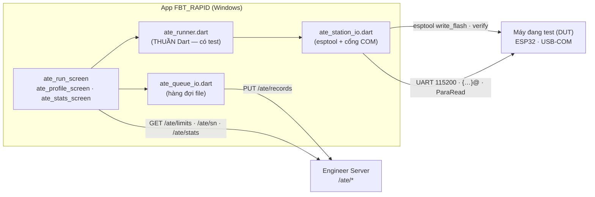
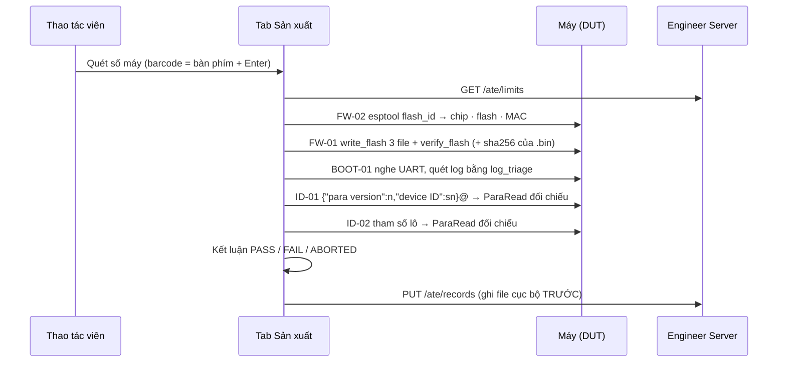
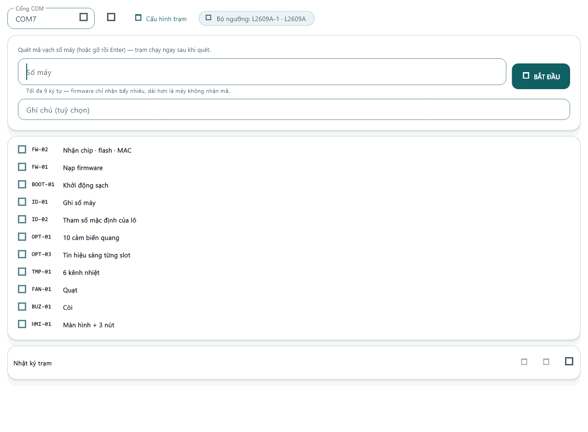
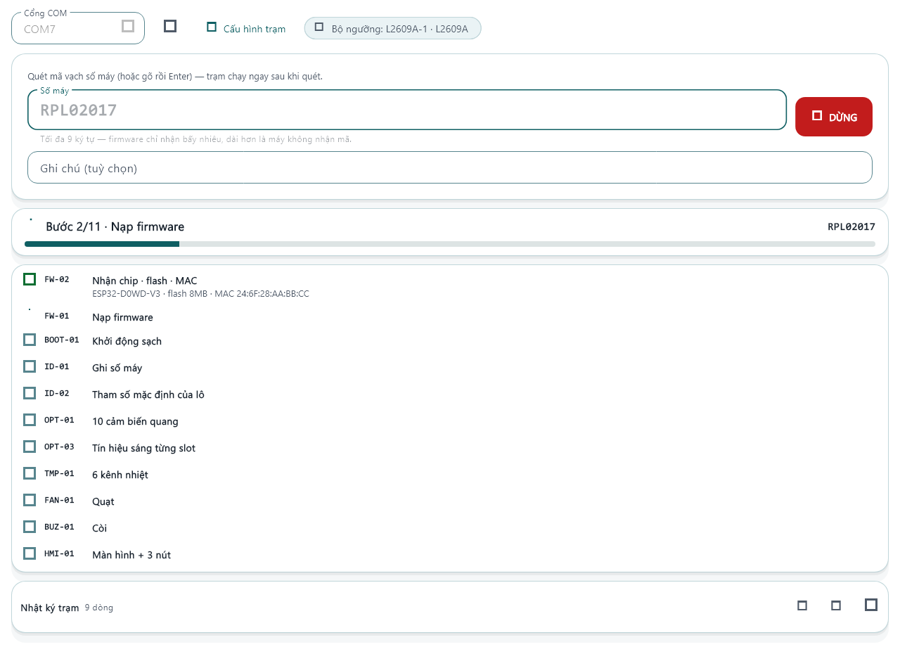
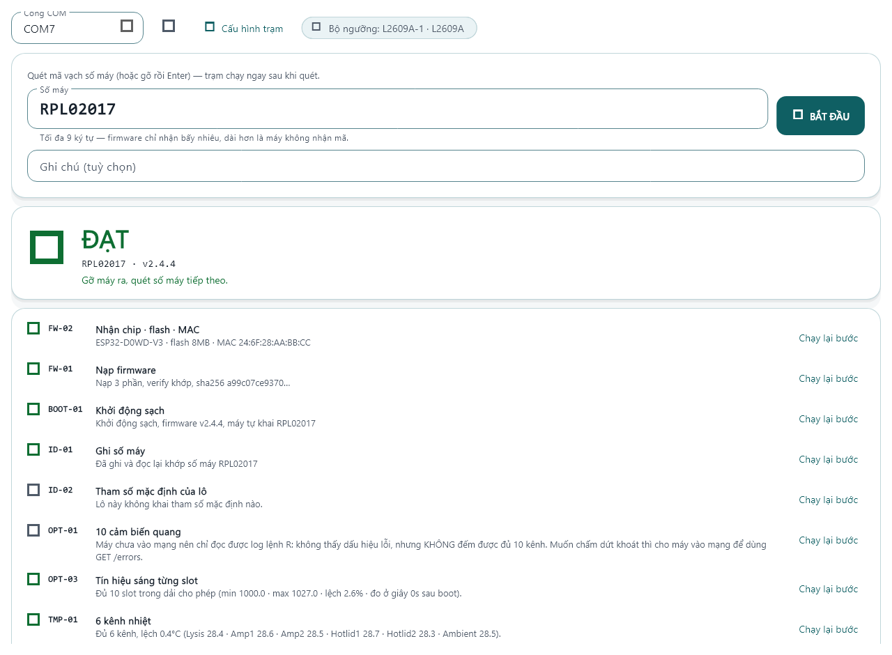
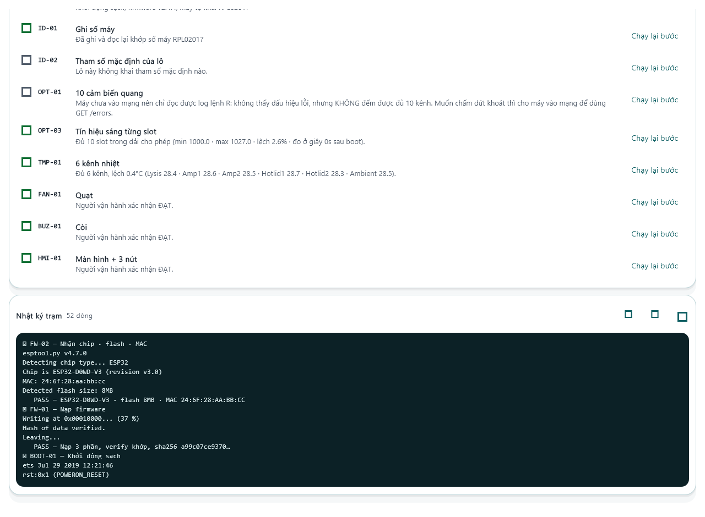
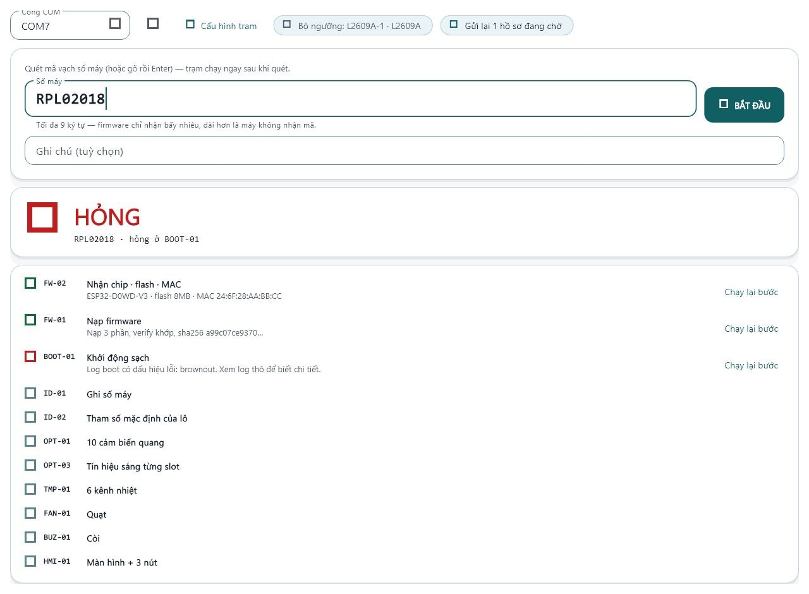

# 08 — Trạm sản xuất ATE (P0: nạp · khai sinh · hồ sơ · P1: tự kiểm phần cứng)

Tab **Sản xuất** biến việc nghiệm thu một máy Forte Rapid+ ở xưởng từ thao tác tay rời rạc
thành **một kịch bản chạy được, có số liệu và có hồ sơ truy vết**. Kế hoạch tổng thể (P0→P5)
ở [plan/ate-san-xuat.md](plan/ate-san-xuat.md); tài liệu này mô tả **phần đã hiện thực = P0 + P1**.

Phạm vi đã hiện thực:

- **P0** — nạp firmware → khai sinh máy (số máy + tham số lô) → hồ sơ nghiệm thu.
- **P1** — tự kiểm phần cứng bán tự động: quang, nhiệt, quạt, còi, màn hình + nút (§2b).

Chưa làm: hiệu chuẩn quang tự động (CAL-01, P3), 3 route test mới trên firmware (P2), chạy rà (P4) —
và **in nhãn QR** của EOL-01 (§9).

---

## 1. Kiến trúc



Ba ranh giới cố ý:

1. **`ate_runner.dart` không biết Flutter, không biết `dart:io`.** Mọi thứ chạm phần cứng đi qua
   giao diện `AteStation`. Nhờ vậy [test/ate_runner_test.dart](../test/ate_runner_test.dart) ép được
   những tình huống không ép được bằng bo thật: bo trả log `Guru Meditation`, máy im lặng, đọc-lại
   không khớp số máy.
2. **Chấm ngưỡng ở app, không ở server và không ở firmware.** Đổi ngưỡng = PUT một bộ `limits` mới,
   không phải nạp lại firmware hay deploy server.
3. **Ghi file trước, đẩy server sau.** Mất mạng không được làm dừng dây chuyền.

## 2. Kịch bản một máy — 5 bước P0



| Mã | Đo gì | FAIL khi |
|---|---|---|
| FW-02 | `flash_id`: chip, dung lượng flash, MAC | esptool thoát ≠ 0, không đọc được MAC, flash sai dung lượng (nếu ngưỡng có khai) |
| FW-01 | nạp 3 file + `verify_flash`, **sha256 của .bin** | nạp lỗi, verify lệch, không đọc được file .bin |
| BOOT-01 | log UART sau khi nạp (`util/log_triage.dart`) | máy im lặng, log có lỗi mức `error`, version khác bản vừa nạp |
| ID-01 | ghi số máy rồi **đọc lại** `ParaRead` | số máy > 9 ký tự, đọc lại không thấy số máy |
| ID-02 | ghi tham số mặc định của lô rồi đọc lại | đọc lại thiếu giá trị nào (rỗng ⇒ `skip`) |

**FW-02 chạy trước FW-01** (kế hoạch xếp ngược lại): bo chết hoặc cáp không có dây data thì biết sau
2 giây, thay vì sau một lượt nạp hỏng nửa chừng.

## 2b. Sáu bước tự kiểm của P1

| Mã | Đo gì | Đường | FAIL khi |
|---|---|---|---|
| OPT-01 | 10 cảm biến quang có mặt | HTTP `GET /errors` nếu máy đã có IP; chưa có thì UART `R` | có mã lỗi ≠ 0000; máy không trả lời `R`; log `R` có dấu hiệu lỗi |
| OPT-03 | Tín hiệu sáng từng slot (`testShot`) | UART `0`–`9`, **một slot một lần** | thiếu số của slot nào; ngoài dải `bright_min/max`; lệch giữa 10 kênh > `bright_spread_pct` |
| TMP-01 | 6 kênh nhiệt | UART `TemperatureOutput` (dòng `TimeRT`/`TimeRB`) | kênh `-127`/NaN (mất cảm biến); lệch giữa kênh > `temp_spread_c`; lệch nhiệt phòng > `temp_tol_c` |
| FAN-01 | Quạt chạy | UART `Fan On` + người xác nhận | người vận hành bấm KHÔNG ĐẠT |
| BUZ-01 | Còi kêu | UART `Buzzer On` + người xác nhận | như trên |
| HMI-01 | Màn TFT + 3 nút vật lý | checklist người xác nhận | như trên |

### Ngưỡng chưa chốt ⇒ `info`, KHÔNG phải `pass`

Bộ ngưỡng mặc định (`DEFAULT_ATE_LIMITS`) để **null** cho toàn bộ phần quang và cho nhiệt phòng. Khi
một ngưỡng còn null, bước tương ứng **ghi số đo vào hồ sơ với kết luận `info`** thay vì `pass`:

- Hồ sơ vẫn ĐẠT (chỉ `fail` mới làm hỏng), nên dây chuyền không bị chặn.
- Nhưng không ai đọc nhầm rằng máy "đã qua kiểm quang" trong khi chưa có ngưỡng nào để so.
- Và đó chính là **chế độ thu số liệu golden unit**: chạy 10–20 máy tốt đã biết → mở mục *Hồ sơ máy*
  đọc các số OPT-03/TMP-01 → chốt ngưỡng → `PUT /ate/limits` bộ mới. Từ lần chạy sau, cùng phép đo đó
  tự chuyển sang `pass`/`fail` mà **không phải sửa một dòng code nào**.

### Hai chỗ lệch với bảng phép đo trong kế hoạch (§6)

1. **TMP-01 đọc qua UART, không qua `GET /home`.** `/home` chỉ có 5 kênh (thiếu `Ambient`) và đòi máy
   đã vào mạng — mà ở P1 máy thường chưa có WiFi (đó là NET-01 của P2). Một lệnh `TemperatureOutput`
   cho đủ **6 kênh** và chạy được với bo vừa nạp xong, nên nó là đường chính.
2. **OPT-01 có đường lùi UART.** Máy chưa có mạng thì gửi `R` và chỉ kết luận được "không thấy lỗi" —
   bước trả `info` kèm câu giải thích, chứ không dám nhận là đã đếm đủ 10 kênh.

## 2c. Màn công nhân thao tác (ảnh thật của bản desktop)

Ảnh dựng từ chính widget của app bằng `test/ate_run_shots_test.dart`
(`flutter test test/ate_run_shots_test.dart --update-goldens --run-skipped`) — máy làm tài liệu không
có Visual Studio nên không dựng được bản Windows để chụp màn hình. Bố cục/màu y hệt bản chạy thật; chỉ
dáng chữ khác vì `flutter test` không có font hệ thống để lùi khi `DMSans.ttf` thiếu glyph tiếng Việt,
và icon hiện thành ô vuông vì golden không nạp font MaterialIcons.

| | |
|---|---|
|  | **Sẵn sàng** — cổng COM, lô + bộ ngưỡng đang áp dụng, ô quét số máy to, nút BẮT ĐẦU. Cấu hình trạm thu gọn (khai một lần cho cả ca). |
|  | **Đang chạy** — dải tiến độ *Bước 9/11 · Quạt* + số máy, nút đỏ DỪNG. Không phải dò trong 11 dòng xem cái nào đang quay. |
|  | **ĐẠT** — chữ lớn, số máy + firmware, và câu *"Gỡ máy ra, quét số máy tiếp theo."* Ô số máy tự xoá và tự focus. |
|  | **Nhật ký trạm** — thu gọn mặc định (thợ đứng máy không đọc log esptool), bung ra thì chiếm hết bề ngang, đếm số dòng, và có nút **sao chép** + **tải `.txt`** để gửi cho kỹ thuật. File tải về kèm đầu trang ghi số máy · lô · trạm · người chạy · bộ ngưỡng — log không có mấy dòng đó thì đọc xong cũng không kết luận được gì. |
|  | **HỎNG** — nói ngay hỏng ở bước nào, bước đó tô đỏ kèm lý do đọc được, các bước sau bỏ trống (dừng đúng chỗ hỏng). Chip *"Gửi lại N hồ sơ đang chờ"* khi mất mạng. |

## 3. Ba luật không được phá

1. **Không tin ACK, phải đọc lại.** `JsonDataConfig()` của firmware **trả true cả khi không ghi gì**
   (thiếu khoá `para version`, hoặc sai tên khoá). Vì vậy ID-01/ID-02 luôn `ParaRead` rồi đối chiếu
   chuỗi; ACK chỉ được ghi vào log.
2. **`para version` LUÔN được chèn** vào mọi JSON gửi qua Serial (`_configJson`). Đường
   `POST /config` được firmware tự chèn — đường Serial thì không.
3. **Không bao giờ gửi lệnh `P`** (đặt PWM LED): nó chặn `while (Serial.available()==0)` và treo
   `SettingTask` của firmware. Lệnh reset dùng `Res`.
4. **`testShot` gửi MỘT slot một lần rồi chờ đúng một con số.** Firmware không echo số slot (§9.3):
   bắn cả 10 slot rồi parse hàng loạt thì một dòng log xen vào là gán nhầm số của slot này sang slot
   khác — mà kết quả vẫn "ĐẠT". Đây là kiểu sai nguy hiểm nhất của cả trạm.
5. **Bước bán tự động không có người xác nhận ⇒ `skip`, không bao giờ `pass`.** Một trạm chạy không
   người mà vẫn đóng dấu "quạt đạt" thì cả cột dữ liệu đó vô giá trị.

## 4. Kết luận hồ sơ

| Kết luận | Khi nào |
|---|---|
| `pass` | chạy đủ **11 bước** (5 của P0 + 6 của P1), không bước nào FAIL — `skip`/`info` không làm hỏng |
| `fail` | có ít nhất một bước FAIL (dừng ngay tại đó) |
| `aborted` | dừng giữa chừng / người bấm DỪNG — **không** được thành `pass` chỉ vì chưa bước nào hỏng |

`fail_code` = **bước hỏng đầu tiên** → đó là cột vẽ Pareto ở mục Thống kê.

Bấm **Chạy lại bước** sẽ chạy lại đúng bước đó rồi **chốt một hồ sơ MỚI**. Hồ sơ cũ không bị sửa:
không có nút sửa verdict, và "máy phải thử 3 lần mới đạt" là thông tin phải giữ lại.

## 5. Hồ sơ đi đâu

```
<gốc lưu file>\FBT_RAPID_ate\cho_gui\<sn>_<thời gian>.json   ← ghi TRƯỚC khi gửi
<gốc lưu file>\FBT_RAPID_ate\da_gui\<sn>_<thời gian>.json    ← gửi xong thì chuyển sang, KHÔNG xoá
```

Trên server: một file JSON trong `FBT_ATE_DIR`, tên `<sn>_<started_at UTC>_<sha256(body)[:12]>.json`.
Tên file mang hết khoá idempotent → **đẩy lại đúng hồ sơ đó ghi đè lên chính nó**, không sinh bản trùng.

Mục **Hồ sơ máy** mở ra nạp sẵn **15 hồ sơ mới nhất** của cả xưởng (`GET /ate/records?limit=15`): câu
hỏi hay gặp nhất ở xưởng là "mấy máy vừa chạy xong thế nào", và nó không cần gõ gì. Ô tra cứu bị khoá
bề ngang (≤ 620px) — mã máy 9 ký tự không cần một ô rộng cả màn hình, và bản trước mở ra chỉ có ô đó
trên một khoảng trắng mênh mông.

Endpoint (xem [../server/README.md](../server/README.md)): `PUT /ate/records` ·
`GET /ate/records?sn&batch&verdict&from&to` · `GET /ate/records/{id}` · `GET /ate/sn/{sn}` ·
`GET /ate/stats?batch=` · `GET /ate/limits?batch=` · `PUT /ate/limits?batch=` · `GET /ate/limits/list`.

## 6. FPY tính thế nào

**FPY (First Pass Yield) = số máy ĐẠT NGAY LẦN THỬ ĐẦU / số máy đã thử.** Máy phải chạy lại 3 lần mới
PASS thì không tính là first-pass. Cố ý **không** dùng "tỉ lệ hồ sơ PASS": con số đó đẹp lên mỗi khi
thao tác viên bấm chạy lại — tức là nó thưởng cho đúng thứ cần phát hiện. Hồ sơ `aborted` không tính
là một lần thử (nó không nói gì về chất lượng máy).

## 7. Tiêu chuẩn (limits) — **đặt theo TỪNG LÔ SẢN XUẤT**

Ngưỡng là **dữ liệu có version**, không phải hằng số trong code, và **admin đặt cho từng lô**: lô dùng
linh kiện quang khác hoặc chạy ở xưởng có nhiệt phòng khác thì ngưỡng khác — ép tất cả về một bộ chung
là hoặc chấm oan lô này, hoặc thả lỏng lô kia.

- **Đặt ở đâu**: tab Sản xuất › mục **Tiêu chuẩn** (`ate_limits_screen.dart`). Nhân sự kỹ thuật
  (`canEditLimits`) sửa; quản lý sản xuất + thao tác viên chỉ xem để biết lô đang chấm theo bộ nào.
- **Trạm dùng bộ nào**: thao tác viên khai **mã lô** trong Cấu hình trạm → trạm gọi
  `GET /ate/limits?batch=<lô>`. Server lùi dần **bộ của lô → bộ chung → bộ mặc định** và trả kèm
  `source`; nếu lô đang chạy chưa có bộ riêng, màn trạm hiện **chip cảnh báo vàng** nói rõ đang chấm
  theo bộ nào. "Tưởng đang chấm theo tiêu chuẩn của lô" là kiểu nhầm không màn hình nào cho thấy.
- **Ô trống = CHƯA CHỐT**, không phải 0 → bước đo ghi số với kết luận `info` (§2b).
- **Một `version` = một nội dung**: server trả 400 nếu lưu nội dung khác dưới version cũ. Hồ sơ chỉ ghi
  chuỗi `limits_ver`, nên cho phép một version mang hai nội dung là làm câu hỏi "máy này bị chấm theo
  ngưỡng nào" thành không trả lời được — đúng bài học đã trả giá với `fbt_v2.4.5.bin` (§7.1 kế hoạch).
  Mỗi lần lưu còn được ghi thêm vào `ate/limits_history.jsonl` (append-only).
- **Hồ sơ mang `batch`** → tra cứu và Thống kê lọc được theo lô (`/ate/records?batch=`, `/ate/stats?batch=`).
- **Nhập / xuất bằng file JSON** (nút trong mục Tiêu chuẩn): khai cả một đợt sản xuất bằng file thay vì
  gõ tay 14 ô cho từng lô, và để R&D gửi tiêu chuẩn sang dưới dạng file. Nhận ba dạng —
  **một bộ** (đúng file nút *Xuất JSON* tạo ra) · **một bộ kèm `batch`** (app tự chọn đúng lô) ·
  **nhiều lô một file** (`{"batches": {...}}` hoặc `{"items": [...]}`). Luật: file **một bộ** chỉ nạp
  vào biểu mẫu để admin kiểm rồi mới bấm Lưu (ghi mù thì dễ đè nhầm); file **nhiều lô** hiện bảng xem
  trước rồi ghi từng lô, **một lô hỏng không chặn các lô còn lại**. Thiếu `version` là từ chối thẳng và
  nói rõ lô nào. Khoá server tự quản (`updated_at/by`, `source`, `batch`) bị bỏ; **khoá app chưa biết
  thì GIỮ nguyên** và báo số lượng — app cũ gặp tiêu chuẩn của app mới không được âm thầm làm mất một
  ngưỡng. Bộ đọc file là hàm thuần `parseAteLimitsImport` (`models/ate_record.dart`, 11 test).

Trạm không lấy được bộ ngưỡng (mất mạng) thì chạy bằng `AteLimits.fallback`, màn hiện chip cảnh báo và
hồ sơ ghi `limits_ver = local-fallback` — người đọc sau biết ngay hồ sơ này chấm bằng bộ dự phòng.

## 8. Bản web — **chạy trạm được**, có ba giới hạn

Từ 2026-09-08 bản web chạy **đủ 11 bước**: nạp bằng **esptool-js** (bundle `web/esptool.js` — thứ tab
Kỹ Thuật đã dùng từ 2026-07) và nói chuyện UART bằng **Web Serial**. Kịch bản
(`ate_runner.dart`) **không đổi một dòng** — nó chỉ nói chuyện qua interface `AteStation`, còn hai bản
hiện thực nằm ở `ate_station_io.dart` / `ate_station_web.dart` và được chọn bằng facade
`services/ate_station.dart`. Màn Chạy trạm cũng **chỉ có một bản** cho cả hai nền tảng.

> Ghi chú trung thực: bản đầu của tài liệu này nói "web không nạp được nên không làm Chạy trạm". Lý do
> đó **sai** — repo đã vendor sẵn esptool-js. Phần đúng còn lại là ba giới hạn dưới đây.

| | Desktop | Web |
|---|---|---|
| Nạp firmware | `esptool.exe` | esptool-js (Chrome/Edge **desktop**) |
| Nguồn firmware | 3 file `.bin` trên máy | **kho OTA của server** (`GET /ota/{file}`) — trình duyệt không giữ được đường dẫn qua F5, mà server thì luôn giữ bản đang chốt |
| Verify sau nạp | `esptool verify_flash` | **chưa có** → FW-01 ghi `info` kèm câu "CHƯA đối chiếu lại được", KHÔNG phải `pass` |
| Cổng | liệt kê COM tự động | người dùng bấm **Chọn cổng** một lần/ca; sau đó `navigator.serial.getPorts()` tự nhớ |
| OPT-01 qua `GET /errors` | có | **bị chặn** (mixed content khi app chạy HTTPS) → tự lùi về đường UART `R` |
| Hàng đợi offline | file trong `FBT_RAPID_ate\` | localStorage, **lược log thô**, trần 60 hồ sơ, mất nếu xoá dữ liệu duyệt |

Nói cách khác: **web đủ dùng cho một trạm phụ hoặc máy mượn**, còn trạm chính vẫn nên chạy bản desktop
vì có verify và hàng đợi ghi ra file.

## 9. Còn thiếu để chạy thật

- [ ] **Đối chiếu tên khoá JSON** (`device ID`, `para version`, `PCB version`) và **tên lệnh** (`Fan On`,
      `Buzzer On`, `R`, `TemperatureOutput`) với firmware đang xuất xưởng. Sai tên khoá thì ID-01 FAIL ở
      bước đọc lại; sai tên lệnh thì bước bán tự động sẽ bị người vận hành chấm KHÔNG ĐẠT — cả hai đều
      an toàn (không âm thầm cho qua), nhưng phải sửa hằng trong `ate_runner.dart` trước lô đầu.
- [ ] **Đo golden unit để chốt ngưỡng quang + nhiệt phòng** rồi `PUT /ate/limits` (đến lúc đó OPT-03 và
      phần "lệch nhiệt phòng" của TMP-01 vẫn chỉ ghi số).
- [ ] **In nhãn QR (EOL-01)**: phần hồ sơ đã xong, phần in nhãn CHƯA — cần chốt máy in (TSC/Zebra), khổ
      nhãn và định dạng QR trước khi viết. Không viết mò khi chưa có máy in để thử.
- [ ] Chốt quy tắc số máy ≤ 9 ký tự + định dạng QR trước khi in nhãn hàng loạt.
- [ ] Deploy `server/app` bản có `/ate/*` (người chạy `sudo systemctl restart fbt-receiver`).
- [x] **Bản web đã nạp bo THẬT** (2026-09-09, MAC 20:43:A8:E0:98:68, app 2.435.936 byte): FW-02 · FW-01
      chạy đúng; **BOOT-01 FAIL cả 14 lượt** — không phải bo, mà là bộ nghe ngắt quá sớm ở banner ROM
      (đã sửa 2026-09-11, xem gotcha CLAUDE.md "máy giả phải trả UART theo từng mẩu"). Cần chạy lại
      một máy để xác nhận BOOT-01 qua rồi mới tin các bước sau.
- [ ] **Bản web: chạy thử trên bo THẬT.** Đã xác minh trên máy local (2026-09-09): danh sách firmware
      đổ đúng từ kho OTA, chọn xong lưu lại theo **tên file** qua F5, và tải được cả 3 bin trong
      trình duyệt (20.000 / 3.000 / 900.000 byte, `GET /ota/{file}` kèm Bearer). CHƯA thử: bấm **Chọn
      cổng** + nạp thật bằng esptool-js — cần ESP32 cắm vào Chrome/Edge máy tính, không giả lập được.
