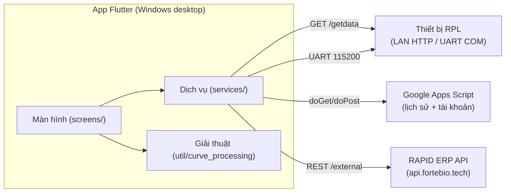

# FBT_RAPID — Tài liệu thiết kế (sơ đồ thuật toán, cấu trúc, giải thuật)

Bộ tài liệu mô tả **kiến trúc, luồng dữ liệu và các giải thuật** của app desktop
**FBT_RAPID** (Flutter / Windows) đồng hành thiết bị xét nghiệm Forte Rapid+.
Sơ đồ vẽ bằng **Mermaid** (GitHub/VS Code render trực tiếp).

> Tài liệu này tập trung "thiết kế & giải thuật". Danh sách tính năng đầy đủ xem
> [../README.md](../README.md); quy ước & gotcha cho người phát triển xem
> [../CLAUDE.md](../CLAUDE.md); hợp đồng API ngoài xem
> [api-guide-external-vi.md](api-guide-external-vi.md).

## Mục lục

| # | Tài liệu | Nội dung |
|---|----------|----------|
| 01 | [Kiến trúc tổng quan](01-kien-truc-tong-quan.md) | Phân lớp, khởi động, điều hướng, trạng thái toàn cục, theme/i18n |
| 02 | [Xác thực & phân quyền](02-xac-thuc-phan-quyen.md) | Đăng nhập (302 Apps Script), phiên, 3 vai trò, ma trận quyền |
| 03 | [Nguồn dữ liệu & lịch sử](03-nguon-du-lieu-va-lich-su.md) | Local/Google/RAPID ERP, `CloudHistoryClient`, model, cache, xuất file |
| 04 | [Giải thuật đường cong CT](04-giai-thuat-duong-cong-ct.md) | Pipeline raw→calibrate→baseline→Savitzky–Golay, công thức |
| 05 | [Theo dõi nhiệt độ realtime](05-theo-doi-nhiet-do.md) | Máy trạng thái cổng COM, ghép cặp TimeRT/TimeRB, watchdog |
| 06 | [Công cụ kỹ thuật](06-cong-cu-ky-thuat.md) | Chia sẻ cổng COM, đọc serial, nạp firmware (esptool) |
| 07 | [Chăm sóc khách hàng](07-cham-soc-khach-hang.md) | Tab CSKH: tra cứu thông tin máy, đọc log qua USB, bộ quét dấu hiệu lỗi, gửi log lên Engineer Server |
| 08 | [Trạm sản xuất ATE](08-tram-san-xuat-ate.md) | Tab Sản xuất (P0): kịch bản nạp · khai sinh · hồ sơ nghiệm thu, FPY/Pareto, hàng đợi offline |

**Kế hoạch đầy đủ (P0→P5):** [ATE — trạm test tự động cho sản xuất](plan/ate-san-xuat.md) — **P0 đã hiện thực**
(xem tài liệu 08); P1→P5 (tự kiểm quang/nhiệt, hiệu chuẩn tự động, burn-in, đa DUT) còn là kế hoạch.

**Kế hoạch (chưa hiện thực):** [Tài khoản cho quản lý & nhân viên xưởng](plan/tai-khoan-nha-may.md) —
thêm vai trò `manager`/`operator`, tách quyền theo việc, token theo phạm vi để máy trạm không cầm quyền ghi OTA.

## Sơ đồ cấp cao nhất

## Quy ước trong tài liệu

- **Comment & UI tiếng Việt** (theo phong cách dự án).
- Tên file mã nguồn ghi theo đường dẫn từ gốc repo, ví dụ `lib/services/...`.
- Sơ đồ Mermaid: `flowchart` (luồng), `sequenceDiagram` (trình tự), `stateDiagram-v2`
  (máy trạng thái), `classDiagram` (lớp/giao diện).
