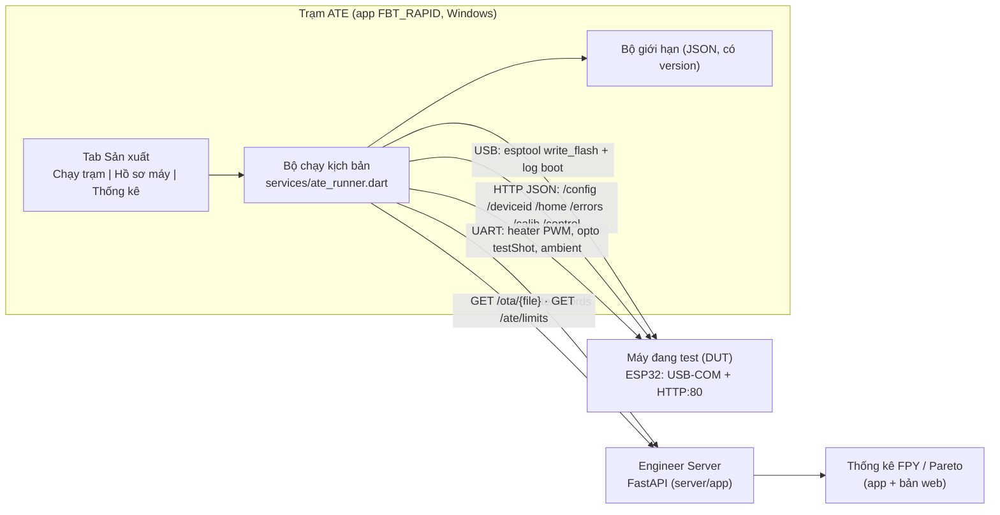
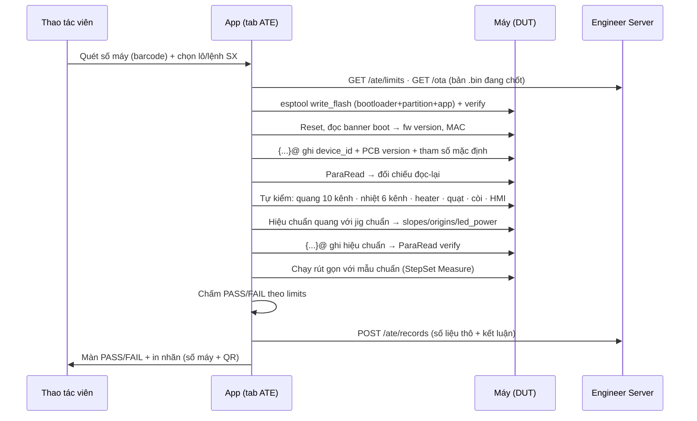

# Kế hoạch phát triển ATE — trạm test tự động cho sản xuất RapidPlus

> Bản định hướng (2026-08-22). Mục tiêu: đưa việc **nạp – khai báo – kiểm tra – hiệu chuẩn – nghiệm thu**
> máy Forte Rapid+ từ thao tác tay rời rạc thành **một trạm ATE** (Automated Test Equipment) chạy trong
> chính app `FBT_RAPID`, có hồ sơ truy vết từng máy trên Engineer Server.
>
> Đây là **kế hoạch**, chưa phải mô tả tính năng đang có. Tài liệu hiện trạng xem [../../README.md](../../README.md).
>
> **Cập nhật 2026-08-23 — đã đối chiếu firmware v2.4.4** (bản nguồn chủ dự án cung cấp; `FirmwareVer` ở
> `src/define.h:420`, bump ngày 2026-08-20). Lưu ý: bản chép trong `04.RapidPlus/03.Firmware/FBT-DXD` vẫn là
> **v2.4.3** — làm ATE phải bám bản 2.4.4. Kết luận lớn nhất: **máy đã có sẵn API HTTP/JSON** (AsyncWebServer
> + SSE) phủ phần lớn nhu cầu ATE → phương án đổi từ "UART + viết giao thức Serial mới" sang **HTTP-first**,
> phần firmware phải thêm rút xuống còn rất nhỏ (§7.1).

> **Cập nhật 2026-09-08 — TRẠM CHẠY ĐƯỢC TRÊN BẢN WEB.** `AteStation` đổi sang mức ý định
> (`chipInfo`/`flash`) + facade `ate_station.dart`/`ate_queue.dart` → web dùng **esptool-js + Web
> Serial**, firmware lấy từ **kho OTA của server**, và **một màn Chạy trạm** dùng chung hai nền tảng.
> Kịch bản 11 bước không đổi một dòng. Ba giới hạn của web (chưa verify sau nạp → FW-01 `info`; cổng
> phải xin quyền một lần; `GET /errors` bị chặn mixed content) ghi ở `docs/08` §8.
>
> **Cập nhật 2026-09-07 (chiều) — TIÊU CHUẨN ĐẶT THEO TỪNG LÔ SẢN XUẤT.** Yêu cầu của chủ dự án: ngưỡng
> không phải một bộ chung mà **admin đặt cho từng lô**. Đã hiện thực: `GET|PUT /ate/limits?batch=` +
> `GET /ate/limits/list` (server lùi dần bộ-của-lô → bộ chung → mặc định, trả kèm `source`), hồ sơ mang
> thêm trường `batch` (lọc được ở `/ate/records` và `/ate/stats`), màn **Tiêu chuẩn** trong tab Sản xuất
> cho nhân sự kỹ thuật (`canEditLimits`), ô **Lô sản xuất** trong Cấu hình trạm. Server **từ chối lưu
> nội dung khác dưới một `version` cũ** — vì hồ sơ chỉ ghi chuỗi đó.
>
> **P0 + P1 ĐÃ HIỆN THỰC.** P1 thêm 6 bước tự kiểm (OPT-01 · OPT-03 · TMP-01 ·
> FAN-01 · BUZ-01 · HMI-01) vào cùng `ate_runner.dart`, tổng 11 bước, 44 test. **Ngưỡng quang chưa chốt
> nên các bước đo trả `info` (ghi số) thay vì `pass`** — chạy 10–20 golden unit rồi `PUT /ate/limits` là
> tự chuyển sang chấm, không phải sửa code. Còn thiếu của P1: **in nhãn QR** (EOL-01) — chờ chốt máy in.
>
> **P0 ĐÃ HIỆN THỰC.** Tab **Sản xuất** có trong app (`lib/screens/ate_screen.dart`),
> kịch bản 5 bước ở `lib/services/ate_runner.dart` (thuần Dart, 20 test), hồ sơ trên server ở `/ate/*`
> (`server/app/main.py`, 9 test). Tài liệu thiết kế phần đã làm: [../08-tram-san-xuat-ate.md](../08-tram-san-xuat-ate.md);
> phần server: `server/docs/plan/ate-ho-so-nghiem-thu.md` + `server/docs/history/2026-09-07.md`.
> Ba chỗ **cố ý lệch** tài liệu này (lý do ghi tại chỗ trong mã):
> 1. Hồ sơ lưu **file JSON** trong `FBT_ATE_DIR`, chưa dùng bảng `ate_records` (§7.2) — khỏi migration +
>    `GRANT` trên box production, hợp đồng REST giữ nguyên khi đổi sau.
> 2. **`PUT /ate/records`** thay cho `POST` (§7.2) — không phụ thuộc thứ tự đăng ký route so với catch-all.
> 3. **FW-02 chạy trước FW-01** (§6) — bo chết/cáp không có dây data thì biết sau 2 giây.
>
> Còn phải làm trước khi chạy lô đầu: đối chiếu **tên khoá JSON** cấu hình Serial với firmware, đo golden
> unit để chốt ngưỡng P1, chốt quy tắc số máy + QR, và **deploy server** (người chạy `systemctl restart`).

---

## 1. Mục tiêu & thước đo

| Mục tiêu | Thước đo (đo trước khi làm để có mốc so sánh) |
|---|---|
| Rút ngắn thời gian nghiệm thu 1 máy | phút/máy (hiện tại: **cần đo**) → mục tiêu giảm ≥ 50% |
| Không còn máy ra xưởng thiếu/sai cấu hình | 100% máy có `device_id`, `slopes`, `led_power` đọc-lại-khớp |
| Phát hiện lỗi tại xưởng thay vì ngoài thị trường | FPY (First Pass Yield) theo tuần, tỉ lệ RMA/1000 máy |
| Truy vết được 1 máy bất kỳ trong < 1 phút | mọi máy có "hồ sơ khai sinh" tra theo số máy |
| Biết lô linh kiện nào đang trôi | biểu đồ xu hướng dark/bright count, dốc gia nhiệt theo thời gian |

Nguyên tắc xuyên suốt: **mọi phép đo phải ra một con số kèm ngưỡng**, không phải "nhìn thấy sáng là được".
Có số thì mới vẽ được xu hướng, mới bắt được lô LED yếu dần **trước khi** nó thành hàng trả về.

---

## 2. Phạm vi

**Trong phạm vi**

- Một tab **Sản xuất (ATE)** trong app `FBT_RAPID` (Windows desktop), chỉ nhân sự (`isStaff`).
- Trình tự trạm: quét số máy → nạp firmware → ghi cấu hình → tự kiểm tra phần cứng → hiệu chuẩn quang →
  kết luận PASS/FAIL → đẩy hồ sơ lên Engineer Server.
- Bộ giới hạn (limits) có **đánh version**, tải từ server, ghi vào từng hồ sơ.
- Bảng + API hồ sơ ATE trên Engineer Server (`server/app/`) và màn thống kê FPY/Pareto.
- Giao thức `TEST` mới trên firmware để máy trả số liệu **máy đọc được**.

**Ngoài phạm vi (tới khi có yêu cầu tường minh)**

- Phần mềm MES/ERP đầy đủ (kế hoạch sản xuất, kho, công đoạn lắp ráp).
- Hiệu chuẩn có chứng chỉ liên kết chuẩn quốc gia — ATE dùng **chuẩn nội bộ**.
- Bàn test cơ khí tự động (robot, băng chuyền). Vẫn là người đặt máy vào jig.
- Viết lại kiến trúc firmware. Giao thức `TEST` là **thêm vào**, không thay thế.

---

## 3. Hiện trạng — cái gì dùng lại được

Điểm mạnh lớn nhất: gần như **toàn bộ lớp thấp đã có sẵn trong app**; ATE chủ yếu là *lớp kịch bản + hồ sơ*.

| Cần cho ATE | Đã có ở đâu | Ghi chú |
|---|---|---|
| Nạp firmware ESP | `lib/screens/flasher_screen.dart` | esptool đi kèm app (installer), offsets theo chip đã có |
| Mở/đọc/ghi COM, chống auto-reset | `lib/services/temperature_serial.dart`, `lib/screens/serial_console_screen.dart` | đã ghim `dtr/rts = off` |
| Lọc cổng USB-serial | `lib/util/serial_ports.dart` | bỏ cổng native/Bluetooth |
| Đọc 6 kênh nhiệt realtime | `TempPortReader` + `lib/services/temp_types.dart` | parse `TimeRT`/`TimeRB` |
| Đa cổng COM song song | tab Log nhiệt (nhiều `TempPortReader`) | nền tảng cho ATE **đa DUT** |
| Nói chuyện Engineer Server | `lib/services/fbt_api.dart` | Bearer token; đã có `/devices`, `/sessions`, `/ota` |
| Kho firmware + chọn bản | tab Quản lý máy (`manager_machine_screen.dart`) | trạm ATE lấy `.bin` từ đây |
| Mã lỗi cảm biến của máy | `SensorError` (`lib/services/fbt_api.dart:36`) | mã 4 số `module*1000 + type*100 + step*10 + slot` |
| Phân quyền, i18n, theme | `session_store.dart`, `util/i18n.dart`, `theme/app_theme.dart` | tab ATE gate bằng `canWrite` |

Phía firmware (`04.RapidPlus/03.Firmware/FBT-DXD`) đã có sẵn các "chân" điều khiển qua UART
(`src/ForteSetting.cpp` + `src/sensor6035.cpp::OptoCommandProcess`):

| Lệnh | Tác dụng | Dùng cho ATE ngay? |
|---|---|---|
| `{...}@` (JSON) | ghi `slopes`/`origins`/`led_power`/`device_id`/tham số thuật toán vào EEPROM | ✅ |
| `ParaRead` | in lại toàn bộ tham số EEPROM | ✅ (đọc-lại để verify) |
| `TemperatureOutput` | bật/tắt xuất 6 kênh nhiệt | ✅ |
| `0`–`9` | `testShot(slot)`: bật LED slot, đo quang, in `{Green: <mean>}` | ⚠️ được, nhưng **không kèm số slot** |
| `A` `B` `C` / `E` `F` | đặt PWM 3 heater đáy / 2 hotlid | ✅ |
| `R` | cấu hình lại toàn bộ cảm biến quang | ⚠️ output dạng text |
| `M` | in JSON hiệu chuẩn (`slopes`, `origins`, `led_power`) | ✅ |
| `Fan On` / `Buzzer ...` | quạt / còi | ✅ |
| `HeaterSimulate`, `StepSet Amp\|Measure` | bỏ qua giai đoạn để chạy nhanh | ✅ (rút ngắn tact time) |
| `Res` | khởi động lại | ✅ |
| `P` | đặt PWM LED — **chặn chờ `Serial.available()`** (`src/sensor6035.cpp:2028`) | ❌ **cấm dùng** trước khi sửa firmware |

### 3.1 Bề mặt HTTP có sẵn trên máy — phần quan trọng nhất (kiểm trên v2.4.4)

Firmware chạy `AsyncWebServer(80)` + SSE `/events`, lên khi vào WiFi STA **hoặc** khi máy tự bật SoftAP.
Đây là kênh **máy đọc được** (JSON), tốt hơn hẳn parse log UART tự do:

| Endpoint | Trả về / tác dụng | Dùng cho phép đo |
|---|---|---|
| `GET /home` | `device` (mã máy), `net{ap,ssid,ip,gw,dns,rssi}`, `temps{lysis,ampLeft,ampRight,topLeft,topRight}`, `status{phase,title,sub}`, `buttons`, `actions`, `cfg{seq,state}` | TMP-01, NET-01, theo dõi trạng thái mọi bước |
| `GET /events` (SSE) | đẩy `home` mỗi 1 s | thay việc poll khi chạy dài |
| `GET /config` | **toàn bộ `parameter`** — `device ID`, `para version`, `PCB version`, `opto calibration{slopes, origins, LED power}`, `parameters{...}`, PID, ngưỡng nhiệt | ID-01/02, CAL-01 **đọc-lại verify** |
| `POST /config` | validate → **xếp hàng** → SettingTask áp bằng `JsonDataConfig()`; chỉ áp các key có mặt | ghi tham số lô, ghi hệ số hiệu chuẩn |
| `POST /deviceid` | ghi mã máy, **có busy gate (409)** | ID-01 (đường được gác, khác đường Serial không gác) |
| `GET /errors` | 10 slot `{code, text}`, mã **4 chữ số y hệt màn TFT** | OPT-01, chẩn đoán FAIL |
| `GET /slots` | `{name, sample, ct, result}` ×10 + `ready` | RUN-01 |
| `GET /curve` | `{count, intervalMs, series:[[…]×10]}` đường cong **đã calibrate** | RUN-01, đối chiếu chất lượng quang |
| `POST /control?btn=red\|green\|white` | **bấm nút vật lý từ xa** | chạy run không cần người bấm |
| `POST /calib?action=start\|next\|measure\|slot&n=\|cancel` | điều khiển **wizard hiệu chuẩn** đang có trên máy (proxy bấm nút) | CAL-01 |
| `GET /wifiscan` · `POST /wifi` | quét/khai báo WiFi | NET-01 |
| `GET /ota` | `version` (vd `v2.4.4`), `state`, `online`, `hasUpdate` | FW-01 xác nhận version sau nạp |
| `POST /otaupload` | **nạp .bin thẳng qua HTTP** | cập nhật firmware máy đã sống (không thay được lần nạp đầu) |
| `POST /reviewlast?go=1` | nạp lại run cuối từ EEPROM (**~8 giây**) | đọc lại kết quả sau khi tắt/bật |

⚠️ Các route này **không có xác thực** (chỉ có busy-gate). Trong xưởng là tiện; ngoài thị trường thì bất kỳ
ai cùng LAN cũng bấm được nút và ghi được EEPROM của máy — nên ghi vào sổ rủi ro sản phẩm, không phải việc
của ATE nhưng ATE là chỗ phát hiện ra.

Kết luận sau khi đối chiếu 2.4.4: **P0, P1 và phần lớn P2 làm được mà KHÔNG đụng firmware.** Việc còn thiếu
thật sự chỉ là 3 phép đo chủ động (§7.1), không phải "viết một giao thức mới".

---

## 4. Kiến trúc đề xuất



**Hai kênh, chia việc rõ ràng** (thay cho phương án UART-only ở bản đầu):

| Kênh | Dùng cho | Vì sao |
|---|---|---|
| **USB-COM** | nạp firmware lần đầu (esptool), đọc log boot, các phép đo **chủ động** chưa có route HTTP (PWM heater `A`–`F`, `testShot` `0`–`9`), kênh nhiệt `Ambient` | bo mạch trắng chưa có WiFi; và 3 thứ này firmware chỉ mở trên Serial |
| **HTTP:80** | mọi thứ còn lại: đọc/ghi tham số, mã máy, trạng thái, nhiệt, lỗi, kết quả, đường cong, hiệu chuẩn, bấm nút | JSON có cấu trúc, có busy-gate 409, có hàng đợi ghi EEPROM — không phải parse text |

Đường mạng: **cho DUT vào LAN xưởng** (`POST /wifi` một lần trong bước NET-01) rồi gọi theo IP. Đừng dựa vào
SoftAP của máy làm đường chính: một PC chỉ nối được **một** AP tại một thời điểm → đa DUT là bất khả. SoftAP
chỉ là đường dự phòng khi máy chưa vào được LAN.

Ba quyết định nền:

1. **ATE nằm trong app hiện có, không viết app riêng.** Serial, esptool, HTTP client, đăng nhập, theme đã
   có sẵn; tách ra là chép lại và phải bảo trì hai nơi. Chế độ trạm chỉ khác ở *giao diện*: một màn kiểu
   kiosk, chữ to, PASS/FAIL rõ, thao tác viên không cần hiểu kỹ thuật.
2. **Nguồn chân lý của kết quả test là server, không phải PC trạm.** PC ghi file cục bộ trước (chạy được
   khi rớt mạng) rồi đẩy lên, có hàng đợi gửi lại — đúng mô hình "file trước, DB sau" mà `server/app` đang
   dùng cho dữ liệu đo.
3. **Giới hạn (limits) là dữ liệu có version, không phải hằng số trong code.** Mỗi hồ sơ ghi kèm
   `limits_version` + `fw_version`. Đổi ngưỡng phải là hành động có chủ đích của `root`, và máy đã nghiệm
   thu vẫn tra lại được nó bị chấm theo ngưỡng nào.

---

## 5. Trình tự một máy qua trạm



Bước nào FAIL thì **dừng đúng bước đó**, hiện nguyên nhân bằng tiếng Việt kèm số đo + ngưỡng, cho **chạy
lại riêng bước đó**; mọi lần chạy lại đều vào hồ sơ (retry cũng là dữ liệu — máy phải thử 3 lần mới đạt là
máy đáng nghi).

---

## 6. Danh mục phép đo (test matrix)

`A` = tự động hoàn toàn · `BT` = bán tự động (người xác nhận). Cột **Pha** xem §8.

| Mã | Hạng mục | Cách đo | Tiêu chí (cần chốt số) | Mức | Pha |
|---|---|---|---|---|---|
| FW-01 | Nạp firmware | USB: esptool 3 file + `verify`; ghi **sha256 của .bin** vào hồ sơ | exit code 0, verify khớp, sha256 khớp bản đã duyệt | A | P0 |
| FW-02 | MAC / chip / flash | USB: esptool `read_mac`, `flash_id` | đúng chip, flash 8 MB, MAC chưa trùng trong DB | A | P0 |
| BOOT-01 | Khởi động sạch | USB: đọc UART 30 s sau reset; sau khi có mạng đối chiếu `GET /ota` → `version` | **không** `Guru Meditation` / `Brownout` / `invalid header`; `version` đúng bản vừa nạp | A | P0 |
| ID-01 | Ghi số máy + PCB version | `POST /deviceid` (có busy-gate) hoặc `{...}@` khi chưa có mạng; đọc-lại `GET /config` | đọc-lại khớp 100%; số máy ≤ **9 ký tự** (§9) | A | P0 |
| ID-02 | Tham số mặc định của lô | `POST /config` (chỉ gửi key cần; firmware tự chèn `para version`) | `GET /config` khớp; `cfg.state == applied` trong `/home` | A | P0 |
| OPT-01 | 10 cảm biến quang có mặt | `GET /errors` sau một lượt đọc + `R` trên Serial | đủ 10 kênh, không mã lỗi module Light | A | P1 |
| OPT-02 | Nhiễu nền (LED tắt) từng slot | Serial (LED off + đo) → **cần route `POST /test/opto`** (§7.1) | trong `[dark_min, dark_max]` | A | P2 |
| OPT-03 | Tín hiệu sáng từng slot | Serial `0`–`9` (`testShot`) → sau P2 dùng `POST /test/opto` | trong `[bright_min, bright_max]`; lệch giữa 10 kênh ≤ x% | BT→A | P1→P2 |
| OPT-04 | Nhiễu chéo giữa slot | bật LED slot i, đọc i±1 (cần route mới) | ≤ x% tín hiệu chính | A | P2 |
| OPT-05 | Tuyến tính LED (3 mức PWM) | quét `LED power` qua `POST /config` + đo | R² ≥ 0.99, dốc trong dải | A | P3 |
| CAL-01 | Hiệu chuẩn quang | **`POST /calib?action=start\|slot&n=\|measure\|next`** lái wizard sẵn có; verify `GET /config` | wizard chạy hết, `slopes` mới trong dải cho phép, đọc-lại khớp | A | P3 |
| TMP-01 | Cảm biến nhiệt | `GET /home` → `temps` (5 kênh) + UART `TemperatureOutput` cho kênh **Ambient** | không `NaN`/`-127`; lệch với nhiệt phòng ≤ 3 °C; lệch giữa kênh ≤ 2 °C | A | P1 |
| TMP-02 | Heater lên nhiệt | Serial `A`/`B`/`C`/`E`/`F` PWM x% trong t giây → **cần route `POST /test/heat`** (§7.1) | dốc °C/phút trong dải từng kênh (bắt heater đứt, đấu nhầm, kém tiếp xúc) | A | P2 |
| TMP-03 | Cắt quá nhiệt | kịch bản an toàn | cắt đúng ngưỡng (99 °C đáy / 85 °C hotlid theo firmware Production) | BT | P4 |
| FAN-01 | Quạt | Serial `Fan On` + theo dõi hạ nhiệt qua `GET /home` | có hạ nhiệt / người xác nhận | BT | P1 |
| BUZ-01 | Còi | Serial `Buzzer` | người xác nhận | BT | P1 |
| HMI-01 | Màn TFT + 3 nút | `POST /control?btn=` (kiểm đường lệnh) + người bấm nút thật theo checklist | màn đổi đúng, 3 nút vật lý ăn | BT | P1 |
| NET-01 | WiFi + đường đẩy dữ liệu | `POST /wifi` (SSID xưởng) → `GET /home` `net.rssi/ip` → ép 1 lần gửi | RSSI ≥ ngưỡng; server nhận trong 30 s, có cờ `stage=ate` (§9) | A | P2 |
| RUN-01 | Chạy rút gọn mẫu chuẩn | `POST /control?btn=` chạy run (Serial `StepSet Measure` + `HeaterSimulate` để rút ngắn); đọc `GET /slots` + `GET /curve` | kết quả P/N đúng kỳ vọng, CT trong dải, đường cong đủ điểm | A | P3 |
| BRN-01 | Chạy rà (burn-in) | n giờ liên tục, theo dõi qua `/events` | không lỗi, không tự reset | A | P4 |
| EOL-01 | Hồ sơ + nhãn | `POST /ate/records`, in QR | có bản ghi trên server | A | P1 |

Mọi ô "cần chốt số" phải điền bằng **dữ liệu đo trên 10–20 máy tốt đã biết** (golden unit), không đặt theo
cảm tính. Việc này chạy song song với code và là việc dễ bị bỏ quên nhất.

---

## 7. Hợp đồng cần thêm

### 7.1 Firmware — chỉ còn 3 phép đo chủ động cần thêm (P2)

Bản đầu đề xuất một giao thức `TEST` mới trên Serial. Sau khi đọc mã 2.4.4: **không cần nữa.** `/config`,
`/deviceid`, `/errors`, `/home`, `/curve`, `/control`, `/calib` đã phủ gần hết, lại đi qua đúng cơ chế
busy-gate + hàng đợi EEPROM firmware đã dựng sẵn. Mở thêm một kênh với luật riêng chỉ tạo thêm chỗ để sai.

Đề xuất mới: **thêm 3 route HTTP** cùng phong cách các route Setting hiện có (validate ở AsyncTCP, việc nặng
đẩy sang task, trả JSON):

| Route | Việc | Ràng buộc bắt buộc |
|---|---|---|
| `POST /test/opto?slot=0..9&led=<pwm>&dark=0\|1` | đo một slot (LED bật theo `led`, hoặc để tắt khi `dark=1`) → `{slot, led, mean, ms}` | chỉ khi `!isBusy()`, ngược lại 409; luôn tắt LED khi thoát |
| `POST /test/heat?ch=A..F&pwm=<0..255>&ms=<...>` | đặt PWM một heater trong `ms` rồi **tự tắt**, trả nhiệt đầu/cuối | `ms` chặn trần; hard-limit vẫn thắng; hết giờ là tắt **kể cả khi mất kết nối** |
| `GET /selftest` | gói tự kiểm (I2C 10 kênh · 6 cảm biến nhiệt · EEPROM · heap · flash · MAC) → 1 JSON tổng | không chạm heater; chạy ở màn idle |

Ba lý do chọn HTTP thay vì Serial: (1) đã có sẵn `isBusy()`/409 + `drainPending()` — khỏi nghĩ lại chuyện
tranh chấp EEPROM giữa các task; (2) không phải đụng `OptoCommandProcess`, nơi `P` đang **chặn**
`while (Serial.available() == 0)` (`src/sensor6035.cpp:2028`) — sửa chỗ đó rủi ro hơn thêm route mới;
(3) một kênh duy nhất thì **đa DUT chỉ là nhiều địa chỉ IP**, không phải nhiều cổng COM.

`GET /selftest` đáng làm sớm vì **dùng lại được ngoài xưởng**: kỹ thuật viên bảo hành mở trình duyệt vào máy
là có ngay bảng tình trạng.

Giữ nguyên trên Serial (không cần sửa gì): `A`–`F`, `0`–`9`, `Fan`, `Buzzer`, `TemperatureOutput` — dùng cho
P1 khi 3 route trên chưa có, và cho máy chưa vào được mạng.

Nơi hiện thực: `FBT-DXD` v2.4.4 (bản đang xuất xưởng), thiết kế để bê sang `FBT-RapidPlus-Production`. Logic
chấm ngưỡng nằm ở **app**, firmware chỉ trả số — đổi ngưỡng không phải nạp lại firmware.

⚠️ **Kỷ luật version** (bài học ghi ngay trong `src/define.h:424`, 2026-08-20): không bao giờ build lại dưới
một chuỗi version đã phát ra máy — `fbt_v2.4.5.bin` trên server từng là **image khác** với source v2.4.5, và
`sessions.version` không phân biệt được. Vì vậy ATE ghi **sha256 của .bin** vào hồ sơ, không chỉ chuỗi
`v2.4.x`.

### 7.2 Server — hồ sơ ATE

```sql
CREATE TABLE ate_records (
  id           bigint GENERATED ALWAYS AS IDENTITY PRIMARY KEY,
  sn           text NOT NULL,             -- số máy (= device_id)
  mac          text,
  station      text NOT NULL,             -- mã trạm/PC
  operator     text NOT NULL,
  fw_version   text, pcb_version text,
  limits_ver   text NOT NULL,
  started_at   timestamptz NOT NULL,
  finished_at  timestamptz NOT NULL,
  verdict      text NOT NULL,             -- pass | fail | aborted
  fail_code    text,                      -- mã bước hỏng đầu tiên, để vẽ Pareto
  steps        jsonb NOT NULL,            -- [{code,name,value,unit,min,max,verdict,raw}]
  calib        jsonb,                     -- slopes/origins/led_power đã ghi
  body_sha256  bytea NOT NULL UNIQUE      -- gửi lại không sinh bản ghi trùng
);
CREATE INDEX ON ate_records (sn, started_at DESC);
CREATE INDEX ON ate_records (started_at DESC) WHERE verdict = 'fail';
```

Endpoint (giữ đúng kiểu Bearer đang dùng):

| Method | Path | Việc |
|---|---|---|
| `POST` | `/ate/records` | trạm đẩy hồ sơ (idempotent theo `body_sha256`) |
| `GET` | `/ate/records?sn=&from=&to=&verdict=&page=&limit=` | tra cứu, phân trang như `/sessions` |
| `GET` | `/ate/records/{id}` | chi tiết đầy đủ |
| `GET` | `/ate/sn/{sn}` | **hồ sơ khai sinh** + mọi lần test lại của một máy |
| `GET` | `/ate/stats?from=&to=` | FPY, sản lượng/ngày, Pareto `fail_code` |
| `GET` `PUT` | `/ate/limits` | bộ giới hạn hiện hành (PUT chỉ `root`) |

⚠️ `server/app/main.py:151` có route bắt-hết `POST /{_path}` cho `/ingest` — `POST /ate/records` **phải khai
báo trước nó**, nếu không hồ sơ ATE rơi vào đường nhận dữ liệu đo.

### 7.3 App — màn hình

Tab **Sản xuất** (chỉ `isStaff`), theo đúng mẫu segmented của tab Kỹ Thuật / Quản lý máy:

- **Chạy trạm** — chọn cổng COM (nhiều cổng nếu đa DUT), ô quét số máy tự focus, nút BẮT ĐẦU lớn, danh sách
  bước chạy tới đâu, kết luận PASS/FAIL chiếm nửa màn, nút in nhãn, nút chạy lại một bước.
- **Hồ sơ máy** — gõ/quét số máy → hồ sơ khai sinh, các lần test, hệ số hiệu chuẩn, đối chiếu với dữ liệu đo
  ngoài thị trường (`/sessions` đã có).
- **Thống kê** — FPY theo ngày/lô, Pareto mã lỗi, xu hướng các số đo chính.

Tệp mới dự kiến: `lib/screens/ate_screen.dart`, `lib/services/ate_runner.dart` (bộ chạy kịch bản),
`lib/services/ate_api.dart`, `lib/models/ate_record.dart`.
Giữ `ate_runner` **không phụ thuộc Flutter** để viết unit test cho phần chấm ngưỡng — phần này sai thì hỏng
cả lô, không nên chỉ kiểm bằng cách cắm máy thật.

⚠️ **Bắt buộc cắt native cho bản web**: ATE dùng `dart:io` + `flutter_libserialport`, kéo thẳng vào cây
import là **hỏng `flutter build web`**. Theo đúng mẫu đang dùng
(`home_shell.dart:15`: `import 'tech_screen.dart' if (dart.library.html) 'tech_screen_web.dart'`) → phải có
`lib/screens/ate_screen_web.dart` (cùng tên class + constructor) hiển thị màn "chỉ chạy trên bản desktop",
hoặc bản Web Serial rút gọn nếu sau này cần. Thao tác file đi qua `util/platform_files.dart`, KHÔNG import
`dart:io` trực tiếp.

---

## 8. Lộ trình

| Pha | Nội dung | Cần firmware? | Ước lượng | Giá trị thu được ngay |
|---|---|---|---|---|
| **P0** ✅ | Trạm "nạp + khai sinh": FW-01/02, BOOT-01, ID-01/02 (đi đường **Serial `{...}@` + `ParaRead`**, không cần máy có mạng), hồ sơ cục bộ + đẩy server | Không | **xong 2026-09-07** | Hết nhầm bản firmware, hết sai/thiếu số máy, có truy vết |
| **P1** ✅ | Tự kiểm bán tự động: OPT-01 (`/errors` + lùi UART `R`), TMP-01 (**UART 6 kênh**, không dùng `/home`), OPT-03 (Serial `0`–`9`), FAN/BUZ/HMI checklist | Không | **xong 2026-09-07** (trừ in nhãn QR của EOL-01) | Thay biên bản giấy bằng số liệu; ngưỡng chưa chốt thì GHI SỐ để chốt sau |
| **P2** | 3 route test mới + tự động hoá: OPT-02/04, TMP-02, NET-01 | **Có** — chỉ 3 route (§7.1) | ~1–1.5 tuần app + **~3–5 ngày firmware** | Bắt lỗi heater/quang mà mắt không thấy |
| **P3** | Hiệu chuẩn quang tự động: lái wizard `/calib` sẵn có (CAL-01, OPT-05) + RUN-01 với mẫu chuẩn | Không (dùng route sẵn có) | ~1.5–2 tuần + thời gian làm jig | Bỏ được công đoạn hiệu chuẩn tay — phần tốn người nhất |
| **P4** | Burn-in, kiểm cắt quá nhiệt, đa DUT (4–8 máy/PC) | Có | ~2 tuần | Tăng sản lượng/người mà không tăng trạm |
| **P5** | Thống kê xu hướng, cảnh báo lô linh kiện trôi, đối chiếu ATE ↔ dữ liệu thị trường | Không | ~1–1.5 tuần | Chuyển từ "phát hiện lỗi" sang "chặn lỗi trước khi xảy ra" |

Ước lượng là **công của 1 người**, chưa gồm thời gian đo golden unit để chốt ngưỡng và thời gian gia công
jig — hai thứ này thường mới là đường găng thật, không phải phần code.

Không đảo thứ tự P2 lên trước P0/P1: hồ sơ + truy vết tạo giá trị ngay cả khi phần tự kiểm còn thô, còn tự
động hoá mà không có hồ sơ thì chỉ là màn hình bấm cho vui.

---

## 9. Rủi ro & bẫy đã biết (rút từ chính mã nguồn hiện tại)

1. **Số máy tối đa 9 ký tự.** `char device_id[10]` (`src/define.h:169`); firmware từ chối ID dài hơn và giữ
   `UNSET`. Quy tắc đặt số máy/QR phải chốt theo ràng buộc này **trước khi in nhãn hàng loạt**.
2. **Lệnh `P` treo `SettingTask`** (`src/sensor6035.cpp:2028` chặn `while(Serial.available()==0)`). ATE
   tuyệt đối không gửi `P` cho tới khi firmware bỏ chặn.
3. **`testShot` không echo slot** → nếu chỉ dựa vào thứ tự gửi, một dòng log xen giữa là lệch kết quả sang
   slot khác mà vẫn "PASS". Đây là kiểu sai nguy hiểm nhất: sai âm thầm. P1 phải parse phòng thủ (gửi 1
   slot, chờ đúng 1 dòng `{Green: …}`, timeout thì FAIL); P2 thay bằng `#ATE` có `slot`.
4. **Quang cần làm nóng ~900 giây tính từ lúc BOOT** (ghi chú trong `src/define.h`), không phải từ lúc bắt
   đầu đo. Nạp xong là đồng hồ preheat mới chạy → làm tuần tự thì tact time chết ở đây. Xử lý: nạp máy #2
   trong lúc máy #1 preheat (xếp lịch nhiều DUT), và đo lại xem phép đo ATE thật sự cần preheat bao lâu
   (khác yêu cầu của phép đo lâm sàng).
5. **Cổng COM là tài nguyên độc quyền.** esptool cần DTR/RTS để reset; phần đọc lại cần DTR/RTS **off**
   (`lib/services/temperature_serial.dart`). Hai pha phải tách bạch, không mở chồng — theo đúng mẫu cờ
   `active:` của `tech_screen.dart`.
6. **Ghi EEPROM phải tuần tự.** `JsonDataConfig()` / `saveSettingDevice()` mỗi hàm tự `EEPROM.begin/end`;
   bắn liên tiếp nhiều lệnh cấu hình mà không chờ xác nhận có thể giẫm lên nhau. ATE gửi từng lệnh, chờ ACK,
   rồi `ParaRead` đối chiếu.
7. **Máy trong xưởng sẽ tự đẩy dữ liệu test lên hệ thống thật.** Firmware gửi tới 3 đích
   (`src/Bluetooth.cpp::postJsonToAllTargets`: Google Sheet · ingest Engineer Server · ERP). Cấu hình WiFi
   xưởng ngay từ đầu là dữ liệu test lẫn vào dữ liệu lâm sàng. Xử lý: chỉ cấu hình WiFi ở bước NET-01, dùng
   SSID xưởng riêng, và **thêm cờ `stage=ate`** (hoặc `kitId` riêng) để lọc được ở server. Phải chốt trước
   khi bật NET-01.
8. **Token trạm.** App trạm nạp token qua `--dart-define=FBT_TOKEN`; không dùng chung token bản web (bản web
   cố tình không nhúng token). Trạm nên có token riêng để thu hồi được nếu mất máy.
9. **Kiểm soát thay đổi.** Đây là thiết bị chẩn đoán: đổi ngưỡng hoặc đổi bản firmware giữa lô mà không ghi
   lại là mất khả năng giải trình. Vì thế `limits_ver` + `fw_version` nằm trong **mọi** bản ghi, và sửa
   limits là quyền `root`.
10. **Kết quả PASS/FAIL không được sửa tay.** Cần "chạy lại" thì tạo bản ghi mới; không có nút sửa verdict.

Bổ sung sau khi đọc **v2.4.4** (những cái này chỉ lộ ra khi đọc mã, không có trong tài liệu API nào):

11. **`POST /config` chỉ XẾP HÀNG — HTTP 200 KHÔNG có nghĩa là đã ghi.** AsyncTCP không được đụng EEPROM nên
    route chỉ validate + enqueue; SettingTask áp sau, và **bỏ luôn request nếu một run bắt đầu chen giữa**.
    ATE phải theo `cfg.seq` + `cfg.state` (`pending|applied|busy`) trong `/home`, chờ `applied`, rồi mới
    `GET /config` đối chiếu. Tin mã 200 là ghi hồ sơ "đã cấu hình" cho máy chưa cấu hình.
12. **Thiếu key `"para version"` → `JsonDataConfig()` không áp gì mà vẫn trả true** (im lặng giả vờ thành
    công). Đi đường `POST /config` thì firmware tự chèn; đi đường Serial `{...}@` thì **ATE phải tự chèn**.
13. **`/home` chỉ có 5 kênh nhiệt** (lysis, ampLeft, ampRight, topLeft, topRight) — **thiếu `Ambient`**. Muốn
    đủ 6 kênh như tab Log nhiệt thì vẫn phải đọc UART `TimeRT`/`TimeRB`.
14. **`/calib` là proxy BẤM NÚT, không phải API dữ liệu**: `start` chỉ chạy từ màn idle (409 nếu khác),
    `slot&n=` chỉ khi đang ở màn chọn slot, `cancel` chỉ khi đang trong luồng calib. ATE phải bám `status`
    trong `/home` để biết wizard đang ở bước nào — kịch bản chạy mù sẽ 409 hàng loạt.
15. **Card Calib và Device ID đang bị ẩn trên web UI** (comment trong `CARDS`, ẩn 2026-08-05) nhưng **route
    firmware vẫn sống** → ATE vẫn dùng được. Rủi ro thật: ai đó "dọn code chết" xoá mất route là gãy trạm →
    phải ghi vào doc firmware rằng ATE phụ thuộc `/calib` + `POST /deviceid`.
16. **Toàn bộ route của máy không có xác thực.** Trong xưởng thì tiện; nhưng ai cùng LAN cũng bấm được nút và
    ghi được EEPROM. Trạm ATE nên nằm ở **VLAN/SSID riêng**, và đây là việc nên đưa vào sổ rủi ro sản phẩm.
17. **`/otaupload` không thay được lần nạp đầu**: bo mạch trắng chưa có firmware → chưa có WiFi → vẫn phải
    esptool qua USB. Chỉ từ lần nâng cấp thứ hai trở đi HTTP mới nhanh hơn cắm cáp.
18. **`POST /reviewlast` mất ~8 giây** (đọc EEPROM + chạy lại thuật toán 10 slot) và `/slots ready=false`
    trong lúc đang chạy run — đặt timeout ngắn rồi chấm FAIL là chấm oan.

---

## 10. Phần cứng / jig cần chuẩn bị

| Hạng mục | Dùng cho | Ghi chú |
|---|---|---|
| Hub USB có nguồn ngoài (≥ 8 cổng) | đa DUT (P4) | dán nhãn cổng cố định để map COM ↔ vị trí |
| Jig định vị + **tấm chuẩn quang** cho 10 slot | OPT-02/03, CAL-01 | quyết định độ lặp lại của cả hệ; **hạng mục quan trọng nhất** |
| Nắp che tối (dark cap) | OPT-02 | đo nhiễu nền ổn định |
| Mẫu chuẩn (positive/negative) | RUN-01 | cần nguồn cung ổn định + hạn dùng |
| Đầu dò nhiệt tham chiếu (PT100/can nhiệt qua USB DAQ) | TMP-01/02 | không có thì chỉ kiểm tương đối, không kiểm được sai số tuyệt đối |
| Máy quét mã vạch USB (HID) | quét số máy | hoạt động như bàn phím, không cần driver |
| Máy in nhãn (TSC/Zebra) | EOL-01 | in số máy + QR |
| 10–20 **golden unit** đã biết tốt | chốt ngưỡng | thiếu bước này thì mọi ngưỡng là phỏng đoán |

---

## 11. Chưa chốt — cần quyết

- [ ] **Sản lượng mục tiêu** (máy/tháng) — quyết định 1 trạm hay đa DUT ngay từ P1.
- [ ] **Firmware xuất xưởng 6–12 tháng tới**: tiếp tục `FBT-DXD` hay chuyển `FBT-RapidPlus-Production`?
      Quyết định nơi hiện thực giao thức `TEST`.
- [ ] **Quy tắc số máy** (≤ 9 ký tự) + định dạng QR + ai cấp số.
- [ ] **Nguồn tấm chuẩn quang / mẫu chuẩn** và chu kỳ kiểm tra lại chuẩn.
- [ ] **Xưởng có mạng tới Engineer Server không?** Nếu không, trạm phải chạy offline hoàn toàn và đồng bộ
      theo mẻ (P0 đã tính đường này, nhưng cần biết để xếp ưu tiên).
- [ ] **Ai ký duyệt ngưỡng** của từng phép đo (kỹ thuật? QA?).
- [ ] Có gắn thêm **cầu chì nhiệt phần cứng** không (câu hỏi đang treo trong `SCOPE.md` của firmware
      Production) — ảnh hưởng trực tiếp tới hạng mục TMP-03.
- [ ] **Có bật lại card Calib + Device ID trên web UI không?** (đang comment từ 2026-08-05). ATE dùng route
      firmware nên không phụ thuộc UI, nhưng bật lại thì thao tác viên có đường tay khi trạm hỏng.
- [ ] **Mạng xưởng**: VLAN/SSID riêng cho DUT + trạm? (liên quan rủi ro §9.16 và bước NET-01).
- [ ] **Bản firmware chuẩn của lô đầu**: v2.4.4 hay bản mới hơn? Chốt cùng **sha256** của `.bin`, không chỉ
      chuỗi version (§7.1).

---

## 12. Tuân thủ quy ước sẵn có của dự án

ATE đụng **3 repo**, mỗi repo đã có luật riêng. Bảng dưới là thứ phải làm đúng khi hiện thực, không phải
thứ để "làm cho nhanh rồi dọn sau".

### 12.1 App `FBT-ToolRapidPlus` — [CLAUDE.md](../../CLAUDE.md) §Quy ước

| Luật | Áp vào ATE |
|---|---|
| Comment & UI **tiếng Việt** | mọi chuỗi màn ATE, kể cả thông báo FAIL |
| Chuỗi UI mới dùng `tr('key')` (`util/i18n.dart`) | thêm nhóm khoá `ate.*`; đổi ngôn ngữ cần `key: ValueKey('locale_..')` — đã có ở `main.dart` |
| Màu **luôn** `Theme.of(context).colorScheme.*` / `AppSemantic.of(context)` | PASS = `AppSemantic.success`, FAIL = `colorScheme.error`; **không** `Colors.green/red` |
| Thẻ nội dung dùng `AppCard`; số/ngày `FontFeature.tabularFigures()`; log/JSON font `JetBrains Mono` | bảng số đo, khối kết quả, log UART của trạm |
| Hành động **ghi** bọc `if (SessionStore.canWrite)` | nạp firmware, ghi EEPROM, đẩy hồ sơ |
| Lọc theo quyền `UserSession.canSee(deviceId)` | màn "Hồ sơ máy" tra theo số máy |
| Persist qua `shared_preferences`, khoá `_k...` trong `app_settings.dart` | cổng COM mặc định, mã trạm, tên thao tác viên, URL/token |
| Mẫu tab segmented: `AppTabScaffold` + `AppTab` | tab Sản xuất (Chạy trạm / Hồ sơ máy / Thống kê) |
| Cắt native cho web bằng conditional import | §7.3 — bắt buộc, nếu không mất bản web |
| Thêm nguồn/cấu hình mới thì sửa **đủ chuỗi**: hằng + persist + ô nhập Cài đặt + khoá i18n | mẫu checklist `CloudSource` trong CLAUDE.md §Kiến trúc — làm y vậy cho cấu hình trạm |
| Giữ `CLAUDE.md` + `README.md` cập nhật sau mỗi thay đổi | thêm mục tab Sản xuất vào README §1, gotcha mới vào CLAUDE.md |

⚠️ Hai chỗ **lệch với thực tế repo**, cần biết trước khi dựa vào tài liệu:

- `CLAUDE.md` nhắc `.claude/settings.json` (Stop hook) và skill `.claude/skills/run-fbt-rapid/` (chụp màn
  hình app) — **thư mục `.claude/` hiện KHÔNG có trong repo** (`git ls-files` chỉ thấy `CLAUDE.md`,
  `server/CLAUDE.md`). Việc cập nhật doc phải làm thủ công; muốn chụp màn ATE tự động thì phải dựng lại
  `driver.ps1`.
- **Repo chưa có thư mục `test/`** (dev dependency `flutter_test` thì có sẵn trong `pubspec.yaml`). Test
  đầu tiên của app sẽ là test cho `ate_runner` — đây là lý do nữa để giữ nó thuần Dart.

### 12.2 Server `server/` — [server/CLAUDE.md](../../server/CLAUDE.md) §Quy ước TỰ ĐỘNG

| Luật | Áp vào ATE |
|---|---|
| Kế hoạch phát triển → file `.md` trong `docs/plan/` | chính file này (bản gốc đặt ở app repo vì ATE là tính năng của app; phần server trích sang `server/docs/plan/` khi bắt tay làm) |
| Mỗi thay đổi → ghi `docs/history/YYYY-MM-DD.md` | server repo gộp theo ngày; firmware repo 1 file/1 thay đổi |
| Update xong → cập nhật `README.md` + `CLAUDE.md` | cả hai repo |
| Phân lớp cố định: `logic.py` (hàm thuần) · `db.py` (SQL) · `main.py` (route) · `deploy/schema.sql` · `tests/` | chấm ngưỡng/validate hồ sơ → `logic.py`; bảng `ate_records` → `deploy/schema.sql`; route → `main.py`; test → `tests/test_logic.py` + `tests/test_api.py` |
| Deploy = `scp` vào `~/fbt_server/` rồi **người** chạy `sudo systemctl restart fbt-receiver` | AI không được restart/ghi production qua SSH; kiểm code đã nạp bằng `curl -s http://127.0.0.1:8080/openapi.json` |
| `POST` catch-all `/{_path}` là đường `/ingest` | `POST /ate/records` phải khai báo **trước** nó (§7.2) |

### 12.3 Firmware — [AGENTS.md](../../../../04.RapidPlus/03.Firmware/FBT-RapidPlus-Production/AGENTS.md) (bản Production) / CLAUDE.md (FBT-DXD)

| Luật | Áp vào ATE |
|---|---|
| Thứ tự ưu tiên **An toàn > Đúng kết quả > Ổn định > Tính năng > Tốc độ** | lệnh `heat.set` phải có timeout tự tắt; hard-limit không được nhường cho lệnh test |
| Không gì được block vòng PID 100 ms / vòng đo 20 s | giao thức `TEST` **không lệnh nào chặn chờ input** (đúng thứ lệnh `P` đang vi phạm) |
| Logic quyết định là **C++ thuần, test được trên host** (`pio test -e native`) | phần parse lệnh `TEST` + đóng gói JSON nên tách thuần để test host |
| Build sạch trước khi commit (`pio run` EXIT=0, `pio test -e native` xanh) | điều kiện merge của P2 |
| Trích `file:line` trước khi đề xuất sửa; không đoán API/phần cứng | các đề xuất trong tài liệu này đều có `file:line` |
| FBT-DXD: **code/UI/comment tiếng Anh**, docs tiếng Việt | ngược với app repo — đừng bê phong cách comment qua lại |
| FBT-DXD: mỗi thay đổi 1 file `docs/history/YYYY-MM-DD-<slug>.md` | ghi lại khi thêm giao thức `TEST` |
| Không commit credential / build artifact | token trạm nạp bằng `--dart-define`, không vào source |

### 12.4 Việc tuân thủ mà bản kế hoạch này còn nợ

- [x] Trích phần server của kế hoạch sang `server/docs/plan/ate-ho-so-nghiem-thu.md` (2026-09-07).
- [ ] Tạo `docs/history/` cho app repo (hoặc chốt là app repo **không** dùng history) — hiện app là repo
      duy nhất trong 3 repo không có nhật ký thay đổi.
- [x] Bổ sung mục tab **Sản xuất** vào `README.md` (§1.10) + `docs/08-tram-san-xuat-ate.md`, gotcha ATE vào
      `CLAUDE.md` (2026-09-07).

---

## 13. Việc làm ngay (nếu duyệt hướng này)

1. Đo mốc hiện tại: thời gian nghiệm thu 1 máy, các bước đang làm tay, tỉ lệ hỏng đang gặp.
2. Đo 10–20 golden unit bằng đúng thứ đã có: `GET /config`, `GET /home`, `GET /errors` qua HTTP + `0`–`9`,
   `TemperatureOutput` qua Serial → bảng số liệu thô để chốt ngưỡng P1. **Việc này làm được ngay hôm nay
   bằng `curl` + cáp USB, chưa cần viết dòng code app nào** — và nó là đầu vào bắt buộc của mọi pha sau.
3. ~~Dựng khung `lib/services/ate_runner.dart` + `lib/screens/ate_screen.dart` cho P0~~ — **xong 2026-09-07**
   (kèm `ate_station_io`, `ate_api`, `ate_queue_io`, `ate_prefs`, `models/ate_record`, `util/sha256`).
4. ~~Thêm bảng `ate_records` + `POST/GET /ate/records`~~ — **xong 2026-09-07** dưới dạng **file + `PUT`**
   (xem ghi chú lệch kế hoạch ở đầu tài liệu). CHỜ người deploy lên box.
5. Chốt **3 route test** (§7.1) với người làm firmware để P2 không phải sửa hai lần — và ghi vào doc firmware
   rằng ATE phụ thuộc `/calib` + `POST /deviceid` (hai route đang trông như code chết).
