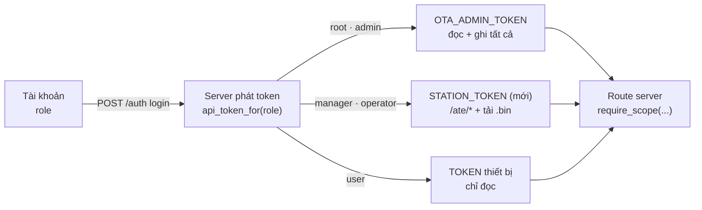

# Kế hoạch — hệ thống tài khoản cho **quản lý & nhân viên xưởng**

> Bản định hướng 2026-09-07, viết sau khi P0 của trạm ATE chạy được
> ([08-tram-san-xuat-ate.md](../08-tram-san-xuat-ate.md)). Phần §1 mô tả **hiện trạng lúc viết**
> (3 vai trò `root / admin / user`); bước A đã hiện thực ngay trong ngày — xem khối cập nhật bên dưới.
>
> Câu hỏi phải trả lời: **cho thao tác viên đứng máy ở xưởng và quản lý sản xuất một tài khoản kiểu
> gì**, để họ làm đủ việc của mình mà không cầm luôn quyền đẩy firmware cho 109 máy ngoài thị trường.

> **Cập nhật 2026-09-07 — chủ dự án đã chốt 3 câu hỏi §9, và BƯỚC A ĐÃ HIỆN THỰC:**
> 1. Tài khoản **cá nhân** cho từng thao tác viên (theo khuyến nghị §5).
> 2. Quản lý sản xuất **KHÔNG** xem dữ liệu lâm sàng.
> 3. Ràng buộc theo trạm: **để sau**, tuỳ thực tế đơn hàng (bước D vẫn treo).
>
> Đã có trong mã: 5 vai trò (`UserRole`), 10 quyền theo tên việc + `canManageRole`, gate tab trong
> `home_shell.dart`, mục Thống kê ẩn với thao tác viên, `manager` chỉ quản lý được `operator` (gác ở CẢ
> app lẫn `server/app/auth.py`), và **máy trạm không còn nhận token ghi OTA**. Test:
> `test/user_session_test.dart` (13) + `server/tests/test_auth_roles.py` (10).
> **Còn lại: bước B** (`STATION_TOKEN` + `require_scope`) — trước bước B, mọi tài khoản hợp lệ vẫn
> `curl` được toàn bộ API, kể cả dữ liệu lâm sàng.

---

## 1. Hiện trạng (đã kiểm lại trong mã, không phải trí nhớ)

| Thứ | Ở đâu | Nội dung |
|---|---|---|
| 3 vai trò | `lib/models/user_session.dart` · `server/app/auth.py:_ROLES` | `root` · `admin` (nhân viên) · `user` (khách hàng) |
| Quyền ghi | `SessionStore.canWrite` = `isStaff` = root+admin | dùng ở **21 chỗ** trong `lib/` |
| Quản lý tài khoản | `canManageUsers` = **root**, server `_require_admin` bắt `role == "root"` + mật khẩu root **mỗi lần** | |
| Phạm vi xem máy | `UserSession.canSee(id)` — `allowAll` chỉ khi root hoặc `ids` chứa `*` | lọc **ở client** |
| Token API | `auth.api_token_for(role)`: root/admin → `OTA_ADMIN_TOKEN` (ghi được OTA), user → `TOKEN` (đọc) | phát lúc đăng nhập |
| Tab Sản xuất | `home_shell.dart`: hiện `if (isStaff)`; nút BẮT ĐẦU gác `SessionStore.canWrite` | |

**Bốn chỗ vỡ khi đưa xuống xưởng:**

1. **Thao tác viên buộc phải là `admin`** thì mới thấy tab Sản xuất — mà `admin` kéo theo: tab **Quản lý
   máy** (chọn bản OTA cho *cả fleet*), tab **Kỹ Thuật** (nạp bất kỳ máy nào), tab **Chăm sóc KH**, và
   **`OTA_ADMIN_TOKEN`** nằm sẵn trong máy trạm. Một người bấm nhầm ở xưởng là 109 máy ngoài thị trường
   nhận firmware sai. Đây là vấn đề nghiêm trọng nhất, và nó không phải giả định: `api_token_for` phát
   token đó cho **mọi** tài khoản admin, trên **mọi** máy họ đăng nhập.
2. **Phạm vi `ids` không dùng được cho xưởng.** `ids` là danh sách mã máy được xem. Máy vừa sản xuất thì
   **chưa ai cấp** cho ai cả → operator tra hồ sơ chính cái máy mình vừa chạy sẽ bị chặn (`canSee` false),
   trừ khi cấp `*` — mà `*` lại mở luôn **toàn bộ dữ liệu lâm sàng** của khách hàng. Hai loại dữ liệu này
   phải tách phạm vi, không thể dùng chung một danh sách.
3. **Quản lý sản xuất không tự cấp được tài khoản.** Chỉ `root` tạo được user, và phải gõ mật khẩu root
   mỗi lần. Xưởng thêm người theo ca thì phải đi xin kỹ thuật — thực tế sẽ thành "dùng chung một tài
   khoản", và hồ sơ ATE mất luôn cột `operator`.
4. **Khoá tài khoản KHÔNG thu hồi được quyền.** `active=false` chỉ chặn **đăng nhập mới**; máy trạm đã
   đăng nhập vẫn giữ phiên + `apiToken` (token dùng chung theo vai trò) và vẫn ghi được. Người nghỉ việc
   mang theo một máy đã đăng nhập là vẫn còn quyền.

---

## 2. Nguyên tắc chọn phương án

1. **Quyền theo VIỆC, không theo chức danh.** Thao tác viên cần đúng một việc: cho máy qua trạm. Mọi thứ
   khác là rủi ro không đổi lại lợi ích gì.
2. **Dữ liệu sản xuất ≠ dữ liệu lâm sàng.** Hồ sơ ATE là dữ liệu nội bộ nhà máy; kết quả xét nghiệm là
   dữ liệu của khách hàng. Hai phạm vi tách hẳn, không dùng chung một danh sách `ids`.
3. **Gác ở UI là tiện, gác ở server mới là an toàn.** Hôm nay lọc nằm ở client (đã ghi trong CLAUDE.md).
   Thêm vai trò ở app là bước 1; nó **không** ngăn được người biết `curl`. Bước 2 (token theo phạm vi) mới
   là cái thật.
4. **Không phá tài khoản đang chạy.** Mọi bước phải deploy được một mình mà app cũ vẫn sống.

---

## 3. Phương án: thêm 2 vai trò

| Vai trò | Ai | Thấy tab | Làm được |
|---|---|---|---|
| `root` | kỹ thuật trưởng | tất cả | tất cả + quản lý **mọi** tài khoản |
| `admin` | nhân viên kỹ thuật / CSKH | Lịch sử · CSKH · Quản lý máy · Kỹ Thuật · Sản xuất | như hôm nay (gồm ghi OTA) |
| **`manager`** *(mới)* | quản lý sản xuất | **Sản xuất** (đủ 3 mục) · Quản lý máy **chỉ-xem** | xem FPY/Pareto/hồ sơ mọi máy sản xuất; **tạo/khoá tài khoản `operator`**; KHÔNG ghi OTA, KHÔNG xem dữ liệu lâm sàng |
| **`operator`** *(mới)* | thao tác viên đứng trạm | **Sản xuất** → *Chạy trạm* + *Hồ sơ máy* | chạy trạm, ghi hồ sơ, tra hồ sơ máy; KHÔNG Thống kê toàn xưởng, KHÔNG OTA, KHÔNG Kỹ Thuật, KHÔNG lịch sử lâm sàng |
| `user` | khách hàng | Lịch sử (theo `ids`) | như hôm nay |

Vì sao **không** gộp `operator` vào `admin` rồi ẩn tab: ẩn tab không thu hồi token. Vì sao **không** gộp
`manager` vào `root`: root là quyền đụng được tài khoản kỹ thuật lẫn tài khoản khách hàng.

### 3.1 Tách `canWrite` thành các quyền có tên

`SessionStore.canWrite` hôm nay mang **bốn** nghĩa khác nhau (đồng bộ lịch sử, ghi OTA, chạy trạm, hiện
tab Kỹ Thuật). Thêm vai trò mà không tách thì mỗi lần đọc code phải đoán nó đang nói nghĩa nào:

| Quyền mới | root | admin | manager | operator | user |
|---|:--:|:--:|:--:|:--:|:--:|
| `canSeeClinical` (Lịch sử, CSKH — vẫn lọc theo `ids`) | ✓ | ✓ | — | — | ✓ |
| `canWriteClinical` (đồng bộ/xoá/lấy-từ-máy) | ✓ | ✓ | — | — | — |
| `canWriteOta` (chọn/tải lên/xoá bản firmware) | ✓ | ✓ | — | — | — |
| `canUseTech` (tab Kỹ Thuật: nạp/serial/log nhiệt) | ✓ | ✓ | — | — | — |
| `canRunStation` (Chạy trạm ATE, ghi hồ sơ) | ✓ | ✓ | ✓ | ✓ | — |
| `canSeeProduction` (hồ sơ ATE, thống kê) | ✓ | ✓ | ✓ | ✓ (chỉ hồ sơ) | — |
| `canManageUsers` | ✓ mọi vai trò | — | ✓ **chỉ `operator`** | — | — |

Chỗ gọi đọc theo TÊN QUYỀN, không theo vai trò — thêm vai trò lần sau chỉ sửa một bảng.

### 3.2 Phạm vi dữ liệu sản xuất

`ids` giữ nguyên nghĩa cũ (dữ liệu lâm sàng). Hồ sơ ATE **không** lọc theo `ids`:

- `operator` / `manager` / `admin` / `root`: tra được hồ sơ ATE của **mọi số máy** — máy vừa ra khỏi
  chuyền chưa thuộc về khách hàng nào cả.
- `user` (khách hàng): **không** thấy tab Sản xuất.

Khi nào cần chặt hơn (nhiều xưởng / nhiều trạm): thêm cột `stations text[]` cho bảng `users` và lọc hồ
sơ theo `station`. **Chưa làm** — 1–2 trạm thì nó chỉ thêm chỗ để sai.

---

## 4. Enforcement: hai lớp

**Lớp 1 — app (rẻ, làm trước):** vai trò quyết định tab nào hiện, nút nào bấm được (§3.1).

**Lớp 2 — server (cái thật):** thêm `STATION_TOKEN` và một dependency `require_scope`:

| Token | Phạm vi | Route |
|---|---|---|
| `OTA_ADMIN_TOKEN` | tất cả | như hôm nay |
| **`STATION_TOKEN`** *(mới)* | `ate` + `ota_read` | `PUT/GET /ate/*` · `GET /ota/{file}` (tải bản .bin đang chốt để nạp) |
| `TOKEN` (thiết bị) | `ingest` + đọc | `/ingest`, `/sessions`, `/devices` |

`STATION_TOKEN` để rỗng ⇒ **tắt**: `manager`/`operator` nhận `TOKEN` như cũ, deploy một mình không đổi
hành vi gì — đúng khuôn `OTA_ADMIN_TOKEN` đã dùng 2026-08-19.

Đổi lại: máy trạm ở xưởng **không còn cầm** token ghi OTA. Mất máy trạm / người nghỉ việc thì xoay
`STATION_TOKEN`, fleet ngoài thị trường không hề bị đụng tới.

---

## 5. Vòng đời tài khoản ở xưởng

| Tình huống | Cách xử lý |
|---|---|
| **Tài khoản cá nhân hay tài khoản trạm?** | **Cá nhân** cho `operator` — hồ sơ ATE ghi `operator = username` của phiên, tự có truy vết. Tài khoản trạm dùng chung thì cột đó thành vô nghĩa và "ai chạy máy này" phải hỏi miệng. Nếu ca kíp đổi quá nhanh: giữ tài khoản trạm nhưng **bắt buộc** ô "Người chạy" quét thẻ nhân viên — và phải ghi rõ trong hồ sơ rằng đó là chuỗi **tự khai**, không xác thực. |
| **Đổi ca** | Đăng xuất → đăng nhập. Phiên lưu cục bộ nên KHÔNG tự hết hạn; đừng đăng xuất khi mạng xưởng đang chết (xem dưới). |
| **Mạng xưởng chết** | Đăng nhập CẦN server. Đã đăng nhập rồi thì trạm chạy offline bình thường (hồ sơ vào `FBT_RAPID_ate\cho_gui\`). ⇒ **quy tắc vận hành: không đăng xuất máy trạm khi mất mạng.** |
| **Người nghỉ việc** | `active=false` (chặn đăng nhập mới) **+ xoay `STATION_TOKEN`** nếu họ mang theo máy đã đăng nhập. Chỉ `active=false` là chưa đủ — xem §1.4. |
| **Quên mật khẩu** | `manager` đặt lại được cho `operator`; `root` cho mọi người. |
| **Máy trạm bị mất** | Xoay `STATION_TOKEN` → mọi máy trạm phải đăng nhập lại (chỉ ảnh hưởng xưởng). |

---

## 6. Thay đổi cụ thể

**App** (~1–1.5 ngày):

| File | Việc |
|---|---|
| `lib/models/user_session.dart` | thêm `manager`/`operator` vào `UserRole` + `roleCodeOf`/`roleFromCode`; thêm 7 getter quyền (§3.1) |
| `lib/services/session_store.dart` | các getter tĩnh tương ứng, giữ `canWrite` như **alias tạm** của `canWriteClinical` để không phải sửa 21 chỗ trong một lần |
| `lib/screens/home_shell.dart` | gate tab theo quyền mới thay vì `isStaff` |
| `lib/screens/ate_screen.dart` | `operator` chỉ thấy 2 mục (Chạy trạm · Hồ sơ máy) |
| `lib/screens/ate_run_screen.dart` | nút BẮT ĐẦU gác `canRunStation` |
| `lib/screens/manager_machine_screen.dart` | `manager` → chỉ-xem (ẩn nút ghi OTA) |
| `lib/screens/user_management_screen.dart` | dropdown vai trò thêm 2 mục; `manager` chỉ tạo/sửa được `operator` |
| `lib/util/i18n.dart` | `role.manager`, `role.operator` |

**Server** (~1–2 ngày, làm được độc lập):

| File | Việc |
|---|---|
| `app/auth.py` | `_ROLES` thêm 2 vai trò; `api_token_for` trả `STATION_TOKEN`; `_require_admin` → cho `manager` nhưng **chỉ** khi user đích có role `operator` |
| `app/config.py` | `STATION_TOKEN` (rỗng = tắt) |
| `app/main.py` | `require_scope(...)` cho `/ate/*`, `/ota/*`, `/sessions`, `/devices` |
| `tests/` | ma trận quyền: mỗi (token, route) một khẳng định — đây là chỗ đáng viết test nhất |

---

## 7. Lộ trình

| Bước | Nội dung | Giá trị ngay | Ước lượng |
|---|---|---|---|
| **A** ✅ | 2 vai trò mới + tách quyền + gate tab (app) + phạm vi quản lý tài khoản (server) | Thao tác viên hết thấy OTA/Kỹ Thuật; máy trạm hết cầm token ghi OTA; hồ sơ có `operator` thật | **xong 2026-09-07** |
| **B** | `STATION_TOKEN` + `require_scope` + test ma trận quyền | Máy trạm **không còn cầm** quyền ghi firmware fleet | ~1–2 ngày |
| **C** | `manager` tự quản lý tài khoản `operator` | Xưởng tự chủ, hết dùng chung tài khoản | ~1 ngày |
| **D** *(khi cần)* | cột `stations`, lọc hồ sơ theo trạm; token/phiên có hạn (thu hồi thật) | Nhiều xưởng / thu hồi tức thì | chưa ước lượng |

Không đảo B lên trước A: A là thứ người dùng thấy ngay và không đụng production; B đụng token, phải làm
khi có người trực để xoay lại nếu hỏng.

---

## 8. Rủi ro & cạm bẫy

1. **`canWrite` đang mang 4 nghĩa ở 21 chỗ.** Đừng thay hàng loạt bằng `sed` — phải đọc từng chỗ xem nó
   định nói nghĩa nào. Giữ `canWrite` làm alias trong bước A, xoá ở bước sau.
2. **App cũ gặp vai trò mới → rơi về `user`** (`roleFromCode` mặc định). Fail-closed nên an toàn, nhưng
   nghĩa là **phải cập nhật app trên máy trạm TRƯỚC khi tạo tài khoản mới**, không thì người ta đăng nhập
   vào thấy mỗi tab Lịch sử và tưởng hỏng.
3. **Đổi `api_token_for` là đổi thứ nằm sẵn trong máy đang chạy.** Ai đang đăng nhập vẫn giữ token cũ tới
   khi đăng nhập lại (bài học 401 của mục OTA, 2026-08-20). Đổi vai trò một tài khoản ⇒ **bắt họ đăng
   xuất/đăng nhập lại**, nếu không quyền cũ còn nguyên trong máy.
4. **Lọc vẫn ở client cho tới bước B.** Trước B, mọi tài khoản hợp lệ vẫn `curl` được toàn bộ API. Đừng
   hứa với ai rằng bước A là "đã phân quyền an toàn".
5. **`README.md` §1.6 đang SAI**: nói đăng nhập qua Apps Script `userAuth.js`, thực tế đã chuyển về
   Engineer Server (`POST /auth`) từ 2026-07-14. Sửa luôn khi làm bước A.
6. **Mật khẩu root gõ mỗi lần** (`_require_admin`) là chủ ý (app không lưu mật khẩu). Mở cho `manager`
   thì giữ đúng cơ chế đó, đừng phát minh phiên admin riêng.

---

## 9. Chưa chốt — cần quyết

- [x] **Bao nhiêu trạm, bao nhiêu người/ca?** → đăng ký sau, tuỳ thực tế đơn hàng ⇒ **chưa** làm cột
      `stations` (bước D vẫn treo, thiết kế đã chừa chỗ).
- [x] **Tài khoản cá nhân hay tài khoản trạm dùng chung?** → **cá nhân** (2026-09-07).
- [x] **Quản lý sản xuất có được xem dữ liệu lâm sàng không?** → **không** (2026-09-07). Cần đối chiếu máy
      ngoài thị trường thì cấp một tài khoản `admin` riêng với `ids` cụ thể, đừng nới `manager`.
- [ ] **Ai cấp tài khoản cho xưởng**: kỹ thuật (root) hay quản lý sản xuất (bước C)?
- [ ] **Operator có được xem Thống kê FPY toàn xưởng không?** Đang để không (tránh so bì giữa ca); nếu
      muốn công khai thì mở, nhưng phải là quyết định có chủ đích.
- [ ] **Có bật `STATION_TOKEN` ngay không**, hay chờ tới khi xưởng chạy ổn định?
