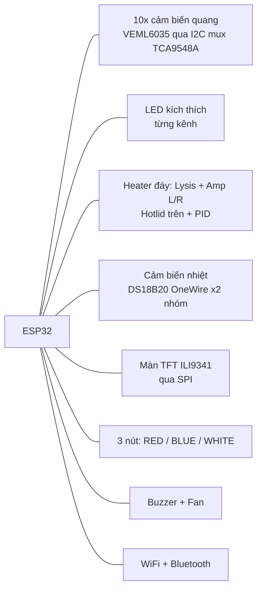

# 01 — Tổng quan

## Thiết bị

**FBT RAPID** — máy xét nghiệm **LAMP-PCR** (khuếch đại đẳng nhiệt). Quy trình:
ly giải mẫu (lysis) → khuếch đại (amplification) → đọc huỳnh quang bằng cảm biến
quang → tính kết quả từng slot (Positive/Negative/...) → upload lên cloud.

Nền tảng: **ESP32** (dual-core), firmware **Arduino/PlatformIO** (`env:esp32dev`,
filesystem LittleFS, flash 8MB).

## Phần cứng chính

## Ngăn xếp phần mềm

- **RTOS**: 6 FreeRTOS task cố định core (xem [02-rtos-tasks.md](02-rtos-tasks.md)).
- **Máy trạng thái UI**: `_displayCLD.type_infor` (enum `e_statuslcd`) điều phối toàn
  bộ quy trình xét nghiệm (xem [03-quy-trinh-xet-nghiem.md](03-quy-trinh-xet-nghiem.md)).
- **Web dashboard**: AsyncWebServer + SSE (xem [05-web-dashboard.md](05-web-dashboard.md)).

## Bản đồ module (src/)

| Module | Trách nhiệm |
|---|---|
| `main.cpp` | Khởi tạo, tạo RTOS task, WiFi STA lúc boot |
| `displayCLD` / `displayLCD.cpp` | Máy trạng thái UI + vẽ màn TFT (`type_infor`) |
| `PIDControl` | Điều khiển nhiệt (heater đáy + hotlid), đọc nhiệt độ đã hiệu chỉnh |
| `thermometer` | Đọc cảm biến nhiệt DS18B20 (OneWire) |
| `sensor6035` | Đọc opto VEML6035, đường cong khuếch đại, tính CT_value/kết quả |
| `acquisition` / `Alg/` | Lấy mẫu ALS + thuật toán phân tích đỉnh/kết quả |
| `button` | 3 nút (`B_RED/B_BLUE/B_WHITE`), short/long press → business logic |
| `Bluetooth.cpp` | BLE config, EEPROM settings, WiFiManager, **upload TLS** Google Sheet |
| `webDashboard` | Web dashboard (AsyncWebServer + SSE + `/control`) |
| `updateOTA` | Cập nhật firmware OTA |
| `ForteSetting` | Tham số hiệu chuẩn (slopes/origins/led_power/kitId...) |
| `errorCheck` | Ghi/đọc lỗi (EEPROM), phân loại lỗi sensor |
| `LED` / `Fan` / `buzzer` | Ngoại vi |

## Các luồng dữ liệu chính

1. **Xét nghiệm**: nút/timer → máy trạng thái → PID nhiệt + đọc opto → `sensor67Value`
   → thuật toán → `CT_value`/kết quả → EEPROM → upload.
2. **Upload**: kết quả → JSON → TLS → Google Apps Script + ForteBio ingest API
   (xem [06-mang-va-upload.md](06-mang-va-upload.md)).
3. **Dashboard**: nhiệt độ/trạng thái/kết quả → SSE → trình duyệt; nút web → `/control`
   → máy trạng thái.

## Ràng buộc thiết kế quan trọng

- **Heap chật**: Bluetooth (~60KB) release 1 chiều; TLS cần ~40KB liền mạch; dashboard
  phải suspend khi upload. Xem [06-mang-va-upload.md](06-mang-va-upload.md).
- **Ngôn ngữ**: code/UI tiếng Anh (an toàn font thiết bị); tài liệu tiếng Việt.
