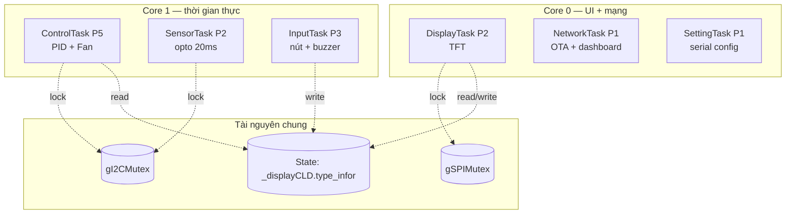

# 02 — Kiến trúc RTOS (tasks & cores)

Firmware chạy 6 FreeRTOS task cố định core, tạo trong `setup()`
([src/main.cpp](../../src/main.cpp)). `loop()` không làm gì (chỉ `vTaskDelay`).

## Bảng task

| Task | Core | Prio | Stack | Chu kỳ | Việc |
|---|---|---|---|---|---|
| **ControlTask** | 1 | 5 | 8192 | 100ms | `_PIDControl.loop()` + `_Fan.loop()` — điều khiển nhiệt |
| **SensorTask** | 1 | 2 | 16384 | 20ms | `_sensor6035.loop()` — đọc opto (mutex I2C) |
| **DisplayTask** | 0 | 2 | 16384 | 100ms | `_displayCLD.loop()` — vẽ TFT (mutex SPI) |
| **NetworkTask** | 0 | 1 | 8192 | 10ms | `updateFirmware()` (OTA) + `dashboardLoop()` (SSE) |
| **InputTask** | 1 | 3 | 8192 | 5ms | `_buttonManager.loop()` + buzzer |
| **SettingTask** | 0 | 1 | 8192 | 10ms | cấu hình qua Serial JSON |

## Phân bố core

- **Core 1** lo phần nhạy thời gian (PID nhiệt, đọc sensor, nút). **Core 0** lo UI, OTA,
  web dashboard, serial.
- **Mutex I2C** (`gI2CMutex`): SensorTask và ControlTask chia sẻ bus I2C (opto + IO expander).
- **Mutex SPI** (`gSPIMutex`, recursive): TFT. `SPILock` RAII; DisplayTask và InputTask
  (handler nút vẽ màn) cùng dùng nên khóa để không xung đột.
- **State chung**: `_displayCLD.type_infor` (enum `e_statuslcd`) là "sự thật" về pha hiện
  tại — nhiều task đọc, các handler nút/sensor ghi. Xem
  [03-quy-trinh-xet-nghiem.md](03-quy-trinh-xet-nghiem.md).

## Giao tiếp giữa task (không dùng queue)

Phối hợp qua **biến chung + cờ**, không qua FreeRTOS queue:

- Nút: ISR ghi `rawPressed` → InputTask poll, debounce, đặt `pendingEvent` →
  `processEvent()` chạy business logic **trong ngữ cảnh task** (Core 1). Web `/control`
  cũng đặt `pendingEvent` để InputTask xử lý (an toàn thread).
- OTA: `volatile OtaState otaState` (1 byte, atomic) điều phối giữa InputTask (user bấm
  chấp nhận) và NetworkTask (tải).
- Nhiệt độ: `_PIDControl` giữ mảng nhiệt đã hiệu chỉnh, các task khác đọc trực tiếp.

## Globals chính

`_displayCLD`, `_PIDControl`, `_sensor6035`, `_ForteSetting`, `_buttonManager`,
`_bottomThermometer`/`_topThermometer`, `error`, `_Fan`, `_buzzer`, `SerialBT`,
`ssid`/`password`/`id_device`.
