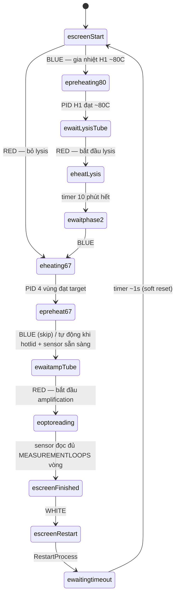
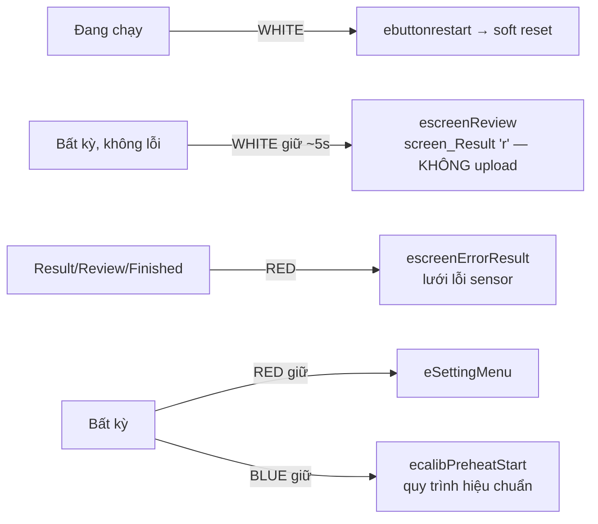

# 03 — Quy trình xét nghiệm (máy trạng thái)

Toàn bộ quy trình điều phối bằng **một biến trạng thái**:
`_displayCLD.type_infor` (enum `e_statuslcd`, [src/displayCLD.h:36-76](../../src/displayCLD.h)).

- **Bơm vẽ**: `displayCLD::loop()` (DisplayTask, Core 0) switch theo `type_infor`, chỉ khi
  `changeScreen == true`. Màn động (timer/nhiệt) để `changeScreen` bật để lặp mỗi tick.
- **3 nguồn ghi transition** (cùng ghi `type_infor`):
  1. **Nút** (`button.cpp`) — user bấm, dispatch trong ngữ cảnh InputTask.
  2. **Timer màn hình** (`displayLCD.cpp`) — `timer10minEnd` (lysis), `timeRefresh`.
  3. **PID nhiệt** (`PIDControl.cpp`) + **opto sensor** (`sensor6035.cpp`) — đạt target / đọc xong.

Mọi handler nút short-press **early-return nếu `ErrorStatus()`** → khi lỗi, nút bị đóng băng.

## Sơ đồ trạng thái (happy path)

Có **2 nhánh vào** từ `escreenStart`, gộp tại `eheating67`:
- **BLUE** = chạy đủ (Lysis + Amplification)
- **RED** = chỉ Amplification (bỏ lysis)

## Bảng chuyển trạng thái (nhánh đầy đủ)

| # | Từ → Đến | Kích hoạt | Ref |
|---|---|---|---|
| 1 | `escreenStart` → `epreheating80` | **BLUE** → `setpid1startpreHeat80()` | button.cpp:553 |
| 2 | `epreheating80` → `ewaitLysisTube` | H1 đạt ~80C (PID xong preheat phase-1) | PIDControl.cpp:900 |
| 3 | `ewaitLysisTube` → `eheatLysis` | **RED** → `startHeating10mins()` (arm timer) | button.cpp:404 |
| 4 | `eheatLysis` → `ewaitphase2` | **timer lysis hết** (`timer10minEnd`) | displayLCD.cpp:821 |
| 5 | `ewaitphase2` → `eheating67` | **BLUE** → `setPreheat67()` + preheat sensor | button.cpp:561 |
| 6 | `eheating67` → `epreheat67` | 4 nhiệt đạt target (Heat67LCD) | displayLCD.cpp:562 |
| 7 | `epreheat67` → `ewaitampTube` | **BLUE** skip **HOẶC** tự động (hotlid + hold + sensor preheat xong) | button.cpp:580 / PIDControl.cpp:1549 |
| 8 | `ewaitampTube` → `eoptoreading` | **RED** → `startAmplification()` + `setStepeSensorstart()` | button.cpp:452 |
| 9 | `eoptoreading` → `escreenFinished` | **sensor đọc xong** MEASUREMENTLOOPS vòng (lưu EEPROM trước) | sensor6035.cpp:1878 |
| 10 | `escreenFinished` (self) | tự chạy `screen_Result('f')`: WiFi + `postData_GoogleSheet()` | displayLCD.cpp:1471 |
| 11 | `escreenFinished` → `escreenRestart` | **WHITE** (guard `FinishStatus()`) | button.cpp:670 |
| 12-13 | `escreenRestart` → `ewaitingtimeout` → `escreenStart` | RestartProcess + timer ~1s → `ForteSetting.rerun()` | displayLCD.cpp:1490-1512 |

**Nhánh RED (amp-only):** `escreenStart` →(RED)→ `eheating67`, rồi gộp vào bước 6→13.

## Upload kết quả

- **Tự động (cuối test):** `escreenFinished` → `screen_Result('f')` → release BT, đọc record
  EEPROM, reconnect WiFi, `postData_GoogleSheet()`; nếu có lỗi thì `postError_fullGoogleSheet()`.
- **Thủ công:** `eSettingMenu` →(RED)→ `eUpLoadData` → upload record gần nhất.

Chi tiết TLS xem [06-mang-va-upload.md](06-mang-va-upload.md).

## Nhánh phụ (abort / review / setting)

## Nhánh lỗi (`errprocess`)

- **Vào (từ bất kỳ đâu):** PID quá/thiếu nhiệt hoặc lỗi sensor nghiêm trọng → `ErrorProcess()`
  set `errprocess` + báo còi + "Please restart power" (displayLCD.cpp:293). **Không** do nút.
- **Trong `errprocess`:** case `loop()` rỗng; mọi nút short-press early-return.
- **Thoát: chỉ power cycle.** Không nút nào xóa được `errprocess`. (Chord BLUE+WHITE 1.5s chỉ
  re-init màn TFT, không đổi `type_infor`.)

## Caveat quan trọng (độ chính xác)

1. **"30 phút" KHÔNG phải timer chuyển trạng thái.** `waitAmplification30min()` chỉ *hiển thị*
   đếm ngược; transition `eoptoreading → escreenFinished` do **vòng đọc sensor** đạt
   `MEASUREMENTLOOPS` (sensor6035.cpp:1878). Ngược lại **"10 phút" lysis LÀ** timer transition.
2. **`escreenResult` gần như không dùng** — case `loop()` là no-op. Kết quả thật vẽ ở
   `escreenFinished` (có upload) và `escreenReview` (không upload).
3. **"Rebooting..." là soft reset**, không phải reboot phần cứng: qua `ewaitingtimeout` →
   `ForteSetting.rerun()`. `ESP.restart()` thật chỉ ở: WHITE tại `eSelectSlot`,
   `eSettingBluetooth`, và `setting_Wifi()`.
4. Comment trong `button.cpp` ghi `epreheating67` là **sai**; đường thật là
   `eheating67 → epreheat67`. Tin code, không tin comment.
