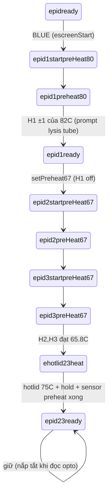
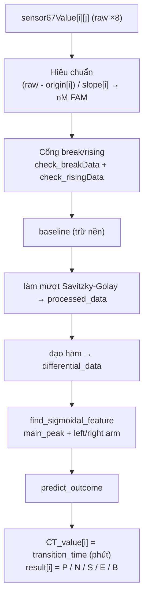

# 04 — Điều khiển nhiệt, đọc sensor, tính kết quả

Ba khối vật lý cốt lõi của máy: **giữ nhiệt** (PID), **đọc huỳnh quang** (opto), và
**tính kết quả** (thuật toán).

---

## A. Điều khiển nhiệt (PID) — ControlTask → `_PIDControl.loop()`

Nguồn: [src/PIDControl.cpp](../../src/PIDControl.cpp), [src/thermometer.cpp](../../src/thermometer.cpp).
Chạy mỗi 100ms trên Core 1.

### Vùng nhiệt & GPIO ([define.h](../../src/define.h))

| Vùng | Vai trò | Pin |
|---|---|---|
| Heater1 (đáy) | **Lysis** | `HEATER1IO=33` |
| Heater2 (đáy) | **Amplification L** | `HEATER2IO=25` |
| Heater3 (đáy) | **Amplification R** | `HEATER3IO=26` |
| Hotlid2 (nắp) | Nắp nóng L | `HOTLID2IO=2` |
| Hotlid3 (nắp) | Nắp nóng R | `HOTLID3IO=16` |

Cảm biến nhiệt: `ONE_WIRE=32` (đáy, 3 sensor), `ONE_WIRE1=15` (trên, 3 sensor = 2 nắp + 1
ambient/PCB). PWM: OFF=0, HALF=127, FULL=255.

### Đọc nhiệt độ + remap (chỗ then chốt)

```
bottomTemperature[i] = _bottomThermometer.getTemperature()[ bottomTemperatureSensorSq[i] ] + temperatureOffset[i]
HotlidTemperature[i] = _topThermometer.getTemperature()[    topTemperatureSensorSq[i]    ] + temperatureOffset[3+i]
```

Chỉ số logic cố định: `bottomTemperature` = {Lysis, Amp-L, Amp-R}; `HotlidTemperature` =
{nắp-L, nắp-R, ambient}. Mảng `*SensorSq[]` được **tự dò 1 lần** bằng `sensorSeq()`
(PIDControl.cpp:420): bật lần lượt từng heater, xem raw sensor nào tăng >3°C → ghi ánh xạ,
lưu EEPROM. Accessor `getBottomTemperature()`/`getHotlidTemperature()` trả mảng đã hiệu chỉnh
(dashboard + LCD dùng).

### 5 PID chia sẻ một bộ I/O

5 đối tượng `PID` (myPID, myPID2/3, myPIDhotlid2/3) đều trỏ vào **cùng** 3 biến toàn cục
`CURRENT_TEMP_PID / RESPONSE_SIGNAL / TARGET_TEMP`. Vì vậy **phải xử lý tuần tự** mỗi vùng:
set input+target → `Compute()` → `analogWrite(pin, RESPONSE_SIGNAL)` → sang vùng kế. Trước PID
có feed-forward 2 mức: xa target → FULL PWM; gần → PID.

### Máy trạng thái `e_pidstep`



Nhiệt mục tiêu: **Lysis 82°C** · **Amplification 65.8°C** (tên code "67" là legacy) · **Hotlid
75°C** · pre-warm H2/H3 60°C · calib 55°C. `epid1ready` giữ H1=82 đồng thời pre-warm H2/H3=60.
Transition `ehotlid23heat → epid23ready` cần đồng thời: cả 2 nắp trong ±3°C **và** đủ thời gian
hold (15 phút, 5 phút nếu qua calib) **và** `_sensor6035.getSensorPreheatReady()`.

**Hai timer, nay CỐ Ý bằng nhau** (2026-08-05): `PIDControl::hotlidWaitMs` = **15 phút** (giữ nắp) và
`parameter.optopreheatduration` = **15 phút** (preheat LED/opto, 900 **giây** →
`PREHEATLOOPS = 900000 / timePerLoop` = **45 vòng** × 20 s). `button.cpp:437-442` khởi động **cả hai
đồng hồ trên hai dòng liền nhau**, nên khớp giá trị nghĩa là quang học ấm đúng bằng khoảng thời gian
nhiệt ổn định.

*Trước đó opto preheat là **5 phút*** — viết `15 * 20`, đọc lên như "15 phút" nhưng là 15 **vòng**
× 20 s, và `sensor6035.h` ghi thẳng "15 mins". Comment nói 15, máy chạy 5.

**Đường calib → amplification không có override tương ứng**: `button.cpp:463-468` cố ý hạ
`hotlidWaitMs` xuống 5 phút, nhưng `optopreheatduration` là tham số lưu nên không đổi theo → đường đó
nay **chờ 15 phút** thay vì 5. Chậm chứ không hỏng; muốn giữ 5 phút thì phải thêm một override
runtime cho `PREHEATLOOPS`, tương tự `hotlidWaitMs`.

### An toàn nhiệt

- **Watchdog sensor**: quá hạn không có dữ liệu / sai số lượng / `-127` → `ErrorProcess` + `rerun()`.
- **Cắt quá nhiệt**: đáy `{Lysis+10, Amp+10, Amp+10}`, nắp `{75+20, 75+20, 50+20}` → dừng hết + rerun.
- **Band maintain**: giữ `target ± 5°C`, lệch → lỗi.
- **Interlock**: khi sensor đang đọc (`bSensorReadingGet()`) thì **tắt hết hotlid** (ổn định quang).
- `rerun()`: dừng heater, xả tích phân 5 PID, về `epidready`.

> Caveat: `DELTA_HALFPWM == DELTA_FULLPWM == 80` nên nhánh HALF-PWM chết → thực tế là
> FULL-PWM-rồi-PID. Tên "67" thực chất là 65.8°C.

---

## B. Đọc opto sensor — SensorTask → `_sensor6035.loop()`

Nguồn: [src/sensor6035.cpp](../../src/sensor6035.cpp). Chạy mỗi 20ms trên Core 1 (mutex I2C).
10 kênh VEML6035 qua 2 mux TCA9548A.

### Máy trạng thái `e_sensorStep`

`eSensorwait` (nghỉ) → `eSensorpreheat` (làm ấm quang ~15p, bật LED, **không lưu**) →
`eSensormaintain` (giữ ấm) → `eSensorstart` (khởi động 1 lần) → `eSensor1stReading` (đọc thật) ·
`eSensorcalib` (hiệu chuẩn 4 điểm). Guard: `setStepeSensorstart()` **forward-only** — đã vào
`eSensor1stReading` thì không lùi (tránh zero COUNTER + xóa dữ liệu giữa chừng).

### Một vòng đọc (`eSensor1stReadingFunc`)

Mỗi `OPTO_INTERVAL`, quét kênh 0→9: bật LED, chờ `LED_DELAY_TIME`, đọc ALS lặp lại đưa vào
`acquisitionControl` → khi đủ 8 mẫu: lọc bỏ mẫu lệch median >3 (`filterOdds`), lấy **tổng** 8 mẫu
(`getSum`) → lưu `sensor67Value[kênh][COUNTER]`. Hết 10 kênh → `COUNTER++`. Khi
`COUNTER >= MEASUREMENTLOOPS`: **lưu EEPROM trước** (record + lỗi), còi, rồi mới set
`escreenFinished` (DisplayTask đọc lại record để vẽ — nên phải ghi trước khi báo).

> Caveat: giá trị lưu là **TỔNG 8 mẫu** (không chia trung bình dù tên là `meanResponse`);
> hệ số slope/origin đã hấp thụ scale ×8.

---

## C. Tính kết quả — raw ALS → CT_value + P/N/S/E/B

3 entry (`bResultGet`, `bResultPutToChart`, `bResultPutToGoogleSheet`) chung 1 pipeline; nguồn
[src/sensor6035.cpp](../../src/sensor6035.cpp) + [src/Alg/](../../src/Alg/). Cho mỗi 10 slot:



- **Hiệu chuẩn**: `(sensor67Value - origins[i]) / slopes[i]` (đây cũng là giá trị chart
  `new_readings` đẩy lên dashboard). Tham số thuật toán nạp từ EEPROM.
- **predict_outcome**: mặc định Negative; không có đỉnh → Negative. CT = điểm cắt ngược dưới
  `transition_percentile × peak`. Phân loại theo `increase`, độ nhọn đỉnh, thời điểm transition:
  **P**ositive / **S**light positive / **E**rror / **N**egative; nếu break bất thường → **B**reak.

> Caveat: `result[i]` chỉ là **ký tự đầu** của chuỗi outcome. `CT_value` = transition_time (phút).

### Hiệu chuẩn (`eSensorcalib`)

Chế độ riêng ngoài quy trình đo: chụp 4 điểm chuẩn (nồng độ 300/200/100/0), khớp bình phương
tối thiểu ra slope/R²/intercept vào `cal_calib[]`.
