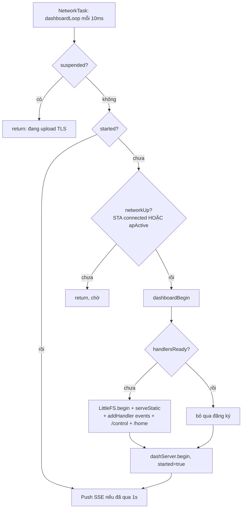
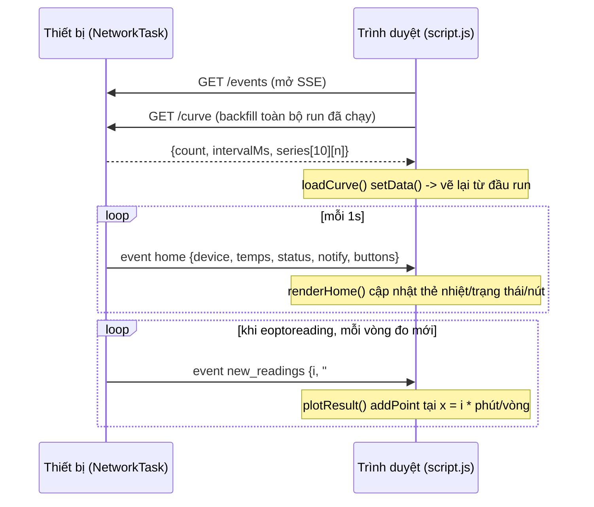
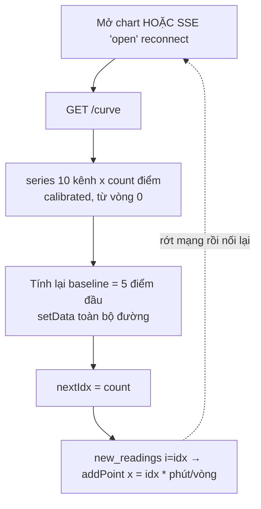
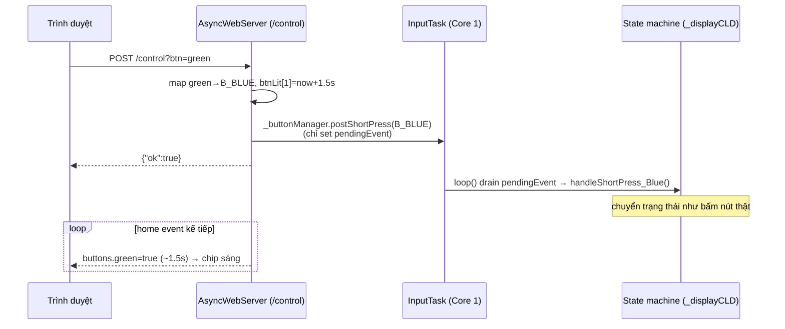
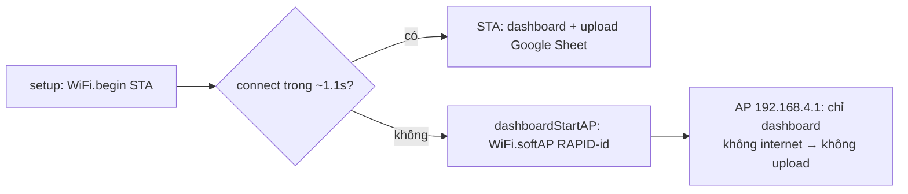
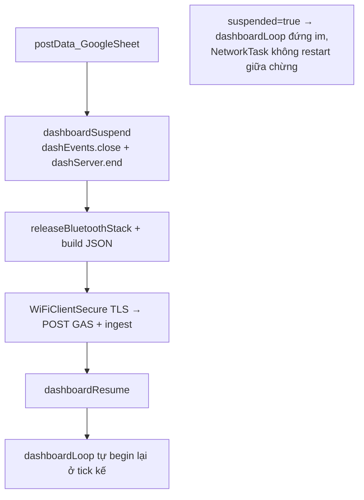
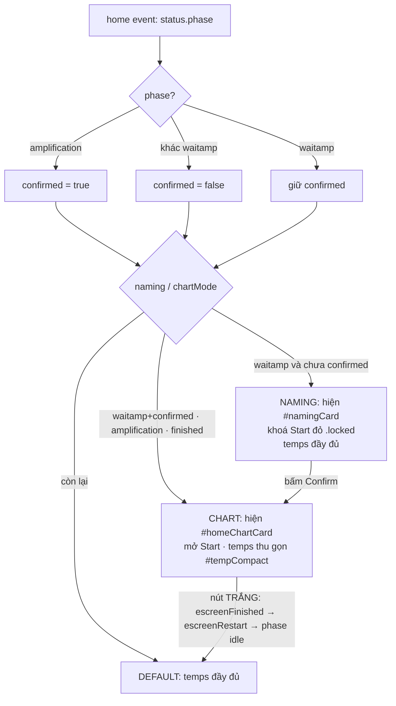
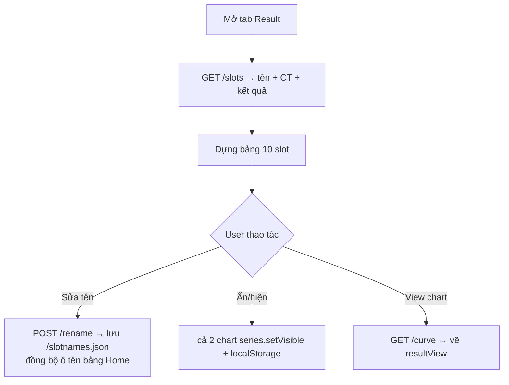

# 05 — Web Dashboard (AsyncWebServer + SSE)

Dashboard web phục vụ ngay từ thiết bị để **giám sát + điều khiển từ xa**. Nguồn:
[src/webDashboard.cpp](../../src/webDashboard.cpp), client [data/](../../data/).

## Thành phần

| Phần | Vai trò |
|---|---|
| `AsyncWebServer dashServer(80)` | HTTP server bất đồng bộ (chạy trên task AsyncTCP riêng) |
| `AsyncEventSource dashEvents("/events")` | Kênh SSE server→client |
| `LittleFS` | Chứa file UI (`data/` nạp qua `uploadfs`) |
| `dashboardLoop()` | Gọi từ NetworkTask mỗi 10ms; đẩy SSE (throttle 1s) |

Routes: `/` (static, `serveStatic`), `/events` (SSE), `/control?btn=` (bấm nút),
`/home` (snapshot JSON — chỉ để debug bằng curl), `/slots` + `/rename` (bảng kết quả),
`/curve` (toàn bộ đường cong để backfill chart).

## Vòng đời khởi động (lazy start)

WiFi STA thường mất 1–3s mới connect (lâu hơn vòng chờ 1.1s lúc boot), nên server
**không** khởi động trong `setup()` mà lazy trong `dashboardLoop()` khi mạng lên.

`handlersReady` đảm bảo handler chỉ đăng ký 1 lần (để `end()`/`begin()` lặp lại khi
suspend/resume không nhân đôi handler).

## Luồng dữ liệu SSE

`dashboardLoop()` (throttle 1s) đẩy 2 loại event tới trình duyệt; client
[data/script.js](../../data/script.js) nghe qua `EventSource`.

- **`home`**: `{device, company, temps{lysis,ampLeft,ampRight,topLeft,topRight},
  status{phase,title,subtitle}, notify{show,title,subtitle}, buttons{red,green,white},
  actions{red,green,white}}`. `phase` suy từ `_displayCLD.type_infor` (`fillStatus`):
  `heater`/`amplification`/`waitamp`/`finished`/`idle` — client đặc biệt hoá `heater`
  (icon nhiệt), `amplification` (reset+chart) và `waitamp` (naming gate).
  Nhiệt độ từ `_PIDControl.getBottomTemperature/getHotlidTemperature`.
- **`actions`** (`fillActions()`): chức năng từng nút ở trạng thái hiện tại, mirror
  `handleShortPress_*` trong `button.cpp`. VD `escreenStart` → green "Lysis",
  red "Amplification", white "" (chip mờ). Firmware phải gửi vì client chỉ có `phase` thô.
- **`new_readings`**: giá trị calibrated `(sensor67Value[i][COUNTER-1] - origins[i]) /
  slopes[i]` cho 10 kênh — chỉ đẩy khi có vòng đo mới (`COUNTER` đổi), tránh điểm trùng.
  Kèm `i` = chỉ số vòng (`COUNTER-1`) → trục X. Client vẽ **trừ baseline**
  (`y - trung bình 5 điểm đầu`), reset khi phase→amplification.

## Backfill chart: thiết bị là nguồn sự thật

SSE chỉ đẩy điểm **mới**; trình duyệt mở muộn hoặc rớt mạng giữa run sẽ mất hẳn đoạn đó
(client không có lịch sử để tự bù). Thiết bị thì luôn giữ đủ trong `sensor67Value[10][130]`
→ cho client hỏi lại toàn bộ thay vì tự nhớ.

- **`GET /curve`** → `{count, intervalMs, series:[[cal...] ×10]}`, cùng công thức calibrate
  như `new_readings`. `count = getCurrentLoop()` khi đang chạy, **fallback
  `getLastRunLoops()` khi = 0**: firmware xoá `COUNTER` ngay lúc run xong
  (`sensor6035.cpp:1908`) trong khi `sensor67Value` vẫn giữ đường cong, nên nếu không
  fallback thì tab Result vẽ **chart trắng** đúng lúc cần xem lại.
- **Cảnh báo**: `clear()` gần như không chạy (chỉ lúc boot) ⇒ `lastRunLoops` **sống sang
  run kế** ⇒ ở `waitamp` của run mới, `/curve` **vẫn trả run trước**. Hợp lý cho Result
  (máy đang giữ run đó, `/slots` cũng trả kết quả run đó), nhưng **Home phải bỏ qua**:
  client chỉ `loadCurve` khi `curveReady` (`phase` = `amplification`/`finished`), run chưa
  chạy ⇒ chart **trống**.
- **Trục X = chỉ số vòng của thiết bị**, không phải wall-clock của trình duyệt:
  `x = i * (intervalMs/60000)` phút. Nhờ chung một gốc, điểm backfill và điểm live nối
  liền nhau — dùng `Date.now()` của client sẽ lệch đúng bằng khoảng thời gian mất kết nối.
- Live point là `idx = loop-1`, còn `/curve` trả `j = 0..count-1` với `count = loop` →
  điểm cuối của backfill trùng đúng điểm live, không hụt cũng không trùng.
- Chart **không** dùng cửa sổ trượt (`addPoint` với `shift=false`) để giữ nguyên cả run.

## Luồng điều khiển (click → nút vật lý)

SSE một chiều, nên lệnh bấm đi bằng request riêng. Trạng thái đèn quay lại qua `home`.

**An toàn thread:** `postShortPress()` chỉ ghi `btnState[b].pendingEvent`; InputTask
(Core 1) mới thực thi handler — không đụng state chung từ task AsyncTCP.
Ánh xạ nhãn: chip **GREEN** = nút vật lý `B_BLUE` (enum firmware giữ tên legacy).

## SoftAP fallback (dùng khi không có WiFi)

AP và upload TLS **loại trừ nhau** (AP = không internet). Highcharts nhúng nội bộ
(`data/highcharts.js`) nên chart chạy cả khi offline.

## Coexistence heap với upload TLS (quan trọng)

AsyncWebServer + SSE socket giữ heap; mbedTLS cần ~32-40KB **liền mạch** cho handshake.
Nếu không nhường → `-32512 SSL memory allocation failed`. Giải pháp: **loại trừ lẫn nhau**.

Chi tiết upload xem [06-mang-va-upload.md](06-mang-va-upload.md).

## Naming gate trên Home + 3 chế độ layout

Khi vào pha khuếch đại (`ewaitampTube`: preheat xong **hoặc** skip preheat), firmware
gửi `phase == "waitamp"`. Home dùng cờ này để **buộc đặt tên slot trước khi Start**.
State machine hoàn toàn phía client (`renderHome` trong `script.js`):

**Chart sống qua lúc run xong**: `chartMode` gồm cả `phase == "finished"`, nên đường cong
**vẫn nằm trên Home** sau khi chạy xong. Chỉ **nút trắng** (trên máy hoặc chip "Next test"/
"Return" trên web) mới xoá nó: white ở `escreenFinished` → `escreenRestart`
(`button.cpp:672`), state này không có trong `fillStatus` → `default` → `phase "idle"` →
`chartMode = false`. Trạng thái máy là nguồn duy nhất; client không cần cờ riêng.

- **Khoá Start chỉ phía web** (`.locked` nuốt click); **nút vật lý trên máy vẫn chạy** —
  gate này chỉ nhắc người dùng đặt tên, không chặn phần cứng.
- **Confirm** (`#confirmNamesBtn`): `confirmed = true` → mở Start + hiện chart + thu gọn
  nhiệt độ. Ô tên trống → series mặc định `#1`–`#10` (`applyNamesTo`).
- **Reload giữa run**: `confirmed` reset `false`, nhưng `phase == "amplification"` tự đặt
  lại `true` → không kẹt ở màn naming. Run kết thúc (`phase` rời amp) → reset để run sau
  lại phải đặt tên.
- **Bảng naming** (`#namingBody`) chỉ dựng 1 lần mỗi phiên waitamp (`namingBuilt`) để
  không cướp focus khi đang gõ.

## Tab Result: xem lại bảng kết quả + chart đã lưu

Tab **Result** (đổi tên từ Process) để **xem lại dữ liệu trong máy**: bảng 10 slot
(ẩn/hiện · tên · CT · kết quả P/N/S/E/B) + đồ thị vẽ từ `/curve`, ẩn đến khi **"View chart"**.

- **`GET /slots`** → `{ready, slots:[{name, ct, result} ×10]}`. `name` từ `/slotnames.json`
  (LittleFS); `ct`/`result` từ cache `gResultsReady`/`gCT`/`gResult`. `ct` chỉ có với P/S.
- **`POST /rename?slot=N&name=X`** → cập nhật `slotNames[N]`, ghi `/slotnames.json`. Client
  đồng bộ ô tên giữa **2 bảng** (naming trên Home + result) qua `data-slot`.
- **Cache kết quả**: `dashboardSetResults(CT_value, result)` gọi trong `screen_Result()`
  (displayLCD.cpp) sau khi tính kết quả → dashboard đọc được.
- **Ẩn/hiện**: client-only (localStorage), áp cho **cả 2 chart** `homeView`/`resultView`.

**Hai chart độc lập**: `homeView` (live trên Home, ăn `new_readings` + backfill `/curve`)
và `resultView` (snapshot trên Result, vẽ từ `/curve` khi bấm View chart / mở lại tab).
Cùng công thức baseline + trục X, nên nhìn giống nhau; Result không cần live vì là xem lại.

Lưu ý: tên lưu LittleFS (không EEPROM, do vùng EEPROM chật/reserved) → sống qua reboot
nhưng `uploadfs` (cập nhật UI) sẽ xoá; firmware tự tạo lại rỗng.

## Công cụ test không cần phần cứng

[tools/sse_test_server.py](../../tools/sse_test_server.py) — mock ESP32 (Python stdlib)
phục vụ `data/` + stream SSE giả (vòng đời heating→amplification→finished). Mock đúng
hợp đồng SSE để validate UI trên trình duyệt trước khi nạp.
