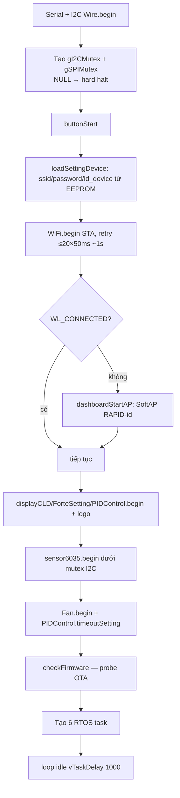
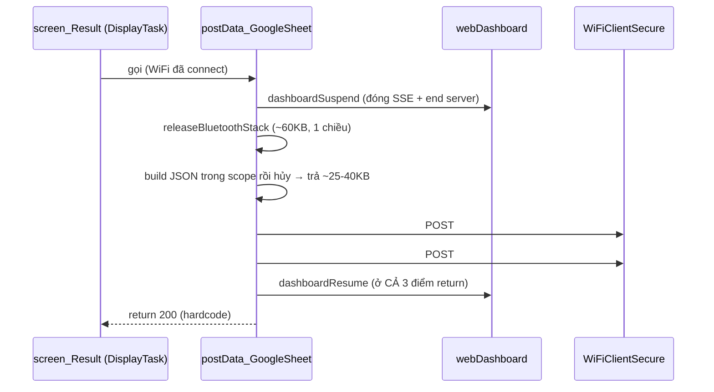
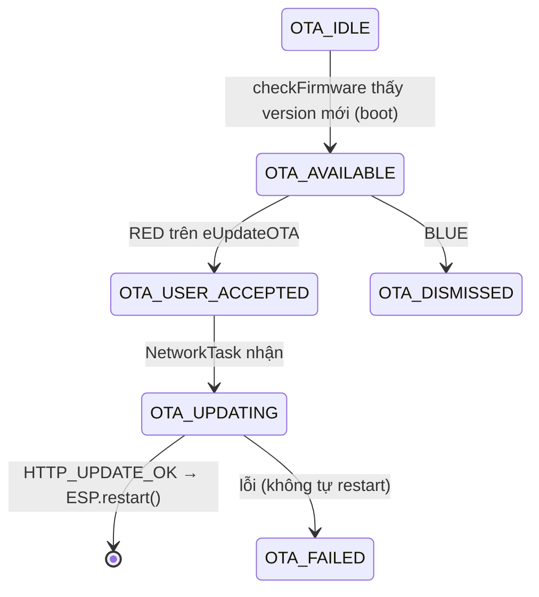

# 06 — Mạng, boot, upload, OTA, heap

Nguồn: [src/main.cpp](../../src/main.cpp), [src/Bluetooth.cpp](../../src/Bluetooth.cpp),
[src/updateOTA.cpp](../../src/updateOTA.cpp), [src/webDashboard.cpp](../../src/webDashboard.cpp).

## Trình tự boot — `setup()`

Dashboard **không** start trong `setup()` (WiFi thường chưa kịp connect) mà lazy trong
`dashboardLoop()` khi `networkUp()`. Xem [05-web-dashboard.md](05-web-dashboard.md).

## WiFi — 3 đường loại trừ nhau

| Đường | Khi nào | Việc |
|---|---|---|
| **STA** (creds EEPROM) | mặc định lúc boot | `WiFi.begin(ssid, password)`; upload Google Sheet được |
| **SoftAP fallback** | STA fail lúc boot | `dashboardStartAP()`: **release BT (~60KB) trước** rồi `softAP("RAPID-<id>")` (mở, 192.168.4.1). Không release BT thì AP hết heap → client không lấy được DHCP IP. |
| **WiFiManager portal** | menu Setting → WiFi (không phải boot) | release BT → `dashboardEnd()` → `resetSettings` → captive portal nhập creds → lưu EEPROM → thường `ESP.restart()` |

## Upload kết quả — `postData_GoogleSheet()`

Gọi từ `screen_Result('f')` (tự động cuối test, hoặc manual). Trình tự tối ưu heap:

- **POST #1 (GAS):** `setFollowRedirects(DISABLE)` — GAS trả **302 sau khi** append xong nên
  **302 = thành công**; host redirect từ chối re-POST. `setInsecure()` (bỏ verify cert → cấp phát
  nhỏ hơn). Timeout 60s (GAS append ~35-40s).
- **POST #2 (ingest):** cùng client, thêm `Authorization: Bearer <token>`.
- **JSON payload:** `method=append`, `id_device`, `version`, `kitId`, `type_Upload`
  (Manual/Auto/N/A), mảng `slopes/origins/LED_power/CT_value/result`, `record_out` (đỉnh + outcome
  từng slot), `amplification` (đường cong raw).

> Caveat: hàm luôn `return 200` (dòng trả code thật bị comment) → caller không biết upload thật
> thành/bại.

## OTA — `updateOTA.cpp`

`OtaState` (1 byte volatile atomic): `IDLE → AVAILABLE → USER_ACCEPTED → UPDATING → (restart|FAILED)`.

`checkFirmware()` GET metadata JSON từ GitHub raw; `updateFirmware()` (NetworkTask poll 10ms) chỉ
hành động khi `OTA_USER_ACCEPTED`, dùng `httpUpdate.update()`. Thành công → `ESP.restart()` (đường
restart duy nhất của OTA).

## Ràng buộc heap (lý do của mọi thứ tự trên)

- **Release BT 1 chiều** (`releaseBluetoothStack`): `esp_bt_mem_release` trả ~60KB **vĩnh viễn**,
  chỉ gọi 1 lần (gọi lần 2 hỏng heap; `SerialBT.*` sau đó → assert → reboot). Cờ `gBtReleased`
  idempotent qua 3 luồng (auto upload, manual upload, WiFiManager).
- **TLS cần ~40KB liền mạch** — chỉ đủ nhờ **bộ ba**: release BT + hủy JsonDocument trước handshake
  + `dashboardSuspend()` (đóng SSE + AsyncWebServer). Thiếu 1 → `-32512` (SSL alloc) / `-10368`
  (X509). Chế độ AP còn chật hơn → `dashboardLoop` log heap mỗi 10s để đo.
- **Fragmentation** (khối liền mạch lớn nhất `getMaxAllocHeap`), không phải tổng free, là thứ gây
  lỗi TLS.
