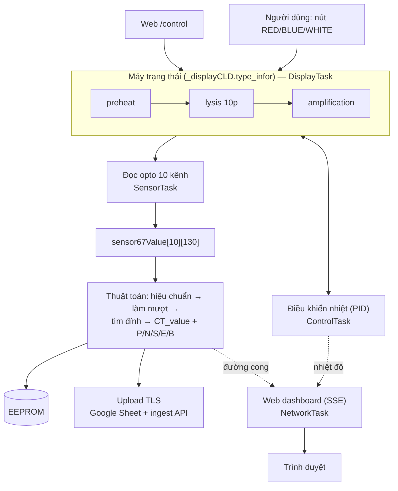

# Kiến trúc FBT RAPID (firmware ESP32)

Mô tả kiến trúc firmware máy xét nghiệm LAMP-PCR **FBT RAPID**. Đọc theo thứ tự dưới,
hoặc nhảy tới phần cần. Mọi tham chiếu code dạng `file:line` trỏ vào [src/](../../src/).

## Mục lục

| # | Tài liệu | Nội dung |
|---|---|---|
| 01 | [Tổng quan](01-tong-quan.md) | Thiết bị, phần cứng, ngăn xếp phần mềm, bản đồ module |
| 02 | [RTOS tasks](02-rtos-tasks.md) | 6 task/core, mutex, giao tiếp giữa task |
| 03 | [Quy trình xét nghiệm](03-quy-trinh-xet-nghiem.md) | Máy trạng thái `type_infor`: preheat→lysis→amplification→kết quả |
| 04 | [Nhiệt & sensor](04-nhiet-va-sensor.md) | PID điều khiển nhiệt, đọc opto, tính CT_value/kết quả |
| 05 | [Web dashboard](05-web-dashboard.md) | AsyncWebServer + SSE, điều khiển, SoftAP, heap |
| 06 | [Mạng & upload](06-mang-va-upload.md) | Boot, WiFi, upload TLS, OTA, ràng buộc heap |

Spec giao diện: [../GUI_SSE/GUI.md](../GUI_SSE/GUI.md). Nhật ký thay đổi: [../history/](../history/).

## Sơ đồ tổng — luồng một lần xét nghiệm

## Nguyên tắc kiến trúc

- **Một biến trạng thái điều phối** (`_displayCLD.type_infor`) — 3 nguồn ghi (nút, timer,
  hoàn tất nhiệt/sensor). Xem [03](03-quy-trinh-xet-nghiem.md).
- **Không dùng queue giữa task** — phối hợp qua biến chung + cờ + mutex (I2C, SPI).
- **Heap chật là ràng buộc xuyên suốt**: BT release 1 chiều, TLS cần khối liền mạch,
  dashboard suspend khi upload. Xem [06](06-mang-va-upload.md).
- **Nhiều "tên legacy"**: enum `B_BLUE` = nút vật lý **green**; "67°C" thực là 65.8°C;
  comment `epreheating67` sai. Tin code, không tin tên/comment.

## Cách cập nhật tài liệu này

Khi kiến trúc đổi: cập nhật file liên quan ở đây + [CLAUDE.md](../../CLAUDE.md) +
[README.md](../../README.md), và thêm nhật ký vào [../history/](../history/). Sơ đồ dùng
**mermaid** (GitHub/VS Code render trực tiếp trong markdown).
