# HƯỚNG DẪN SỬ DỤNG WEB DASHBOARD

Máy xét nghiệm LAMP-PCR **FBT RAPID (RPL)** — Forte Biotech

Tài liệu này hướng dẫn vận hành máy RPL **qua trình duyệt web** (điện thoại, máy tính bảng
hoặc máy tính), kết hợp với các thao tác thực tế trên máy: bấm nút, nạp ống, đóng nắp gia
nhiệt. Mọi bước đều theo đúng trình tự mà máy thực sự chạy.

Phiên bản firmware áp dụng: **v2.4.3**.

<!-- toc -->

# 1. Giới thiệu

## 1.1. Web dashboard dùng để làm gì

Máy RPL có màn hình TFT nhỏ và 3 nút bấm ngay trên thân máy. Web dashboard là **màn hình
thứ hai** của cùng chiếc máy đó: mở trên điện thoại hoặc máy tính, người vận hành có thể

- xem trạng thái, nhiệt độ và thời gian còn lại của lần chạy;
- bấm các nút của máy từ xa;
- **đặt tên bệnh và tên mẫu cho từng kênh** — việc này chỉ làm được trên web;
- xem **biểu đồ khuếch đại theo thời gian thực**;
- đọc lại bảng kết quả và đường cong của lần chạy vừa xong;
- cấu hình WiFi, thông số nhiệt/thời gian và cập nhật firmware.

> Máy là nguồn dữ liệu duy nhất. Trang web không tự lưu lịch sử: mỗi lần mở hoặc mỗi lần
kết nối lại, trang tải toàn bộ dữ liệu từ máy. Vì vậy đóng trình duyệt giữa chừng **không**
làm mất dữ liệu của lần chạy đang thực hiện.

## 1.2. Ba nút trên máy

Máy có ba nút vật lý. Trên web, ba nút này hiện thành ba ô bấm trong khung **"CONTROLS"**,
theo đúng thứ tự và màu sắc như trên máy.

| Nút trên máy | Ô trên web | Vai trò chung |
| --- | --- | --- |
| **XANH LÁ** | ô xanh lá bên trái | Bắt đầu quy trình Lysis; ở một số màn là "đi tiếp" |
| **ĐỎ** | ô đỏ ở giữa | Bắt đầu Amplification; ở một số màn là "xác nhận / bắt đầu" |
| **TRẮNG** | ô trắng bên phải | Mở màn hình QR để vào web; ở các màn khác là "quay lại" |

Chữ trên mỗi ô bấm **thay đổi theo trạng thái của máy**: ô đỏ có thể là "Amplification",
"Confirm & heat", "Start" hoặc "Errors Table" tuỳ thời điểm. Ô nào bị mờ và hiện dấu `-`
nghĩa là **nút đó không có tác dụng** ở màn hình hiện tại.

Nhãn **"Return"** của ô trắng có nghĩa là *đưa máy về màn hình chính*. Ở màn hình chờ thao
tác thì đó chỉ là huỷ bỏ vô hại, nhưng ở màn hình đang gia nhiệt hoặc đang đo thì nó **huỷ
lần chạy** — xem cảnh báo bên dưới.

> ! Ô bấm trên web gửi lệnh y hệt nút vật lý. Không bấm từ xa khi chưa biết chắc máy đang ở
bước nào và không có ai đứng cạnh máy — một số bước cần thao tác tay ngay sau đó
(nạp ống, đóng nắp).

> ! **Nút TRẮNG trong lúc máy đang gia nhiệt hoặc đang đo sẽ HUỶ LẦN CHẠY.** Máy in
*"Reboot in 1 second"*, tắt toàn bộ gia nhiệt và khởi động lại; đường cong đang đo **không
được ghi lại** và mất hoàn toàn. Trên web nút này chỉ mang nhãn hiền lành **"Return"** —
hãy coi nhãn đó là **"huỷ lần chạy"** trong suốt thời gian máy đang chạy.

## 1.3. Giữ nút — các chức năng phụ trên máy

Ngoài bấm nhanh, mỗi nút còn một chức năng khi **giữ khoảng 2 giây**. Các chức năng này chỉ
có trên máy, **không có ô tương ứng trên web**.

| Giữ nút | Chức năng |
| --- | --- |
| **ĐỎ** | Mở menu Setting trên màn hình máy (bật điểm phát sóng / gửi lại dữ liệu lần chạy trước) |
| **TRẮNG** | Xem lại kết quả lần chạy gần nhất ngay trên màn hình máy — **không** huỷ lần chạy đang thực hiện |
| **XANH LÁ** | Vào chế độ **hiệu chuẩn quang học** — chỉ dành cho kỹ thuật viên |

> ! **Các lệnh giữ nút không bị khoá ở bất kỳ trạng thái nào**, kể cả khi máy đang chạy
và kể cả khi máy đang báo lỗi. Hãy cẩn thận khi cầm máy lúc đang có lần chạy.

> ! **Không giữ nút XANH LÁ trong vận hành thường ngày.** Chế độ hiệu chuẩn là quy trình
kỹ thuật nhiều bước, cần thay ống chuẩn nhiều lần và **không có nút thoát trên máy**. Nếu
lỡ vào, hãy tắt và bật lại nguồn máy.

## 1.4. Giới hạn số người xem

Máy chỉ phục vụ **2 người xem trực tuyến cùng lúc** (mỗi tab trình duyệt tính là một người).
Người thứ ba vẫn mở được trang và vẫn xem được bảng kết quả cùng biểu đồ đã lưu, nhưng
**không nhận cập nhật trực tiếp** — góc trên bên phải sẽ nằm ở **"Offline"**.

> Khi một người đóng tab, người đang chờ **phải tải lại trang** mới vào được suất trống —
trang không tự nối lại trong trường hợp này. Đóng bớt các tab thừa là cách nhanh nhất để
giải phóng suất xem.

<!-- pagebreak -->

# 2. Kết nối vào web dashboard

## 2.1. Đọc dòng địa chỉ mạng trên màn hình máy

Ở góc dưới màn hình chính của máy có một dòng địa chỉ **tự cập nhật liên tục**. Đây là cách
nhanh nhất để biết có vào web được hay không:

| Màn hình máy hiện | Nghĩa | Việc cần làm |
| --- | --- | --- |
| **"Scanning..."** | Máy đang dò và kết nối WiFi | Chờ vài giây |
| Một **địa chỉ IP** (ví dụ `192.168.1.42`) | Máy đã vào mạng WiFi | Mở địa chỉ đó trên trình duyệt (mục 2.2) |
| **"0.0.0.0"** | Máy **không vào được WiFi** nên đã bật điểm phát sóng riêng | Làm theo mục 2.3 |

> Ngay sau khi bật nguồn, máy có thể hiện màn hỏi **cập nhật firmware** trước khi vào màn
hình chính. Khi đó bấm **nút XANH LÁ** để bỏ qua và vào màn hình chính, hoặc **nút ĐỎ** nếu
muốn cập nhật ngay (mất khoảng 2 phút và máy sẽ tự khởi động lại).

## 2.2. Trường hợp máy đã nối WiFi

Đây là trường hợp thông thường trong phòng xét nghiệm.

1. Ở màn hình chính của máy (màn có dòng "Press Green: Lysis" và "Press Red: Amplification"),
   bấm **nút TRẮNG**.
2. Màn hình máy chuyển sang **mã QR**. Ngay dưới mã QR có in **địa chỉ IP** của máy.
3. Dùng camera điện thoại quét mã QR, hoặc mở trình duyệt và gõ địa chỉ IP đó.
4. Bấm **nút TRẮNG** lần nữa để máy quay về màn hình chính.

Điện thoại và máy phải **cùng một mạng WiFi**.

> Mã QR mã hoá địa chỉ dạng `http://<tên-máy>.local/`. Địa chỉ này không đổi khi router cấp
lại IP mới, nên quét QR luôn đúng. Tuy nhiên một số điện thoại Android đời cũ không hiểu
dạng `.local`; khi đó hãy **gõ tay địa chỉ IP** in ở dòng chữ bên dưới mã QR.

## 2.3. Trường hợp máy chưa có WiFi

Khi không kết nối được mạng nào, máy tự phát một điểm phát sóng WiFi riêng:

1. Trên điện thoại, vào phần WiFi và tìm mạng tên **`FBT-<mã máy>`** (ví dụ `FBT-RPL02013`).
   Mạng này **không có mật khẩu**.
2. Kết nối vào mạng đó. Điện thoại thường tự mở trang dashboard; nếu không, mở trình duyệt
   và gõ **`192.168.4.1`**.
3. Vào thẻ **Setting → WiFi** để khai báo mạng WiFi của phòng (xem mục 7.1).

## 2.4. Bật điểm phát sóng khi cần

Nếu máy đang ở màn hình chính và bạn muốn chủ động bật điểm phát sóng để vào web:

1. **Giữ nút ĐỎ** khoảng 2 giây → máy vào menu Setting trên màn hình TFT.
2. Bấm **nút XANH LÁ** → máy bật điểm phát sóng và hiện mã QR để tham gia mạng.
3. Quét mã QR để điện thoại tự vào mạng `FBT-<mã máy>`, rồi mở `192.168.4.1`.

> ! Khi rời khỏi màn hình QR, máy sẽ **tự khởi động lại** để tắt điểm phát sóng và quay về
mạng WiFi thường. Đừng rời màn hình QR khi đang có người dùng web.

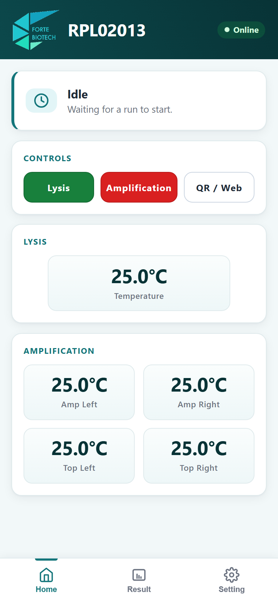

<!-- pagebreak -->

# 3. Màn hình Home

Đây là màn hình mặc định khi mở web.

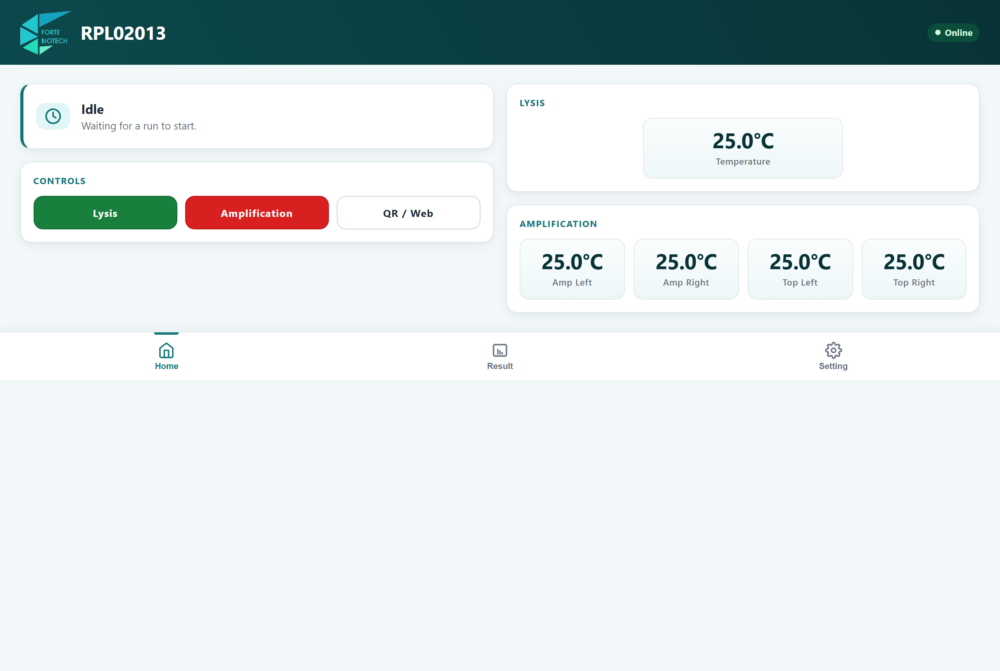

Các thành phần từ trên xuống (trên điện thoại) hoặc từ trái sang (trên máy tính):

- **Thanh tiêu đề**: logo Forte Biotech, **mã máy** (ví dụ `RPL02013`) và chỉ báo
  **"Online" / "Offline"**. "Offline" nghĩa là trình duyệt đang mất liên lạc với máy —
  hãy kiểm tra WiFi.
- **Khung trạng thái**: dòng chữ lớn là việc máy đang làm ("Idle", "Amplification",
  "Insert amplification tube"...), dòng nhỏ bên dưới là chi tiết (nhiệt độ hiện tại /
  mục tiêu, thời gian còn lại, số vòng đã đo).
- **CONTROLS**: ba ô bấm tương ứng ba nút trên máy (mục 1.2).
- **Nhiệt độ**: khối **LYSIS** (khối ly giải) và khối **AMPLIFICATION** gồm
  *Amp Left / Amp Right* (hai khối gia nhiệt đáy) và *Top Left / Top Right* (nắp gia nhiệt).
- **Thanh điều hướng**: **Home – Result – Setting**, luôn ở đáy màn hình.

> Trong lúc máy đang chạy, thanh điều hướng **tự động ẩn đi** để tránh bấm nhầm. Nó hiện lại khi lần chạy kết thúc. Đây là hành vi bình thường, không phải lỗi.

## 3.1. Ý nghĩa các ô bấm theo từng bước

| Trạng thái máy hiển thị | Ô xanh lá | Ô đỏ | Ô trắng |
| --- | --- | --- | --- |
| "Idle" | Lysis | Amplification | QR / Web |
| "Insert lysis tube" | – | Start lysis | Return |
| "Remove lysis tube" | Amplification | – | Return |
| "Name the samples" | – | Confirm & heat | Return |
| "Warming up optics" | Skip preheat | – | Return |
| "Insert amplification tube" | – | Start | Return |
| "Amplification" (đang đo) | – | – | Return |
| "Run complete" | – | Errors Table | Next test |

<!-- pagebreak -->

# 4. Ly giải mẫu — giai đoạn 1

Ly giải là bước phá vỡ tế bào để giải phóng vật liệu di truyền. Dùng khi mẫu **chưa được ly
giải sẵn**. Quy trình **bắt đầu bằng nút XANH LÁ** và các bước đầu thực hiện **trên máy**.
Xong bốn bước, máy đi thẳng sang giai đoạn khuếch đại ở mục 5.

1. **Bấm nút XANH LÁ** ở màn hình chính (hoặc ô "Lysis" trên web). Máy gia nhiệt khối ly giải
   tới **82 °C**; web hiện **"Heating lysis block"** kèm nhiệt độ hiện tại / mục tiêu.

2. Khi đạt nhiệt, web hiện **"Insert lysis tube"** kèm nhiệt độ khối. **Thao tác trên máy:**
   đặt ống lysis vào khối ly giải.

3. Bấm ô đỏ **"Start lysis"**. Web hiện **"Lysis running"** và đếm ngược — mặc định
   **10 phút**. Không mở khoang ly giải trong lúc này.

4. Hết giờ, web hiện **"Remove lysis tube"** với hướng dẫn:
   *"Take the tube out and close the lid, then press Amplification (green)."*
   **Thao tác trên máy:** lấy ống lysis ra và đóng nắp.

   > ! Ống vừa lấy ra đang **nóng**. Máy đứng chờ ở bước này cho tới khi có người thao tác —
   nó sẽ không tự đi tiếp.

5. Bấm ô xanh lá **"Amplification"**. Từ đây quy trình đi tiếp **giống hệt Bước 2 đến Bước 5
   ở mục 5**: gia nhiệt 65.8 °C → nạp ống → Start → theo dõi → kết quả.

> Ở luồng này máy **bỏ qua 15 phút giữ nhiệt** của giai đoạn ổn định quang học, vì khối máy
đã nóng sẵn suốt quá trình ly giải. Vì vậy luồng đầy đủ không lâu hơn luồng chỉ khuếch đại
đúng bằng thời gian ly giải.

> Ở luồng Lysis, bảng đặt tên mẫu xuất hiện **muộn hơn** — tại bước "Insert amplification
tube". Cách điền hoàn toàn giống mục 5, Bước 1. Sau khi điền xong bấm **Confirm** để mở khoá
nút **"Start"**.

<!-- pagebreak -->

# 5. Khuếch đại — giai đoạn 2

**Mẫu đã ly giải sẵn thì bắt đầu thẳng từ mục này**, bằng nút ĐỎ ở màn hình chính. Đi từ
mục 4 sang thì máy đã ở Bước 2.

Với thông số mặc định, toàn bộ lần chạy mất khoảng **60–75 phút**: gia nhiệt vài phút, giữ
nhiệt và ổn định quang học **15 phút**, rồi đo **120–130 vòng × 20 giây ≈ 40–43 phút**. Số
vòng đúng của máy bạn xem ở thẻ **Profile Configuration** (mục 7.2).

## Bước 1 — Bấm "Amplification" và đặt tên mẫu

Trên web, ở màn hình Home khi máy đang **"Idle"**, bấm ô đỏ **"Amplification"**.

Máy chuyển sang trạng thái **"Name the samples"**. **Máy chưa gia nhiệt ở bước này** — mọi
nhiệt độ vẫn ở mức phòng.

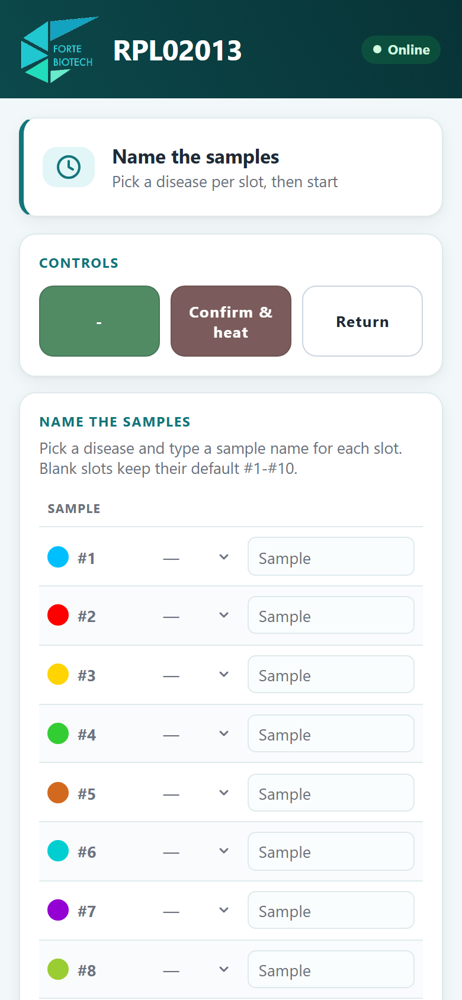

Bảng gồm 10 dòng, tương ứng 10 kênh của máy. Mỗi dòng có:

- **chấm màu** — đúng màu đường biểu đồ của kênh đó;
- **số kênh** `#1`–`#10` — đúng vị trí ống trên máy;
- **ô chọn bệnh** — danh sách cố định: PCV, PCM, EHP, EMS, WSSV, TPD, PCT, ISKNV, PCS,
  ASF p72, ASF I177L, ASF MGF;
- **ô nhập tên mẫu** — gõ tự do, tối đa 32 ký tự (ví dụ mã ao nuôi, mã bệnh phẩm).

Điền lần lượt cho các kênh sẽ dùng.

> Kênh để trống vẫn chạy bình thường và sẽ mang tên mặc định `#1`–`#10`. Tên bệnh là thứ
hiện trên chú giải biểu đồ; tên mẫu chỉ hiển thị trên web, không gửi lên đám mây và không
hiện trên màn hình máy.

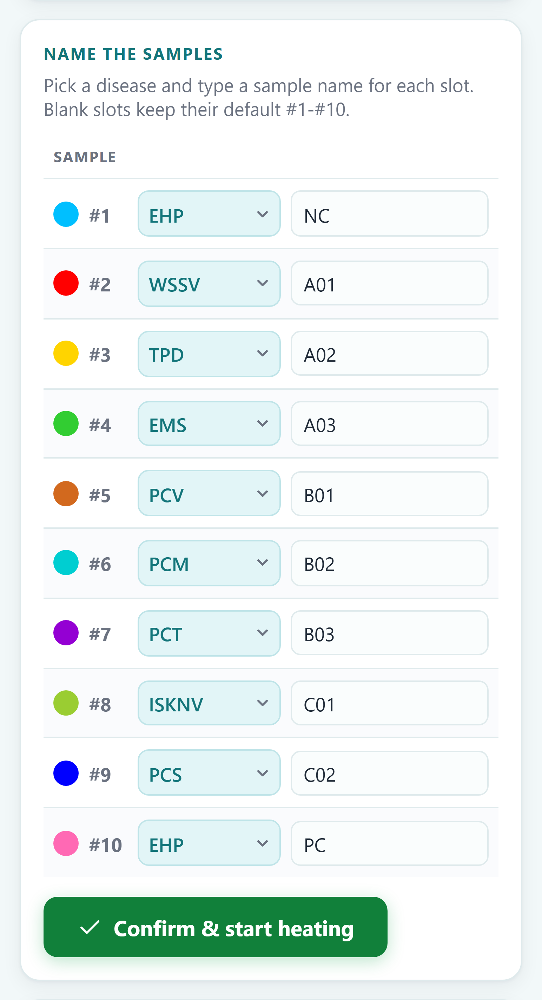

Trên **máy tính**, bảng đặt tên trải ngang hết bề rộng nên thấy trọn 10 kênh cùng lúc.
Đây là lý do nên đặt tên trên máy tính nếu có sẵn.

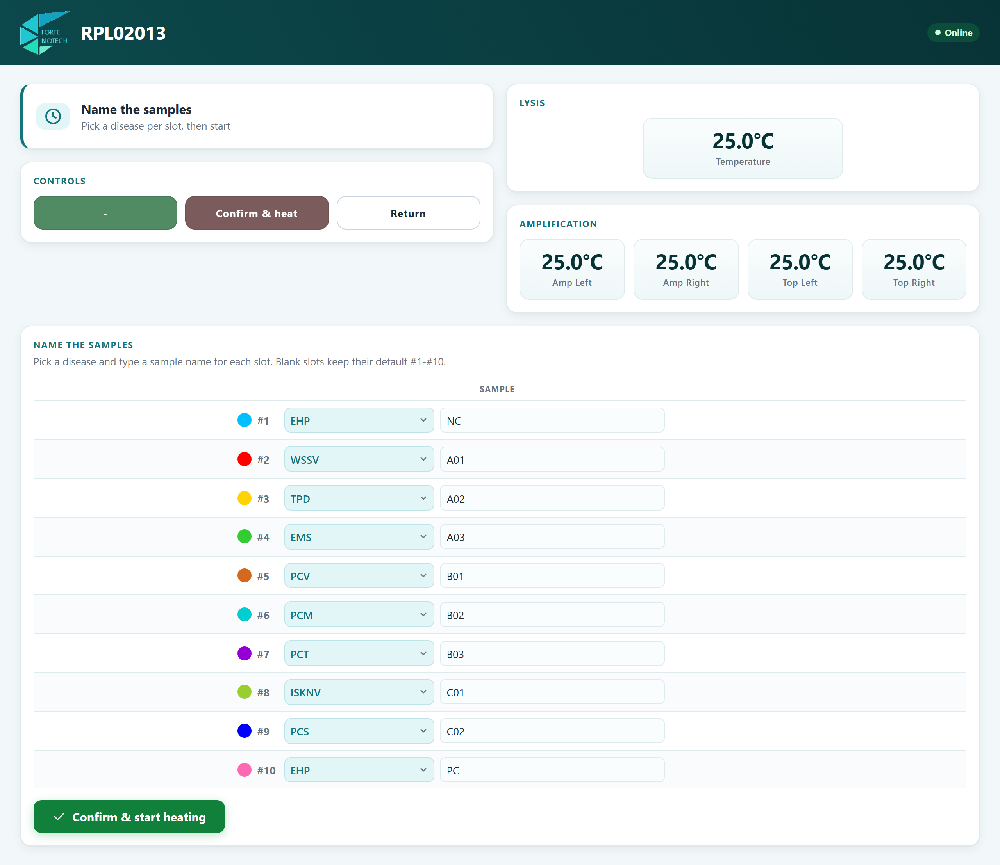

<!-- pagebreak -->

## Bước 2 — Xác nhận để máy bắt đầu gia nhiệt

Bấm nút xanh lớn **"Confirm & start heating"** ở cuối bảng (hoặc ô đỏ **"Confirm & heat"**
trong khung CONTROLS).

Máy bắt đầu gia nhiệt hai khối khuếch đại tới **65.8 °C** và hai nắp gia nhiệt. Dòng trạng
thái hiện **"Heating to 65.8 C"** kèm nhiệt độ thực tế của từng khối và từng nắp.

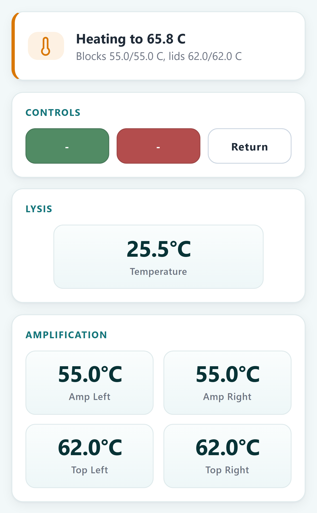

Sau khi đạt nhiệt, máy còn một giai đoạn giữ nhiệt và ổn định quang học, hiển thị
**"Warming up optics"** kèm số phút còn lại.

> ! Giai đoạn giữ nhiệt bảo đảm khối gia nhiệt và bộ quang ổn định trước khi đo. Chỉ bấm
"Skip preheat" (ô xanh lá) khi máy vừa chạy xong một lần chạy khác và vẫn còn nóng.

## Bước 3 — Nạp ống vào máy

Khi máy sẵn sàng, trạng thái đổi thành **"Insert amplification tube"** và ô đỏ hiện chữ
**"Start"**.

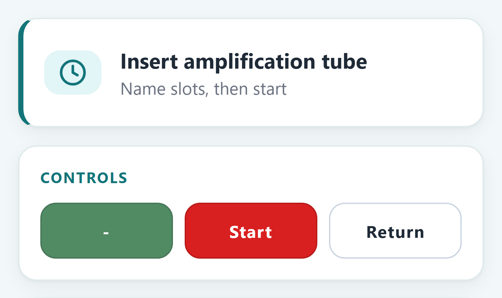

**Thao tác trên máy — thực hiện tại chỗ:**

1. Mở nắp gia nhiệt của máy.
2. Đặt các ống phản ứng vào **đúng kênh đã đặt tên ở Bước 1**. Kênh `#1` là kênh số 1
   trên thân máy.
3. Đóng chặt nắp gia nhiệt.

> ! Nắp gia nhiệt hoạt động ở **75 °C** — vẫn đủ nóng để gây bỏng, cẩn thận khi mở và đóng.
Đóng nắp không chặt sẽ gây bay hơi và làm sai kết quả.

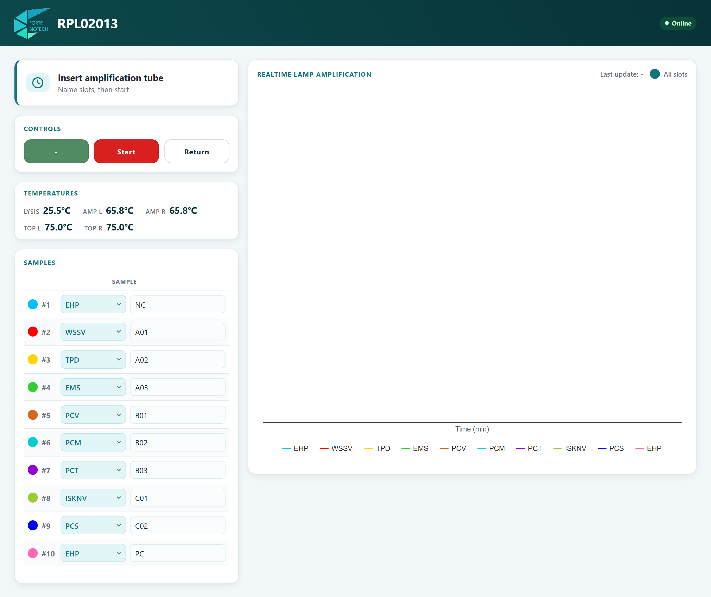

<!-- pagebreak -->

## Bước 4 — Bắt đầu đo và theo dõi

Bấm ô đỏ **"Start"** (hoặc nút ĐỎ trên máy). Máy bắt đầu đếm vòng đo.

Giao diện chuyển sang chế độ theo dõi: bảng nhiệt độ thu gọn thành một dòng và **biểu đồ
khuếch đại thời gian thực** hiện ra.

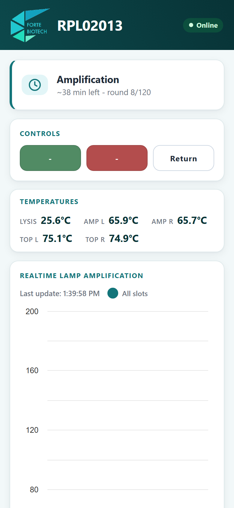

Dòng trạng thái hiện **"Amplification"** kèm **số phút còn lại** và **số vòng đã đo**
(ví dụ `~19 min left - round 65/120`).

### Trên điện thoại

Bảng 10 kênh **được ẩn đi** để biểu đồ chiếm trọn màn hình. Tên các kênh vẫn đọc được ở
**chú giải ngay dưới biểu đồ**.

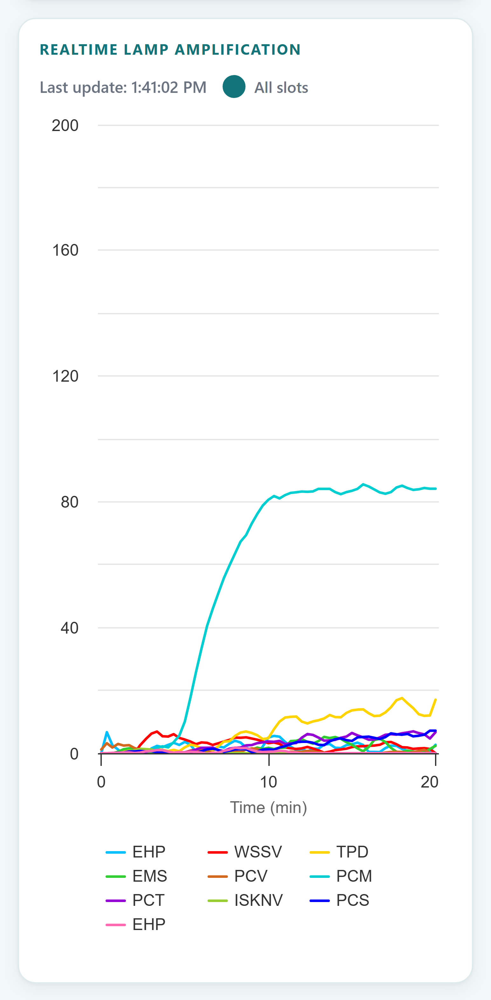

### Trên máy tính

Biểu đồ chiếm cột phải, còn cột trái giữ nguyên trạng thái, nút bấm, nhiệt độ và **bảng 10
kênh làm chú giải** — tra cứu kênh nào là mẫu nào mà không cần rời mắt khỏi đường cong.

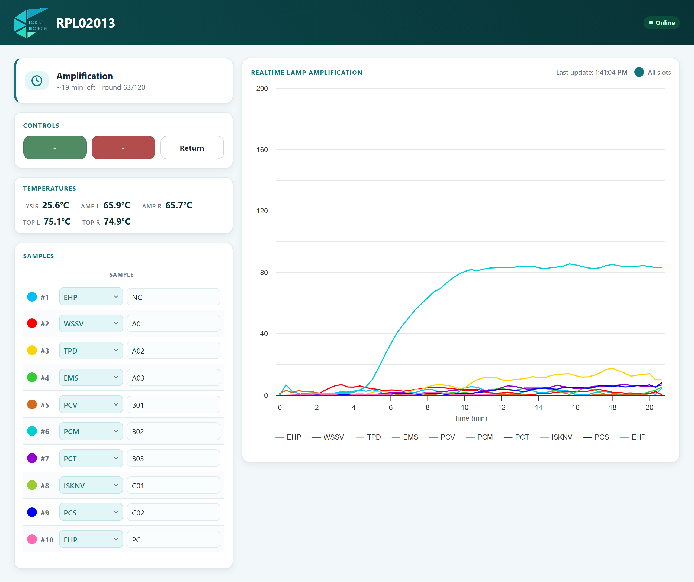

### Cách đọc biểu đồ (giống nhau ở mọi thiết bị)

- Trục ngang là **thời gian tính bằng phút** kể từ lúc bắt đầu đo.
- Trục dọc là **tín hiệu huỳnh quang đã trừ nền**. Máy lấy mức nền trung bình trong khoảng
  **phút 2 đến phút 6** — đó là lúc quang học đã ổn định. Vì vậy vài phút đầu biểu đồ nằm
  phẳng quanh 0 là **đúng**, không phải máy hỏng.
- Kênh **dương tính** cho đường cong đi lên rõ rệt rồi bão hoà. Kênh **âm tính** nằm phẳng
  suốt lần chạy.
- Ô **"All slots"** ở góc phải trên biểu đồ bật/tắt tất cả các đường cùng lúc. Muốn ẩn/hiện
  từng kênh thì bấm **chấm màu** ở đầu dòng tương ứng trong bảng 10 kênh — trên điện thoại
  bảng này đang ẩn, nên hãy dùng thẻ **Result** sau khi lần chạy kết thúc.

> Có thể đóng trình duyệt hoặc mất WiFi giữa chừng. Khi mở lại, trang tải lại **toàn bộ**
đường cong từ đầu lần chạy — không mất đoạn nào.

> ! Trong suốt giai đoạn này, **đừng bấm ô trắng "Return"** (và đừng bấm nút TRẮNG trên
máy). Nó khởi động lại máy và **mất toàn bộ lần chạy đang thực hiện** — không có xác nhận, không hoàn
tác được. Muốn xem tab khác thì dùng thanh điều hướng, không dùng nút này.

<!-- pagebreak -->

## Bước 5 — Kết thúc lần chạy

Khi đủ số vòng, máy chuyển sang **"Finishing the run"** và tính kết quả rồi gửi lên đám mây.
Giai đoạn này mất **khoảng 30–90 giây**.

Khi xong, trạng thái đổi thành **"Run complete – Results ready."** và có thông báo
**"Amplification finished"**.

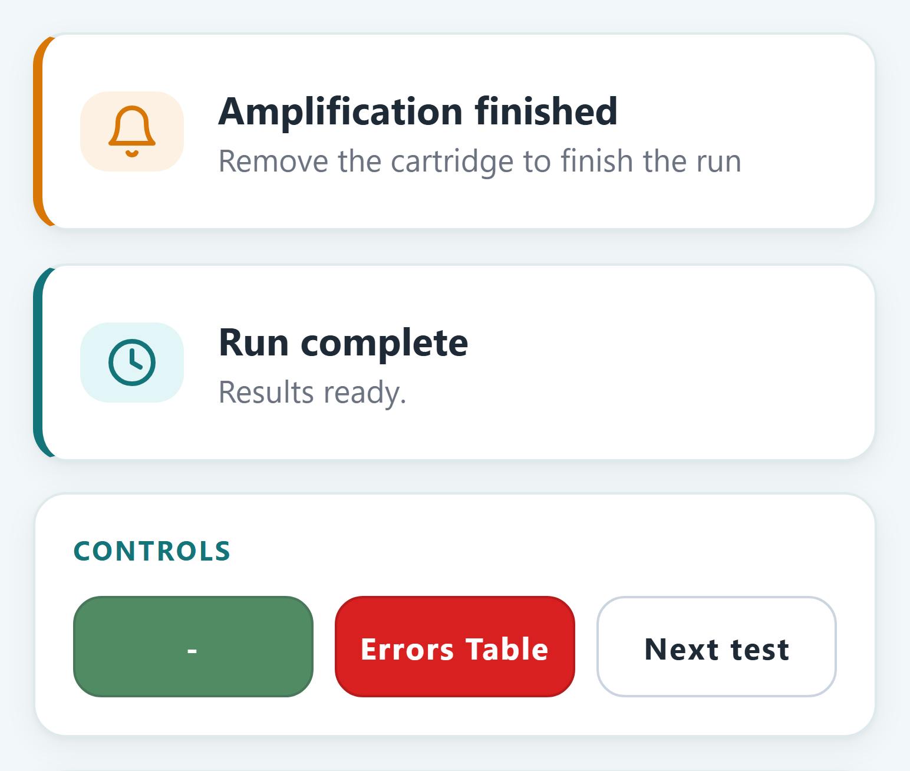

**Thao tác trên máy:** mở nắp gia nhiệt và lấy các ống ra.

Biểu đồ vẫn ở lại màn hình Home để xem tiếp. Khi muốn chuẩn bị lần chạy mới, bấm ô trắng
**"Next test"** — máy quay về màn hình chính và biểu đồ trên Home mới biến mất.

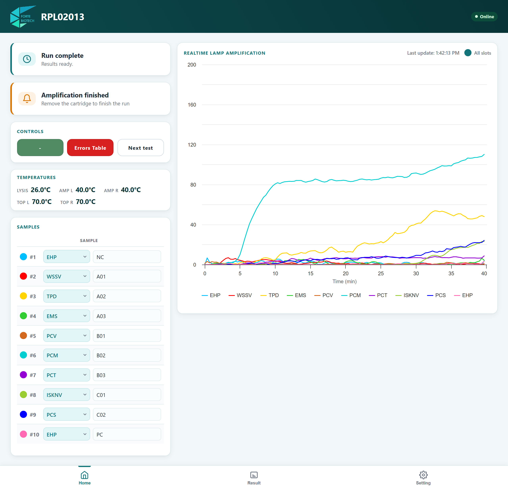

> ! Đừng tắt nguồn máy trong lúc còn hiện "Finishing the run": máy đang tính kết quả và gửi
dữ liệu. Kết quả của lần chạy vẫn được lưu trong bộ nhớ máy sau khi hoàn tất, nhưng tắt giữa chừng
có thể mất lần gửi lên đám mây.

<!-- pagebreak -->

# 6. Đọc kết quả — thẻ Result

Bấm **Result** ở thanh điều hướng dưới cùng.

## 6.1. Bảng kết quả

Bảng có 4 cột, theo thứ tự:

| Cột | Ý nghĩa |
| --- | --- |
| **chấm màu** | Màu đường của kênh đó trên biểu đồ. Bấm để ẩn/hiện đường. |
| **RESULT** | Kết luận của máy, ghi bằng một chữ cái (xem bảng dưới). |
| **CT** | Thời điểm đường cong vượt ngưỡng. Càng nhỏ, tải lượng càng cao. Dấu `-` nghĩa là không có tín hiệu khuếch đại. |
| **SAMPLE** | Tên bệnh đã chọn và tên mẫu đã nhập. Vẫn sửa được sau khi chạy xong. |

## 6.2. Ý nghĩa chữ cái ở cột RESULT

| Chữ | Đầy đủ | Nghĩa |
| --- | --- | --- |
| **P** | Positive | **Dương tính** — có khuếch đại rõ. |
| **S** | Slight Positive | **Dương tính yếu** — có tín hiệu nhưng thấp; nên xem lại đường cong và cân nhắc chạy lại. |
| **N** | Negative | **Âm tính** — không phát hiện khuếch đại. |
| **E** | Error | **Lỗi** — kênh đo gặp sự cố; kết quả kênh này không dùng được. |
| **B** | Break | **Gián đoạn** — phép đo bị đứt quãng; cần chạy lại kênh này. |

> ! Kênh báo **E** hoặc **B** là *không có kết quả*, **không phải âm tính**. Phải chạy lại.

Dòng có kết quả **P** hoặc **S** được tô nền nhạt để dễ nhận ra, nhưng **kết luận nằm ở chữ
cái**, không nằm ở màu nền.

## 6.3. Xem lại đường cong

Bấm nút **"View chart"** ở cuối bảng để hiện đường cong của lần chạy đã lưu.

**Trên điện thoại**, biểu đồ hiện **phía trên** bảng; cuộn xuống để xem lại bảng.

**Trên máy tính**, biểu đồ và bảng nằm **cạnh nhau và cao bằng nhau**: đối chiếu chữ
cái kết quả với đường cong tương ứng mà không phải cuộn.

## 6.4. Bảng lỗi cảm biến

Bảng kết quả cho biết **kết luận**; bảng lỗi cho biết **vì sao một kênh không có kết luận**.
Cả hai nói về cùng một lần chạy, nhìn từ hai phía.

Bấm nút **"Error table"** ở cuối thẻ Result. Bảng lỗi **thay chỗ biểu đồ** chứ không nằm dưới
nó — bấm **"View chart"** để quay lại đường cong.

Bảng có 3 cột:

| Cột | Ý nghĩa |
| --- | --- |
| **Slot** | Kênh `#1`–`#10` |
| **Code** | Mã lỗi 4 chữ số. Kênh không lỗi hiện dấu `—`, đúng như dấu `----` máy in ra. |
| **Detail** | Mô tả lỗi, ví dụ `[Sensor Light]- no data from sensor 1st reading` |

Ngay trên bảng có một dòng tóm tắt: **"No sensor errors in the last run"** nếu sạch, hoặc
đếm rõ **"N of 10 channels reported a sensor error"** nếu có lỗi.

> **Mã 4 chữ số này giống hệt mã máy in trên màn hình TFT.** Nó ghép theo công thức
`môđun × 1000 + loại × 100 + bước × 10 + kênh`, nên đọc chéo giữa màn hình máy và web được.
Khi báo cho kỹ thuật viên, **đọc nguyên mã 4 chữ số** là đủ để họ biết hỏng ở đâu.

**Xem ngay trên màn hình Home:** hết lần chạy, bấm ô đỏ **"Errors Table"** — máy chuyển sang
màn bảng lỗi và web đi theo máy, biểu đồ trên Home đổi thành đúng bảng đó. Ai đứng ở máy và
ai cầm điện thoại nhìn thấy cùng một thứ. Bấm ô trắng để rời khỏi màn này.

> ! **"No stored run to report on yet." không có nghĩa là không có lỗi.** Câu đó nghĩa là máy
**chưa có lần chạy nào để soi** — vừa bật máy, hoặc vừa bắt đầu lần chạy mới nên kết quả cũ
đã bị xoá. Chỉ khi bảng hiện đủ 10 dòng thì câu **"No sensor errors in the last run"** mới là
lời xác nhận thật.

> ! Kênh báo lỗi là kênh **không có kết quả** — ở bảng kết quả nó mang chữ **E** hoặc **B**.
Đừng đọc thành âm tính, phải chạy lại kênh đó. Nếu cùng một kênh báo lỗi ở nhiều lần chạy
liên tiếp, đọc mã 4 chữ số cho kỹ thuật viên.

## 6.5. Xem lại lần chạy sau khi đã tắt máy

Máy lưu **lần chạy gần nhất** trong bộ nhớ trong. Sau khi tắt và bật lại, vào thẻ **Result**, trang
sẽ tự đọc lại lần chạy đó.

> Quá trình đọc lại mất **khoảng 8 giây** vì máy phải đọc bộ nhớ và tính lại kết quả cho cả
10 kênh. Trong lúc chờ, bảng và biểu đồ tạm để trống — hãy đợi, đừng tải lại trang liên tục.

> ! Máy chỉ giữ **một** lần chạy. Khi bắt đầu lần chạy mới, kết quả lần chạy trước bị xoá khỏi máy. Nếu cần lưu,
hãy chụp màn hình hoặc lấy dữ liệu đã gửi lên đám mây trước khi chạy lần tiếp theo.

<!-- pagebreak -->

# 7. Thẻ Setting

Bấm **Setting** ở thanh điều hướng dưới cùng. Màn hình hiện các thẻ cấu hình; bấm vào một thẻ
để mở bảng nhập liệu, bấm mũi tên quay lại để trở về.

Phía dưới có khung thông tin máy: **mã máy (ID)**, tên công ty, **mạng WiFi đang dùng** và
**địa chỉ IP**.

> ! **Không đổi được cấu hình khi máy đang chạy.** Trong lúc đang chạy, các thẻ bị làm xám và
máy sẽ từ chối mọi thay đổi. Đây là bảo vệ có chủ đích: đổi nhiệt độ hay thời gian giữa chừng
sẽ làm hỏng lần chạy đang thực hiện. Hãy đợi lần chạy kết thúc.

## 7.1. WiFi

Thẻ WiFi có hai tab: **"Connect"** (nối mạng mới) và **"Saved"** (các mạng đã lưu).

**Nối một mạng WiFi mới:**

1. Ở tab **Connect**, chờ danh sách **"Nearby networks"** hiện ra. Mỗi dòng có tên mạng,
   **biểu tượng cột sóng** và **ổ khoá** nếu mạng có mật khẩu. Bấm nút quét lại ở góc phải
   nếu chưa thấy mạng cần tìm.
2. Bấm vào tên mạng — tên tự điền vào ô SSID và danh sách tự thu gọn lại.
3. Nhập mật khẩu (tối đa **54 ký tự**).
4. Bấm **"Save & reboot"**. **Máy sẽ khởi động lại** để thử mạng mới.

> Máy chỉ đổi mạng lúc khởi động, nên bước khởi động lại là bắt buộc. Sau khi máy khởi động
xong, kết nối lại điện thoại vào đúng mạng đó rồi mở lại dashboard.

> ! Nếu mật khẩu sai, máy **giữ nguyên mạng cũ** chứ không mất kết nối, và trang sẽ báo nhập
lại mật khẩu. Bạn không bị mất mạng đang dùng vì gõ sai.

Tab **"Saved"** liệt kê các mạng đã lưu (tối đa 5). Mạng máy đang nối có nhãn
**"connected"**. Mỗi dòng có **"Connect"** (chuyển sang mạng đó, máy khởi động lại) và
**"Forget"** (xoá khỏi danh sách).

## 7.2. Profile Configuration — thông số chạy

Thẻ này đặt nhiệt độ và thời gian của quy trình. **Mọi thời gian nhập bằng PHÚT.**

| Trường | Ý nghĩa | Mặc định |
| --- | --- | --- |
| Lysis temperature | Nhiệt độ khối ly giải | 82 °C |
| Lysis time | Thời gian ly giải | 10 phút |
| Amplification temperature | Nhiệt độ khối khuếch đại | 65.8 °C |
| Amplification time | Tổng thời gian đo | 40 phút (120 vòng); tối đa 43 phút (130 vòng) |
| Opto preheat | Thời gian ổn định quang học trước khi đo | 15 phút |

> ! **Amplification time tối đa là 43 phút.** Trang sẽ tự giới hạn giá trị nhập vào; máy cũng
từ chối giá trị vượt ngưỡng. Đây là giới hạn của bộ nhớ lưu đường cong, không phải tuỳ chọn.

> Chỉ sửa các thông số này khi có quy trình xét nghiệm yêu cầu rõ ràng. Sai nhiệt độ ly giải hoặc
nhiệt độ khuếch đại sẽ làm hỏng toàn bộ lần chạy.

## 7.3. Firmware — cập nhật phần mềm máy

Thẻ này hiện phiên bản firmware đang chạy và cho phép cập nhật theo hai cách:

**Cách 1 — Cập nhật qua mạng** (máy phải có Internet):

1. Bấm **"Check for updates"**. Máy hỏi máy chủ xem có bản mới không.
2. Nếu có, bấm nút cài đặt. Máy tải và cài, sau đó **tự khởi động lại**.

**Cách 2 — Nạp bằng tệp `.bin`** (khi máy không có Internet): chọn tệp firmware rồi bấm
**"Upload & install"**. Thanh tiến trình hiện phần trăm; xong, máy tự khởi động lại.

> ! Chỉ nạp tệp `.bin` **lấy từ Forte Biotech** và **đã tải về hoàn chỉnh**. Máy không kiểm
tra được tệp có bị cắt cụt hay không — một tệp tải dở vẫn được chấp nhận và có thể làm máy
không khởi động lại được. Nếu đường truyền chập chờn, hãy tải lại tệp trước khi nạp.

> ! **Không tắt nguồn trong lúc đang cập nhật.** Khi máy khởi động lại, trang web sẽ mất kết
nối trong chốc lát rồi tự nối lại — đó là dấu hiệu cập nhật thành công, không phải lỗi.

> Máy từ chối cập nhật khi đang chạy hoặc khi mất Internet. Hãy chạy cập nhật lúc máy rảnh.

<!-- pagebreak -->

# 8. Xử lý sự cố thường gặp

| Hiện tượng | Nguyên nhân và cách xử lý |
| --- | --- |
| **Đang chạy mà không thấy bảng 10 kênh trên điện thoại** | Đúng như thiết kế: biểu đồ được ưu tiên toàn màn hình. Tên kênh nằm ở chú giải dưới biểu đồ; xem chi tiết ở thẻ **Result**. |
| Quét QR không mở được trang | Điện thoại không hiểu địa chỉ `.local`. Gõ tay **địa chỉ IP** in dưới mã QR. |
| Không tìm thấy máy trên mạng | Router đã cấp IP khác. Bấm **nút TRẮNG** trên máy để xem lại mã QR và IP mới. |
| Trang hiện **"Offline"** ở góc trên | Mất liên lạc với máy. Kiểm tra điện thoại còn đúng mạng WiFi không; trang tự nối lại khi có mạng. |
| Mở trang được nhưng số liệu không cập nhật | Đã đủ **2 người xem**. Nhờ người khác đóng bớt tab, rồi **tải lại trang** của bạn. |
| Máy hiện màn hình lỗi và **các nút bấm nhanh không ăn** | Bộ bảo vệ nhiệt đã ngắt lần chạy. Máy in **"Please restart power"** — hãy **tắt và bật lại nguồn**. Nếu lặp lại nhiều lần, liên hệ kỹ thuật. |
| Đang chạy thì máy tự khởi động lại | Nhiều khả năng có người bấm **nút TRẮNG / "Return"**. Lần chạy đó đã mất, phải chạy lại. |
| Thanh Home/Result/Setting biến mất | Bình thường — máy đang chạy nên thanh này bị ẩn. Nó hiện lại khi lần chạy kết thúc. |
| Thẻ Setting bị xám, bấm không được | Máy đang bận (đang chạy, hiệu chuẩn hoặc cập nhật). Đợi máy rảnh. |
| Bảng Result trống sau khi bật lại máy | Máy đang đọc lại lần chạy trước từ bộ nhớ, mất **khoảng 8 giây**. Đợi, đừng tải lại trang liên tục. |
| Biểu đồ vài phút đầu phẳng ở mức 0 | Bình thường — máy đang lấy mức nền ở phút 2–6. Đường cong thật xuất hiện sau đó. |
| Nút "Start" không bấm được | Chưa bấm **Confirm** ở bảng đặt tên. Điền tên rồi bấm Confirm để mở khoá. |
| Bấm ô đỏ nhưng máy không phản ứng | Ở màn hình đó nút đỏ không có tác dụng (ô hiện dấu `-` và bị mờ). Xem lại bảng ở mục 3.1. |
| Lưu WiFi xong máy mất kết nối | Máy khởi động lại là đúng quy trình. Nối điện thoại vào mạng mới rồi mở lại trang. |
| Kênh báo **E** hoặc **B** | Kênh đo lỗi hoặc phép đo bị gián đoạn. **Không đọc là âm tính** — phải chạy lại kênh đó. |

<!-- pagebreak -->

# 9. Phụ lục — thông số mặc định

| Thông số | Giá trị mặc định |
| --- | --- |
| Nhiệt độ khối ly giải | 82 °C |
| Thời gian ly giải | 10 phút (600 giây) |
| Nhiệt độ khối khuếch đại | 65.8 °C |
| Số vòng đo | 120 vòng (mặc định) — tối đa 130 vòng |
| Thời gian mỗi vòng đo | 20 giây |
| Thời gian đo | ≈ 40 phút (tối đa ≈ 43 phút) |
| Thời gian ổn định quang học | 15 phút |
| Nhiệt độ nắp gia nhiệt (Top Left / Top Right) | 75 °C |
| Số kênh | 10 |
| Số người xem web cùng lúc | 2 |
| Số mạng WiFi lưu được | 5 |
| Số lần chạy lưu trong máy | 1 (lần chạy gần nhất) |

## Danh mục bệnh chọn được cho từng kênh

PCV · PCM · EHP · EMS · WSSV · TPD · PCT · ISKNV · PCS · ASF p72 · ASF I177L · ASF MGF

---

_Tài liệu do Forte Biotech phát hành cho máy FBT RAPID (RPL), firmware v2.4.3._
